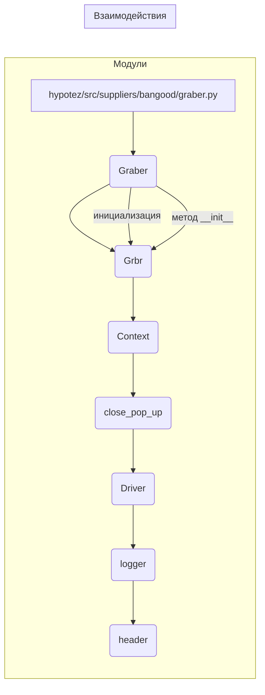

```MD
# <input code>

```python
## \file hypotez/src/suppliers/bangood/graber.py
# -*- coding: utf-8 -*-\
#! venv/Scripts/python.exe
#! venv/bin/python/python3.12

"""
.. module: src.suppliers.bangood 
	:platform: Windows, Unix
	:synopsis:  Класс собирает значение полей на странице  товара `bangood.com`. 
    Для каждого поля страницы товара сделана функция обработки поля в родительском классе.
    Если нужна нестандертная обработка, функция перегружается в этом классе.
    ------------------
    Перед отправкой запроса к вебдрайверу можно совершить предварительные действия через декоратор. 
    Декоратор по умолчанию находится в родительском классе. Для того, чтобы декоратор сработал надо передать значение 
    в `Context.locator`, Если надо реализовать свой декоратор - раскоментируйте строки с декоратором и переопределите его поведение

"""


from typing import Any
import header
from src.suppliers.graber import Graber as Grbr, Context, close_pop_up
from src.webdriver.driver import Driver
from src.logger import logger


# # Определение декоратора для закрытия всплывающих окон
# # В каждом отдельном поставщике (`Supplier`) декоратор может использоваться в индивидуальных целях
# # Общее название декоратора `@close_pop_up` можно изменить 


# def close_pop_up(value: Any = None) -> Callable:
#     """Создает декоратор для закрытия всплывающих окон перед выполнением основной логики функции.

#     Args:
#         value (Any): Дополнительное значение для декоратора.

#     Returns:
#         Callable: Декоратор, оборачивающий функцию.
#     """
#     def decorator(func: Callable) -> Callable:
#         @wraps(func)
#         async def wrapper(*args, **kwargs):
#             try:
#                 # await Context.driver.execute_locator(Context.locator.close_pop_up)  # Await async pop-up close  
#                 ... 
#             except ExecuteLocatorException as e:
#                 logger.debug(f'Ошибка выполнения локатора: {e}')
#             return await func(*args, **kwargs)  # Await the main function
#         return wrapper
#     return decorator


class Graber(Grbr):
    """Класс для операций захвата Morlevi."""
    supplier_prefix: str

    def __init__(self, driver: Driver):
        """Инициализация класса сбора полей товара."""
        self.supplier_prefix = 'bangood'
        super().__init__(supplier_prefix=self.supplier_prefix, driver=driver)
        # Устанавливаем глобальные настройки через Context
        
        Context.locator_for_decorator = None # <- если будет уастановлено значение - то оно выполнится в декораторе `@close_pop_up`

```

# <algorithm>

```mermaid
graph TD
    A[Инициализация Graber] --> B{Проверка Context.locator_for_decorator};
    B -- false --> C[Инициализация super().__init__];
    B -- true --> D[Выполнение декоратора];
    C --> E[Завершение инициализации];
    D --> E;
    E --> F[Обработка запроса на веб-странице];
    F --> G[Возврат данных];
```

**Пример:**

Инициализация `Graber` класса с передачей `driver`. При инициализации, если `Context.locator_for_decorator` имеет значение, выполняется декоратор `close_pop_up`.  В противном случае, `super().__init__` выполняет общую логику инициализации. В итоге, возвращаются данные с обработанной веб-страницы.

# <mermaid>



**Объяснение диаграммы:**

Диаграмма отображает зависимости между классами и модулями в коде. `Graber` напрямую зависит от `Grbr`, `Context`, `close_pop_up`, `Driver`, `logger` и `header`.  `Graber` использует методы, определённые в `Grbr`.  `Context`  представляет глобальные настройки, используемые в `Graber` и других классах.  `close_pop_up` содержит логику закрытия всплывающих окон.  `Driver` — для взаимодействия с веб-драйвером.  `logger` — для ведения журналов, а `header` — неизвестен из контекста, предполагается что нужен для импорта других модулей.


# <explanation>

**Импорты:**

- `header`:  Неизвестен из контекста, вероятно импортирует другие необходимые модули.
- `from src.suppliers.graber import Graber as Grbr, Context, close_pop_up`: Импортирует класс `Graber` (переименован в `Grbr`) и классы  `Context` и `close_pop_up` из модуля `graber.py` в папке `suppliers`.  Связь с другими модулями осуществляется через путь `src.`, предполагая, что это часть проекта (структура папок проекта не указана).
- `from src.webdriver.driver import Driver`: Импортирует класс `Driver` из модуля `driver.py` в папке `webdriver`. Это указывает на то, что `Graber` использует веб-драйвер для взаимодействия с веб-страницами.
- `from src.logger import logger`: Импортирует объект `logger` из модуля `logger.py`, предположительно, для ведения журналов.


**Классы:**

- `Graber`: Наследуется от `Grbr` (из `src.suppliers.graber`) и содержит специфические методы для сбора данных с сайта bangood.com. `supplier_prefix` используется для обозначения поставщика. Метод `__init__` инициализирует класс.
- `Grbr`: Родительский класс, вероятно содержит общие методы и атрибуты для работы с веб-драйвером и обработкой данных, также вероятно обрабатывает декоратор для закрытия всплывающих окон.
- `Context`: Представляет контекст, где хранятся глобальные настройки, включая объект `driver` для взаимодействия с веб-драйвером и `locator_for_decorator`. Используется для передачи данных между классами.

**Функции:**

- `close_pop_up`:  (комментирована) Декоратор, предназначенный для закрытия всплывающих окон на сайте перед выполнением основной функции.  В данном случае декоратор комментирован и не используется.


**Переменные:**

- `MODE`:  Строковая переменная, хранит режим работы (например, 'dev', 'prod').
- `supplier_prefix`: Строковая переменная, содержащая префикс имени поставщика, используется в `__init__` для уникальной идентификации поставщика.


**Возможные ошибки/улучшения:**

- **Отсутствие реализации декоратора `close_pop_up`**: Декоратор для закрытия всплывающих окон не реализован.  В случае его необходимости, требуется реализовать внутреннюю логику обработки.
- **Отсутствует функциональность для обработки данных**:  Код `Graber` содержит только инициализацию, но не содержит логики для извлечения данных с сайта. Требуется добавить функции для сбора данных.
- **Неопределенный `header`**:  Использование `import header` без дальнейшей информации о содержимом этого файла может вызывать проблемы.


**Цепочка взаимосвязей:**

`Graber` использует `Grbr`, `Context`, `Driver`, `logger` и вероятно, `header`. Взаимодействие реализовано через вызовы методов и передачу данных.  `Grbr` и `Context` связаны напрямую, `Graber` наследует от `Grbr`.  `Driver` нужен для взаимодействия с веб-драйвером, `logger` - для записи логирования.