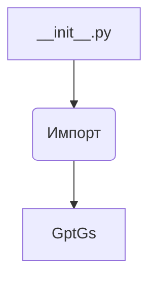
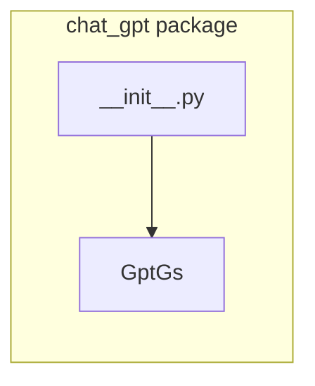

```MD
# Анализ файла `hypotez/src/suppliers/chat_gpt/__init__.py`

## <input code>

```python
## \file hypotez/src/suppliers/chat_gpt/__init__.py
# -*- coding: utf-8 -*-

#! venv/bin/python/python3.12

"""
.. module: src.suppliers.chat_gpt 
	:platform: Windows, Unix
	:synopsis:

"""


from .gsheet import GptGs
```

## <algorithm>

Файл `__init__.py` - это инициализирующий файл для пакета `chat_gpt`.  Он импортирует модуль `gsheet`.  Алгоритм работы состоит в простом импорте.



Пример:
В другом модуле проекта, при импорте пакета `chat_gpt`, будет доступна переменная `MODE` и класс `GptGs`.

## <mermaid>



## <explanation>

**Импорты:**

- `from .gsheet import GptGs`: Импортирует класс `GptGs` из модуля `gsheet.py`, который находится в той же директории (`./gsheet.py`).  Это типичная практика для организации связанных модулей внутри пакета. `.` указывает, что импортируемый модуль находится в текущем подпакете (`suppliers/chat_gpt`).

**Переменные:**

- ``:  Очевидно, эта переменная хранит режим работы (например, 'dev' или 'prod'), вероятно, используемый для конфигурации в других частях проекта.  Важно, что она объявлена на уровне модуля, что делает её доступной в любом месте модуля `chat_gpt`.

**Классы:**

-  `GptGs`:  Класс, определённый в файле `gsheet.py`, чьё назначение неизвестно из представленного фрагмента кода.  Необходимы дополнительный код `gsheet.py` для понимания его поведения.

**Функции:**

-  Нет функций. Файл `__init__.py` используется для импорта классов и переменных, необходимых для взаимодействия с другими частями проекта.

**Возможные ошибки и улучшения:**

- Не хватает контекста.  Без доступа к файлу `gsheet.py` сложно оценить корректность и эффективность кода.
- Документация: Более подробные комментарии в `__init__.py` и `gsheet.py` значительно улучшат понимание кода.


**Связь с другими частями проекта:**

Файл `__init__.py` служит точкой входа в пакет `chat_gpt`.  При импорте пакета `chat_gpt` в других частях проекта, импортируются определённые классы (в данном случае `GptGs`) и переменные (`MODE`), что позволяет использовать функциональность, предоставляемую пакетом.  Следующие части проекта могут использовать `GptGs` для взаимодействия с Google Sheets или другим сервисом, если это предполагается его реализацией в `gsheet.py`.   Например, код в `hypotez/src/main.py` или других модулях может напрямую импортировать класс `GptGs` из пакета `chat_gpt` и использовать его.