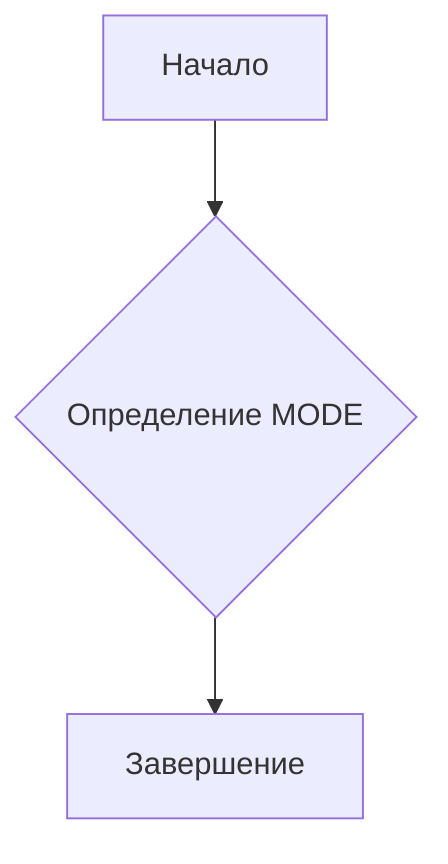

1. **<input code>**:

```python
## \file hypotez/src/suppliers/chat_gpt/gemini_traigner.py
# -*- coding: utf-8 -*-
#! venv/Scripts/python.exe
#! venv/bin/python/python3.12

"""
.. module: src.suppliers.chat_gpt 
	:platform: Windows, Unix
	:synopsis:

"""


"""
	:platform: Windows, Unix
	:synopsis:

"""


"""
	:platform: Windows, Unix
	:synopsis:

"""


"""
  :platform: Windows, Unix

"""
"""
  :platform: Windows, Unix
  :platform: Windows, Unix
  :synopsis:
"""
```

2. **<algorithm>**:

Этот код не содержит алгоритма в привычном смысле. Он представляет собой фрагмент Python-скрипта, содержащий комментарии и константу.  Поскольку нет управляющих конструкций (условных операторов, циклов), алгоритм работы сводится к простому определению константы `MODE`.  Нет вызова функций или классов.  

**Блок-схема:**



**Пример:**
В данном примере переменная `MODE` получает строковое значение "dev".

3. **<mermaid>**:

```mermaid
graph LR
    A[gemini_traigner.py] --> B();
```

4. **<explanation>**:

* **Импорты**: Нет импортов. Код не использует какие-либо внешние модули или библиотеки.
* **Классы**: Нет классов.
* **Функции**: Нет функций.
* **Переменные**:
    * `MODE`: Строковая переменная, содержащая значение 'dev'.  Представляет собой константу, скорее всего, использующуюся для определения режима работы программы (например, 'dev' - режим разработки, 'prod' - режим производства).  Значение этой переменной в данном фрагменте не используется.
* **Возможные ошибки или области для улучшений**:
    * **Неиспользуемые комментарии**: Многие комментарии в коде не содержат существенной информации и могут быть удалены или переформулированы для повышения ясности.
    * **Неконсистентность**: Переменная `MODE` определена несколько раз (в разных местах, с одинаковым именем, и с разными комментариями).  Это может быть следствием работы над кодом.  Необходим анализ всей программы, чтобы понять значение этой константы.
    * **Отсутствие логики**: Фрагмент кода не содержит логической структуры и не выполняет никакой работы.  Необходимо добавить код для реализации требуемой функциональности.


**Цепочка взаимосвязей с другими частями проекта**:

Фрагмент кода `gemini_traigner.py` возможно входит в более крупный проект, в котором определенная константа `MODE` используется для настройки поведения и управления различными аспектами системы,  например, подключаемыми модулями, путями к ресурсам или режимами записи в файлы.  Для построения полного анализа, необходим весь код программы.