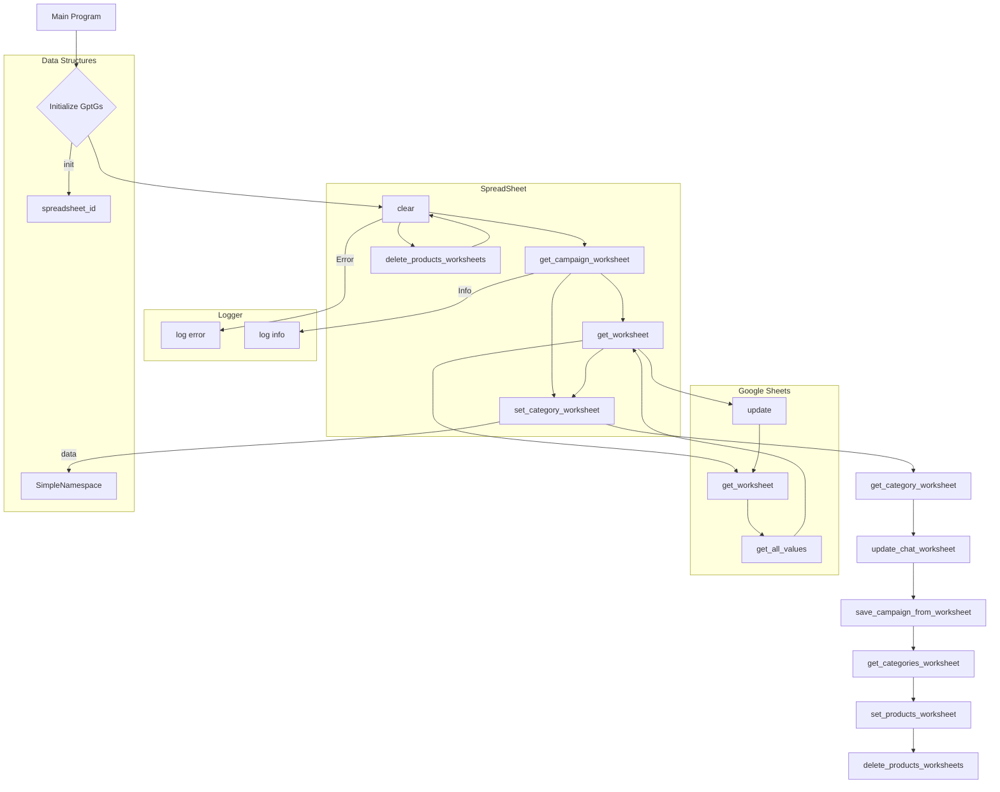

# <input code>

```python
## \file hypotez/src/suppliers/chat_gpt/gsheet.py
# -*- coding: utf-8 -*-\
#! venv/Scripts/python.exe
#! venv/bin/python/python3.12

"""
.. module: src.suppliers.chat_gpt 
	:platform: Windows, Unix
	:synopsis:

"""


"""
	:platform: Windows, Unix
	:synopsis:

"""


"""
	:platform: Windows, Unix
	:synopsis:

"""


"""
  :platform: Windows, Unix

"""
"""
  :platform: Windows, Unix
  :platform: Windows, Unix
  :synopsis:
"""
  
""" module: src.suppliers.chat_gpt """


""" AliExpress Campaign Editor via Google Sheets """


from lib2to3.pgen2.driver import Driver
import time
from types import SimpleNamespace
from typing import List
from gspread.worksheet import Worksheet
from src.goog.spreadsheet.spreadsheet import SpreadSheet

from src.utils.jjson import j_dumps
from src.utils.printer import pprint
from src.logger import logger


class GptGs(SpreadSheet):
    """ Class for managing Google Sheets within AliExpress campaigns.

    Inherits from `SpreadSheet` and `AliCampaignEditor` to manage Google Sheets,
    write category and product data, and format sheets.
    """
    ...

    def __init__(self):
        """ Initialize AliCampaignGoogleSheet with specified Google Sheets spreadsheet ID and additional parameters.
        @param campaign_name `str`: The name of the campaign.
        @param category_name `str`: The name of the category.
        @param language `str`: The language for the campaign.
        @param currency `str`: The currency for the campaign.
        """
        # Initialize SpreadSheet with the spreadsheet ID
        super().__init__('1nu4mNNFMzSePlggaaL_QM2vdKVP_NNBl2OG7R9MNrs0')


    def clear(self):
        """ Clear contents.
        Delete product sheets and clear data on the categories and other specified sheets.
        """
        try:
            self.delete_products_worksheets()
            # ws_to_clear = ['category','categories','campaign']
            # for ws in self.spreadsheet.worksheets():
            #     self.get_worksheet(ws).clear()
                
        except Exception as ex:
            logger.error("Ошибка очистки",ex)

    # ... (rest of the code)
```

# <algorithm>

The code defines a class `GptGs` that inherits from `SpreadSheet` to manage Google Sheets.  It provides methods for interacting with various worksheets, writing and reading data, and managing campaign and category information.

**Algorithm Example: `update_chat_worksheet`**

1. **Input:** `data` (SimpleNamespace or dictionary/list), `conversation_name`, optional `language`.
2. **Get Worksheet:** Retrieves the worksheet with the given `conversation_name` using `self.get_worksheet()`.
3. **Extract Data:** Extracts data from the `data` object (e.g., `name`, `title`, etc.) using `.get()` to handle missing attributes gracefully.
4. **Prepare Updates:** Creates a list of dictionary updates for the worksheet using `updates`.  Each dictionary specifies a cell range and the value to be written.
5. **Error Handling:** Includes a `try...except` block to catch any potential errors during the writing process and log them using `logger.error()`.
6. **Update Worksheet:** Uses `ws.update()` with the prepared `updates` to write the data to the worksheet.


# <mermaid>



**Dependencies:**

- `gspread`: Used for interacting with Google Sheets.  A dependency of `src.goog.spreadsheet`.
- `src.goog.spreadsheet.spreadsheet`: This likely defines a base class or interface for interacting with Google Sheets.  It's the parent class (`SpreadSheet`) of `GptGs`.
- `src.utils.jjson`:  Handles JSON operations (likely serialization/deserialization).
- `src.utils.printer`:  Provides pretty-printing of data structures.
- `src.logger`:  A custom logging module for the project.


# <explanation>

**Imports:**

- `lib2to3.pgen2.driver`: Unknown purpose in this context; likely irrelevant to the core functionality.
- `time`: Used for pausing execution (e.g., `time.sleep(10)` in `set_product_worksheet`).
- `types`: Provides the `SimpleNamespace` class, used for representing structured data.
- `typing`:  Provides type hints for better code clarity (e.g., `List`).
- `gspread.worksheet`: Provides access to Google Sheet worksheets.
- `src.goog.spreadsheet.spreadsheet`: Likely defines the `SpreadSheet` class (base class for `GptGs`) for Google Sheet operations.
- `src.utils.jjson`: Used for handling JSON data.
- `src.utils.printer`: Used for pretty-printing data (useful for debugging).
- `src.logger`:  Used for logging errors and messages, centralizing logging in the project.


**Classes:**

- `GptGs`: Manages Google Sheets interactions related to AliExpress campaigns.  It inherits from `SpreadSheet` which suggests a hierarchy for handling spreadsheet operations.


**Methods:**

- `__init__`: Initializes the `GptGs` object with the Google Sheets spreadsheet ID.
- `clear`: Clears content from various worksheets (including products, categories, campaign). Crucial for managing data consistency in the spreadsheet.
- `update_chat_worksheet`: Writes data to a specific conversation worksheet.
- `get_campaign_worksheet`: Reads campaign data from the 'campaign' sheet.
- `set_category_worksheet`: Writes category data vertically.
- `get_category_worksheet`: Reads category data.
- `set_categories_worksheet`: Writes multiple category data in rows.
- `get_categories_worksheet`: Reads all category data.
- `set_product_worksheet`: Creates/updates product data in worksheets based on category names.  Includes error handling (crucial for robustness).
- `get_product_worksheet`: Reads product data.
- `set_products_worksheet`: Writes product data based on category names and updates multiple entries using batch_update.
- `delete_products_worksheets`: Deletes sheets that don't correspond to categories. Prevents data clutter.
- `save_categories_from_worksheet`: Saves/Updates categories from the Google sheet.
- `save_campaign_from_worksheet`: Saves the campaign data.


**Variables:**

- `MODE`: Likely a configuration variable indicating the execution mode ('dev' in this case).
- `spreadsheet_id`: The ID of the Google Spreadsheet being accessed.


**Error Handling:**

Extensive use of `try...except` blocks for error handling.  This is essential to prevent the script from crashing due to issues with the Google Sheets API or invalid data.  The `exc_info=True` in the `logger.error` calls helps provide more detailed error information.  The error handling is well implemented.

**Possible Improvements:**

- **Type hinting:**  While type hinting is used in many parts, some additional type hints for local variables (e.g., the `ws` variable in many functions) could improve clarity.
- **Data Validation:**  Add checks to validate the format and type of data read from the spreadsheet to prevent unexpected behavior.
- **More Robust `clear` Method:** Consider using the `ws.clear()` method directly on the specified worksheets for better clarity and efficiency.
- **`set_products_worksheet` Efficiency:**  Using `ws.batch_update` for updating products is efficient. Consider optimizing the code for very large datasets.
- **`campaign` and `category` Attributes:**  The `campaign` and `category` attributes within the `GptGs` class could benefit from being better defined for clearer object-oriented structure in their respective classes.


**Relationships with Other Parts of the Project:**

The code heavily relies on `src.goog.spreadsheet.spreadsheet`, `src.utils.jjson`, `src.utils.printer`, and `src.logger`. This suggests a modular structure where these are separate components of the project.  The `campaign` and `category` objects (not shown fully in the excerpt) are likely defined elsewhere in the project. The way data is accessed through these attributes suggests there are classes responsible for managing campaign and category data that are not directly included in this code snippet. The interaction with this other part of the system is through passing and retrieving the `campaign`, `category` objects.