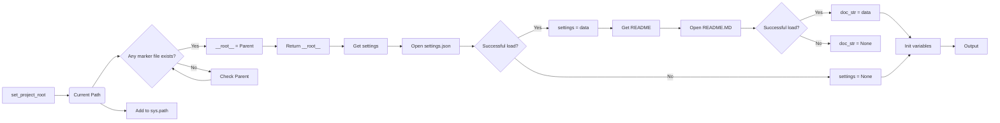

# <input code>

```python
## \file hypotez/src/suppliers/ebay/header.py
# -*- coding: utf-8 -*-\
#! venv/Scripts/python.exe
#! venv/bin/python/python3.12

"""
.. module: src.suppliers.ebay 
	:platform: Windows, Unix
	:synopsis:

"""
MODE = 'dev'

import sys
import json
from packaging.version import Version

from pathlib import Path
def set_project_root(marker_files=('__root__')) -> Path:
    """
    Finds the root directory of the project starting from the current file's directory,
    searching upwards and stopping at the first directory containing any of the marker files.

    Args:
        marker_files (tuple): Filenames or directory names to identify the project root.
    
    Returns:
        Path: Path to the root directory if found, otherwise the directory where the script is located.
    """
    __root__:Path
    current_path:Path = Path(__file__).resolve().parent
    __root__ = current_path
    for parent in [current_path] + list(current_path.parents):
        if any((parent / marker).exists() for marker in marker_files):
            __root__ = parent
            break
    if __root__ not in sys.path:
        sys.path.insert(0, str(__root__))
    return __root__


# Get the root directory of the project
__root__ = set_project_root()
"""__root__ (Path): Path to the root directory of the project"""

from src import gs

settings:dict = None
try:
    with open(gs.path.root / 'src' /  'settings.json', 'r') as settings_file:
        settings = json.load(settings_file)
except (FileNotFoundError, json.JSONDecodeError):
    ...

doc_str:str = None
try:
    with open(gs.path.root / 'src' /  'README.MD', 'r') as settings_file:
        doc_str = settings_file.read()
except (FileNotFoundError, json.JSONDecodeError):
    ...


__project_name__ = settings.get("project_name", 'hypotez') if settings  else 'hypotez'
__version__: str = settings.get("version", '')  if settings  else ''
__doc__: str = doc_str if doc_str else ''
__details__: str = ''
__author__: str = settings.get("author", '')  if settings else ''
__copyright__: str = settings.get("copyrihgnt", '')  if settings else ''
__cofee__: str = settings.get("cofee", "Treat the developer to a cup of coffee for boosting enthusiasm in development: https://boosty.to/hypo69")  if settings else "Treat the developer to a cup of coffee for boosting enthusiasm in development: https://boosty.to/hypo69"
```

# <algorithm>

**Шаг 1:** Функция `set_project_root` ищет корневую директорию проекта.
    * Вход: кортеж `marker_files` с именами файлов/папок, по которым определяется корень.
    * Выход: `Path` к корневой директории.
    * Алгоритм: начинается с текущей директории файла, ищет вверх по дереву директорий. Если в родительской директории находится любой файл/папка из `marker_files`, то текущая директория становится корнем.
    * Пример: Если `__file__` указывает на `hypotez/src/suppliers/ebay/header.py`, то функция будет искать `pyproject.toml`, `requirements.txt`, `.git` в `hypotez/src/suppliers/ebay`, `hypotez/src`, и т.д.  Если найдет, то возвращает соответствующую директорию.
    * Пример данных: `marker_files = ('pyproject.toml', 'requirements.txt')`


**Шаг 2:**  Получение корня проекта.
    * Вызов функции `set_project_root()` с заданными `marker_files`. Результат записывается в переменную `__root__`.


**Шаг 3:** Чтение настроек.
    * Используется `gs.path.root / 'src' / 'settings.json'`, предполагается, что `gs` содержит путь к корню проекта (предварительно рассчитанный в `set_project_root`).
    * `settings` получает значения из `settings.json`.
    * Обработка исключений: Если файл не найден или содержит недопустимый JSON, то `settings` остается None.
    * Пример данных: `settings.json`: `{"project_name": "MyProject", "version": "1.0.0", ...}`

**Шаг 4:** Чтение README.
    * Аналогично чтению настроек, с файлом `README.MD`.
    * Пример данных: `README.MD`: содержит текст документации.

**Шаг 5:** Инициализация переменных.
    * Используя `settings.get()`, загружаются значения из словаря настроек, если они существуют, в противном случае используются значения по умолчанию.
    * `__project_name__`, `__version__`, `__doc__`, `__author__`, `__copyright__`, `__coffee__` инициализируются.
    * Пример данных: Если `settings` пусто, то `__project_name__` будет "hypotez".


# <mermaid>



**Объяснение диаграммы:**

* `A`: Функция `set_project_root`.
* `B`: Текущий путь.
* `C`: Проверка существования маркеров файлов.
* `D`: При успехе, корневой путь устанавливается на родительскую директорию.
* `E`: Проверка следующей родительской директории.
* `F`: Возвращение корневого пути.
* `G`: Добавление корневого пути в `sys.path`.
* `H`: Получение настроек.
* `I`: Открытие `settings.json`.
* `J`: Проверка успешного чтения файла.
* `K`: Сохранение данных настроек в `settings`.
* `L`: Установка `settings` в `None`.
* `M`: Получение содержимого `README.MD`.
* `N`: Открытие `README.MD`.
* `O`: Проверка успешного чтения файла.
* `P`: Сохранение содержимого `README.MD` в `doc_str`.
* `Q`: Установка `doc_str` в `None`.
* `R`: Инициализация переменных `__project_name__`, `__version__`, etc.
* `S`: Вывод результата.


# <explanation>

**Импорты:**

* `sys`: Для доступа к системным переменным, в том числе пути.
* `json`: Для работы с JSON файлами.
* `packaging.version`: Для работы с версиями пакетов.
* `pathlib`: Для работы с путями к файлам.
* `src.gs`: (предполагается) Модуль, содержащий константы пути к корневому каталогу проекта.


**Классы:**

Нет классов в данном коде.


**Функции:**

* `set_project_root(marker_files)`:
    * Назначение: находит корневой каталог проекта, начиная с текущего файла.
    * Аргументы: кортеж `marker_files` с именами файлов/папок, по которым определяется корень.
    * Возвращаемое значение: `Path` к корневому каталогу.
    * Пример: `set_project_root(('pyproject.toml', 'requirements.txt'))`


**Переменные:**

* `MODE`: Строковая константа, хранящая режим работы.
* `__root__`: `Path` объект, содержащий путь к корневому каталогу проекта.
* `settings`: Словарь, содержащий настройки проекта, загруженные из `settings.json`.
* `doc_str`: Строковая переменная, содержащая текст из `README.MD`.
* `__project_name__`, `__version__`, `__doc__`, `__details__`, `__author__`, `__copyright__`, `__cofee__`: Переменные, содержащие информацию о проекте, полученные из `settings` или установленные по умолчанию.


**Возможные ошибки и улучшения:**

* **Обработка ошибок:** Обработка `FileNotFoundError` и `json.JSONDecodeError` – правильно, но рекомендуется более подробная логика. Например, вывести сообщение об ошибке в `sys.stderr` вместо `...`.
* **Более ясная структура:**  использование вспомогательных функций для упрощения кода.
* **Документация:** Документируйте переменные `__project_name__`, `__version__`, `__doc__`, `__details__`, `__author__`, `__copyright__`, `__coffee__`.
* **Исключения:** Обработка возможных ошибок, например, некорректного формата JSON в `settings.json` или отсутствия ожидаемых полей в нём.
* **Зависимости:** Подробнее прояснить зависимость от `src.gs`,  как определяется корневой путь проекта через `gs`.

**Взаимосвязи с другими частями проекта:**

Код сильно зависит от `src.gs`, предполагается, что модуль `gs` предоставляет методы и переменные для работы с путями к ресурсам проекта, в частности, к корневой директории.