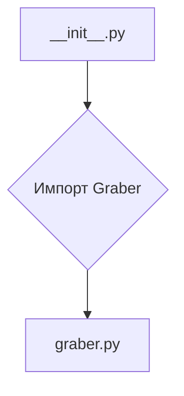
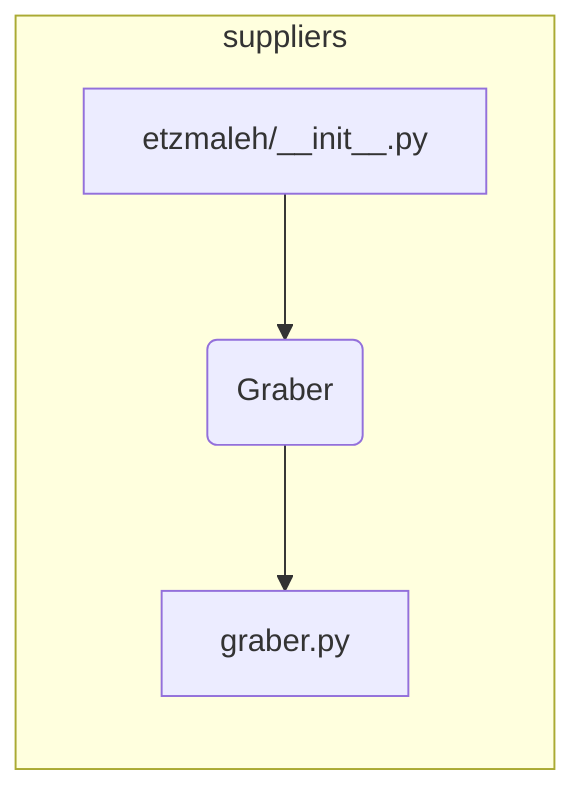

```MD
# Анализ кода hypotez/src/suppliers/etzmaleh/__init__.py

## <input code>

```python
## \file hypotez/src/suppliers/etzmaleh/__init__.py
# -*- coding: utf-8 -*-

#! venv/bin/python/python3.12

"""
.. module: src.suppliers.etzmaleh 
	:platform: Windows, Unix
	:synopsis:

"""


from .graber import Graber
```

## <algorithm>

Алгоритм в данном файле очень прост. Он импортирует класс `Graber` из модуля `graber.py`, находящегося в той же директории (`./graber`).  Более подробная блок-схема требует анализа `graber.py`.  В данном `__init__.py`  нет собственно обработки данных,  вся логика находится в `graber.py`.




Примеры: Если `graber.py` содержит класс `Graber` с методами для работы с данными, то `__init__.py` позволит использовать эти методы в других частях проекта.


## <mermaid>



## <explanation>

**Импорты:**

* `from .graber import Graber`: Этот импорт подключает класс `Graber` из файла `graber.py` в текущем пакете (`etzmaleh`).  Символ `.` перед именем файла указывает на поиск файла `graber.py` в той же директории, что и `__init__.py`.  Это стандартный способ импортировать модули в Python.


**Классы:**

*  `Graber`:  Данный класс содержится в файле `graber.py` и не определен в `__init__.py`.  Информация о нем в `__init__.py` ограничена импортом,  нам не известны его атрибуты и методы без изучения  `graber.py`.


**Функции:**

* Нет функций в этом файле. Вся функциональность класса `Graber` скрыта и должна быть реализована в файле `graber.py`.


**Переменные:**

* ``:  Переменная глобального уровня, вероятно,  используется для выбора режима работы (например, 'dev', 'prod') в дальнейшем коде проекта.  Без дополнительного контекста сложно сказать о ее назначении.

**Возможные ошибки/улучшения:**

* Отсутствие документации:  Хотя есть docstrings, они не содержат подробностей о классе `Graber`.  Добавление более детальной документации (docstrings к методам `Graber` и  `__init__.py`) существенно улучшит читаемость и понимание кода.
* Неясный функционал:  Без кода `graber.py` трудно оценить полную функциональность и связь с другими частями проекта.  Описание класса `Graber` в `__init__.py` в виде короткого описания его цели и роли  повысит понимание.
* Возможно, `graber.py` импортирует другие модули.  Для полного анализа требуется  проверить `graber.py`.

**Цепочка взаимосвязей:**

Файл `__init__.py`  служит для инициализации пакета `etzmaleh`.  Он импортирует необходимые классы, которые, предположительно,  используются  в других частях проекта,  например,  в классах или функциях, которые импортируют `Graber`.  Для определения полной цепочки необходимо проанализировать импорты и вызовы в других файлах.  Без  `graber.py`  и кода, который использует `Graber` - невозможно проследить всю цепочку.