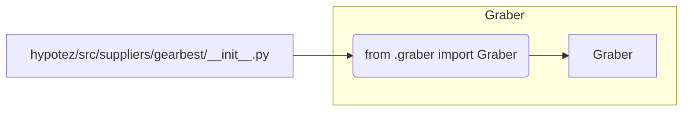

# <input code>

```python
## \file hypotez/src/suppliers/gearbest/__init__.py
# -*- coding: utf-8 -*-
#! venv/Scripts/python.exe
#! venv/bin/python/python3.12

"""
.. module: src.suppliers.gearbest 
	:platform: Windows, Unix
	:synopsis:

"""


from .graber import Graber
```

# <algorithm>

Нет конкретного алгоритма для этого файла.  Файл `__init__.py` в пакете Python используется для инициализации пакета.  В данном случае он просто импортирует класс `Graber` из модуля `graber.py`, который, предположительно, находится в той же папке (`./graber.py`).

**Пример:**

```
# Другой файл (например, main.py)
import hypotez.src.suppliers.gearbest

# После импорта можно получить доступ к классу Graber:
graber_instance = hypotez.src.suppliers.gearbest.Graber()
```

# <mermaid>



**Объяснение диаграммы:**

Файл `__init__.py` содержит единственную строку импорта, которая подключает класс `Graber` из модуля `graber.py`.  Зависимость односторонняя - `__init__.py` использует `graber.py`.  Сама диаграмма показывает, как `__init__.py` экспортирует (используя импорт) класс `Graber` в остальную часть проекта.


# <explanation>

* **Импорты:**
    * `from .graber import Graber`:  Этот импорт подключает класс `Graber` из модуля `graber.py`, который находится в той же директории (`.`) с текущим файлом (`__init__.py`). Это типичная практика для организации Python-модулей.  `.` в начале пути импорта указывает на текущий пакет, который является `hypotez/src/suppliers/gearbest` в этом случае.

* **Классы:**
    * `Graber`: Этот класс, определённый в `graber.py`,  предположительно содержит логику для извлечения данных с сайта GearBest.  Подробная информация о `Graber` зависит от кода в `graber.py` и  неизвестна без его просмотра.

* **Функции:**
    * Нет функций, определённых непосредственно в `__init__.py`. Все функциональность сосредоточена в `graber.py`.

* **Переменные:**
    * ``:  Это строковая переменная, вероятно, используемая для определения режима работы (например, 'dev' для разработки, 'prod' для производства). Она используется в `graber.py` или других связанных файлах.

* **Возможные ошибки или области для улучшений:**

    * **Отсутствие документации:** Не хватает документации к классу `Graber`, что затрудняет понимание его работы без просмотра исходного кода.
    * **Непонятный контекст:** Без кода в `graber.py` неясно, для чего нужен класс `Graber` и как он взаимодействует с другими частями проекта.

* **Цепочка взаимосвязей:**

    * `__init__.py` экспортирует класс `Graber`.
    *  Любой модуль, который импортирует `hypotez.src.suppliers.gearbest`, может использовать класс `Graber`.  Этот импорт позволит взаимодействовать с логикой сбора данных с сайта GearBest.  Следующим этапом может быть использование `Graber` для выполнения сбора данных и последующей обработки.


**Дополнительные соображения:**

Файл `__init__.py` играет ключевую роль в структурировании проекта. Он позволяет импортировать связанные компоненты из пакета `gearbest` в другие части проекта, без необходимости указания полного пути к файлам.  Без файла `__init__.py`  каждый раз нужно было бы использовать длинное имя пути импорта, например `from hypotez.src.suppliers.gearbest.graber import Graber`. Это снижает наглядность и сложность работы.