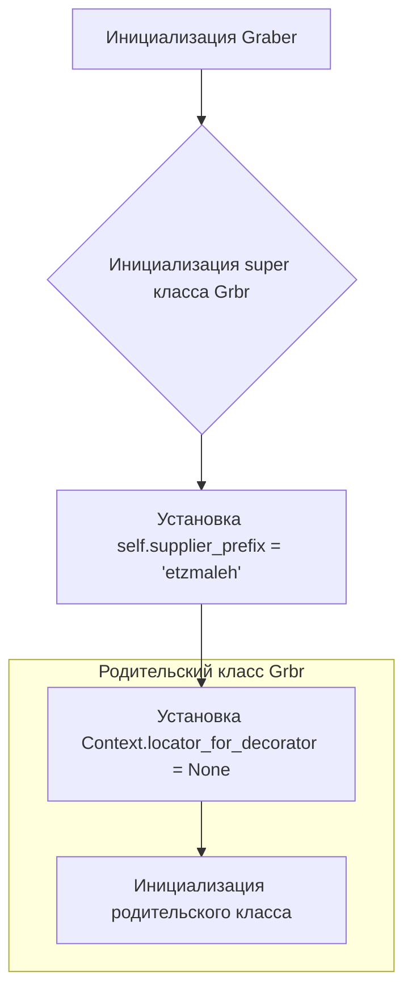
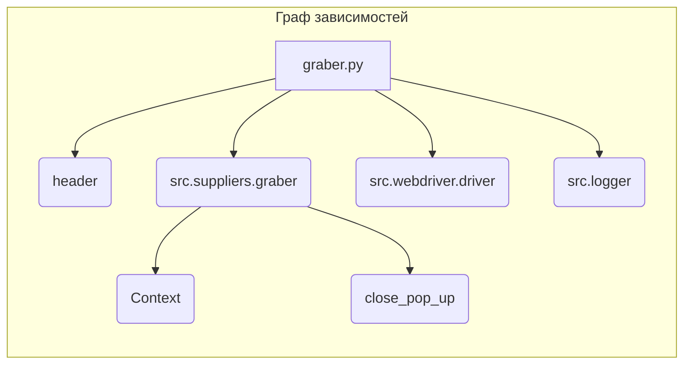

# <input code>

```python
## \file hypotez/src/suppliers/gearbest/graber.py
# -*- coding: utf-8 -*-\
#! venv/Scripts/python.exe
#! venv/bin/python/python3.12

"""
.. module: src.suppliers.gearbest 
	:platform: Windows, Unix
	:synopsis:Класс собирает значение полей на странице  товара `gearbest.com`. 
    Для каждого поля страницы товара сделана функция обработки поля в родительском классе.
    Если нужна нестандертная обработка, функция перегружается в этом классе.
    ------------------
    Перед отправкой запроса к вебдрайверу можно совершить предварительные действия через декоратор. 
    Декоратор по умолчанию находится в родительском классе. Для того, чтобы декоратор сработал надо передать значение 
    в `Context.locator`, Если надо реализовать свой декоратор - раскоментируйте строки с декоратором и переопределите его поведение

"""


from typing import Any
import header
from src.suppliers.graber import Graber as Grbr, Context, close_pop_up
from src.webdriver.driver import Driver
from src.logger import logger


# # Определение декоратора для закрытия всплывающих окон
# # В каждом отдельном поставщике (`Supplier`) декоратор может использоваться в индивидуальных целях
# # Общее название декоратора `@close_pop_up` можно изменить 


# def close_pop_up(value: Any = None) -> Callable:
#     """Создает декоратор для закрытия всплывающих окон перед выполнением основной логики функции.

#     Args:
#         value (Any): Дополнительное значение для декоратора.

#     Returns:
#         Callable: Декоратор, оборачивающий функцию.
#     """
#     def decorator(func: Callable) -> Callable:
#         @wraps(func)
#         async def wrapper(*args, **kwargs):
#             try:
#                 # await Context.driver.execute_locator(Context.locator.close_pop_up)  # Await async pop-up close  
#                 ... 
#             except ExecuteLocatorException as e:
#                 logger.debug(f'Ошибка выполнения локатора: {e}')
#             return await func(*args, **kwargs)  # Await the main function
#         return wrapper
#     return decorator


class Graber(Grbr):
    """Класс для операций захвата Morlevi."""
    supplier_prefix: str

    def __init__(self, driver: Driver):
        """Инициализация класса сбора полей товара."""
        self.supplier_prefix = 'etzmaleh'
        super().__init__(supplier_prefix=self.supplier_prefix, driver=driver)
        # Устанавливаем глобальные настройки через Context
        
        Context.locator_for_decorator = None # <- если будет уастановлено значение - то оно выполнится в декораторе `@close_pop_up`
```

# <algorithm>



**Пример:**  В функции `__init__` происходит инициализация класса `Graber`. Значение `self.supplier_prefix` устанавливается в 'etzmaleh'.  Затем вызывается конструктор родительского класса `Grbr`.  В итоге устанавливается глобальная переменная `Context.locator_for_decorator` в `None`


# <mermaid>




# <explanation>

**Импорты:**

- `header`:  Скорее всего, файл с дополнительными настройками или функциями, специфичными для данного проекта.  Связь с другими пакетами неясна без доступа к этому файлу.
- `src.suppliers.graber`:  Основной класс сбора данных.  `Graber` наследуется от этого класса, что указывает на общую логику для разных поставщиков.
- `src.webdriver.driver`:  Модуль, отвечающий за взаимодействие с веб-драйвером.
- `src.logger`:  Модуль для логирования. Используется для вывода информации об ошибках и других событий.

**Классы:**

- `Graber`: Наследуется от `Grbr` (из `src.suppliers.graber`).  `supplier_prefix` - строковое поле, вероятно, уникальный идентификатор поставщика. Метод `__init__` инициализирует класс и устанавливает значение `supplier_prefix` и глобальные настройки.

**Функции:**

- Нет явных функций в этом фрагменте кода.

**Переменные:**

- `MODE`: Поле, вероятно, указывает на режим работы приложения (разработка/производство).
- `supplier_prefix`:  Строка, уникальный идентификатор поставщика, используемый, вероятно, для обработки данных.
- `Context.locator_for_decorator`: Переменная, определяющая, какой декоратор будет использоваться. Сейчас она имеет значение `None`.

**Возможные ошибки или улучшения:**

- **Отсутствует реализация декоратора:**  Комментарии указывают на возможность добавить функционал закрытия всплывающих окон через декоратор.  Пока декоратор `close_pop_up` не реализован.
- **Неясный смысл `header`:** Без доступа к `header.py` сложно понять его роль и корректность использования.
- **Отсутствует логирование:**  В `__init__` логирование отсутствует, хотя в коде есть импорт `src.logger`.  Добавление логирования в инициализацию улучшило бы отладку и контроль выполнения.
- **Неясность ролей и типов данных:** Нужно больше контекста, чтобы полностью понять назначение переменных и аргументов.
- **Типизация:** Использование `Any` в некоторых местах может быть нежелательным.


**Цепочка взаимосвязей:**

```
src/suppliers/graber -> src/suppliers/gearbest/graber
src/suppliers/graber -> Context
src/webdriver/driver -> Context 
src/logger -> Graber
```


**В итоге:** Код представляет собой класс `Graber`, который наследуется от другого класса `Grbr`, предназначенного, вероятно, для сбора данных от разных поставщиков.  Он инициализируется, устанавливая префикс поставщика и глобальную переменную для возможного декоратора.  Необходимо больше контекста, чтобы понять полный функционал и взаимодействие с другими частями проекта.