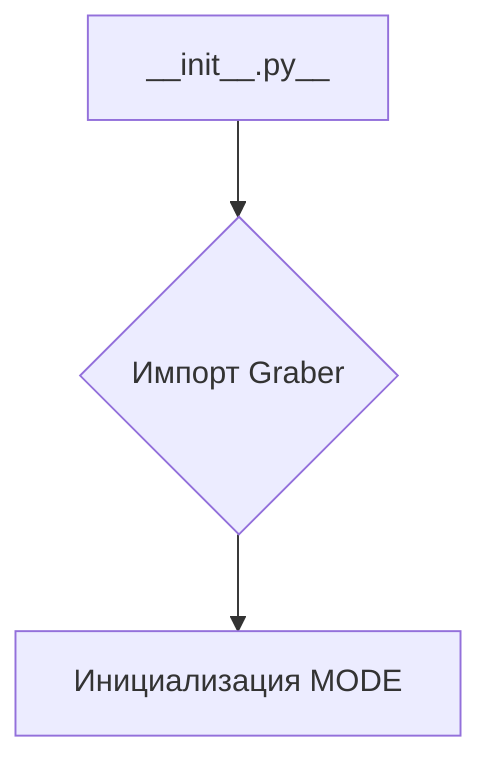
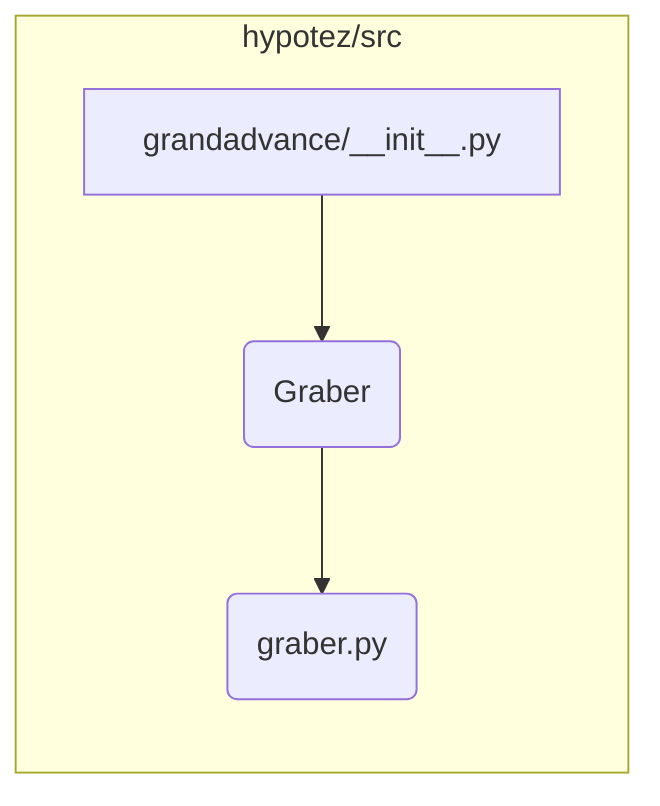

# <input code>

```python
## \file hypotez/src/suppliers/grandadvance/__init__.py
# -*- coding: utf-8 -*-
#! venv/Scripts/python.exe
#! venv/bin/python/python3.12

"""
.. module: src.suppliers.grandadvance 
	:platform: Windows, Unix
	:synopsis:

"""


from .graber import Graber
```

# <algorithm>

Этот код представляет собой файл инициализации для модуля `grandadvance` внутри пакета `suppliers` проекта `hypotez`.  Он импортирует класс `Graber` из файла `graber.py` в том же каталоге.

**Блок-схема:**



**Пример данных:**

* `MODE` будет иметь значение `'dev'`

# <mermaid>



# <explanation>

**Импорты:**

* `from .graber import Graber`: Этот импорт подключает класс `Graber` из файла `graber.py`, который находится в том же подкаталоге (`./graber.py`).  Это стандартная импортная конструкция для работы с модулями внутри одного пакета.  `src` - это, вероятно, корневая директория проекта,  `suppliers` - папка, содержащая логику для разных поставщиков данных, `grandadvance` - конкретная реализация для поставщика данных под названием "Grand Advance".

**Классы:**

* `Graber`:  Этот класс (скорее всего, определен в файле `graber.py`) - это центральная часть логики для взаимодействия с источником данных "Grand Advance".  Без просмотра `graber.py` трудно сказать точно, но, вероятно, он содержит методы для получения данных, обработки, валидации и т.д.  Мы не знаем, какие методы и атрибуты содержит класс `Graber`.

**Функции:**

* Нет функций в данном файле.  Он служит исключительно для импорта класса `Graber`

**Переменные:**

* ``: Это переменная, которая задаёт режим работы.  Скорее всего, она используется для выбора конфигураций (например, тестовые/производственные настройки) в других частях проекта.  В данном случае, тип переменной – строка.


**Возможные ошибки или области для улучшений:**

* **Отсутствие документации:** Хотя есть docstring, она не очень подробная.  Необходимо документировать назначение переменной `MODE`, что она обозначает и как ее использовать в других модулях.
* **Отсутствие обработки исключений:** Не указано, что произойдёт, если файл `graber.py` отсутствует или содержит ошибки.  Необходимо добавить проверки существования и валидации файла `graber.py`.


**Взаимосвязи с другими частями проекта:**

Этот файл импортирует класс `Graber` и, вероятно, используется в других частях проекта `hypotez`, которые нуждаются в работе с данными от поставщика Grand Advance.   `Graber` — это компонент, который позволяет другой части проекта взаимодействовать с этим источником данных, но нам нужно посмотреть на другие файлы, чтобы увидеть, как `Graber` используется.