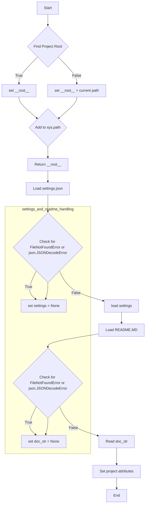

# Анализ кода из файла hypotez/src/suppliers/grandadvance/header.py

## <input code>

```python
## \file hypotez/src/suppliers/grandadvance/header.py
# -*- coding: utf-8 -*-\n#! venv/Scripts/python.exe\n#! venv/bin/python/python3.12\n\n"""
.. module: src.suppliers.grandadvance 
	:platform: Windows, Unix
	:synopsis:

"""


import sys
import json
from packaging.version import Version
from pathlib import Path
def set_project_root(marker_files=('__root__')) -> Path:
    """
    Finds the root directory of the project starting from the current file's directory,
    searching upwards and stopping at the first directory containing any of the marker files.

    Args:
        marker_files (tuple): Filenames or directory names to identify the project root.
    
    Returns:
        Path: Path to the root directory if found, otherwise the directory where the script is located.
    """
    __root__:Path
    current_path:Path = Path(__file__).resolve().parent
    __root__ = current_path
    for parent in [current_path] + list(current_path.parents):
        if any((parent / marker).exists() for marker in marker_files):
            __root__ = parent
            break
    if __root__ not in sys.path:
        sys.path.insert(0, str(__root__))
    return __root__


# Get the root directory of the project
__root__ = set_project_root()
"""__root__ (Path): Path to the root directory of the project"""


from src import gs

settings:dict = None
try:
    with open(gs.path.root / 'src' /  'settings.json', 'r') as settings_file:
        settings = json.load(settings_file)
except (FileNotFoundError, json.JSONDecodeError):
    ...


doc_str:str = None
try:
    with open(gs.path.root / 'src' /  'README.MD', 'r') as settings_file:
        doc_str = settings_file.read()
except (FileNotFoundError, json.JSONDecodeError):
    ...


__project_name__ = settings.get("project_name", 'hypotez') if settings  else 'hypotez'
__version__: str = settings.get("version", '')  if settings  else ''
__doc__: str = doc_str if doc_str else ''
__details__: str = ''
__author__: str = settings.get("author", '')  if settings  else ''
__copyright__: str = settings.get("copyrihgnt", '')  if settings  else ''
__cofee__: str = settings.get("cofee", "Treat the developer to a cup of coffee for boosting enthusiasm in development: https://boosty.to/hypo69")  if settings  else "Treat the developer to a cup of coffee for boosting enthusiasm in development: https://boosty.to/hypo69"
```

## <algorithm>


**Пример:** Если файл `pyproject.toml` находится в родительской директории текущего файла, функция `set_project_root` вернет путь к этой родительской директории, добавит его в `sys.path` и вернет его значение.


## <mermaid>

```mermaid
graph LR
    subgraph Project Initialization
        A[set_project_root] --> B(Path(__file__));
        B --> C[resolve()];
        C --> D[parent];
        D --> E{marker files exist?};
        E -- yes --> F[__root__ = parent];
        E -- no --> G[__root__ = current_path];
        F --> H[sys.path.insert(0,__root__)];
        G --> H;
        H --> I[__root__];
    end
    I --> J[Load settings.json];
    J --> K{File exists?};
    K -- yes --> L[settings = json.load];
    K -- no --> M[settings = None];
    L --> N[Load README.MD];
    N --> O{File exists?};
    O -- yes --> P[doc_str = file.read()];
    O -- no --> Q[doc_str = None];
    P --> R[Set project attributes];
    M --> R;
    Q --> R;
    R --> S[End];
```
**Описание зависимостей:**

* `pathlib`: Используется для работы с путями к файлам.
* `json`:  Используется для загрузки JSON-файла `settings.json`.
* `packaging.version`: (не используется напрямую в примере, но импортирован) Используется для работы с версиями пакетов.
* `sys`: Используется для добавления пути в `sys.path`.
* `gs`:  Внутри `src`, скорее всего,  содержит вспомогательные функции и переменные, относящиеся к управлению путями проекта.  Эта зависимость неявно подразумевает организацию проекта на основе модулей и папок.

## <explanation>

**Импорты:**

* `sys`: Используется для добавления пути к проекту в `sys.path`, что позволяет импортировать модули из подпапок.
* `json`: Используется для загрузки настроек из файла `settings.json`.
* `packaging.version`:  Не используется напрямую, но импортируется (возможно, для работы с версиями пакетов в будущем).
* `pathlib`:  Обеспечивает удобный и переносимый способ работы с файловыми путями.
* `gs`:  Скорее всего, является собственным модулем из папки `src`, используемым для работы с путями внутри проекта (например, `gs.path.root`).  Это показывает структуру проекта, с использованием модуля `gs`.

**Классы:**

Нет явных классов.

**Функции:**

* `set_project_root(marker_files)`:  Находит корневую директорию проекта, начиная с текущего файла, поднимаясь вверх по иерархии директорий, пока не найдет директорию, содержащую указанные файлы (маркеры).  Это важная функция, обеспечивающая абсолютный путь к проекту, независимо от того, в какой подпапке запущен скрипт.
    * Аргументы: `marker_files` (кортеж строк) — список файлов, по наличию которых определяется корень проекта.
    * Возвращаемое значение: `Path` — путь к корневой директории.
    * Пример: если в папке `grandadvance` есть `pyproject.toml`, эта функция вернет путь к этой директории.

**Переменные:**

* `MODE`:  Строковая константа, вероятно, для определения режима работы (например, `dev`, `prod`).
* `__root__`:  Переменная, содержащая путь к корневой директории проекта.
* `settings`: Словарь, содержащий данные из файла `settings.json`.
* `doc_str`: Строка, содержащая содержимое файла `README.MD`.
*  `__project_name__`, `__version__`, `__doc__`, `__details__`, `__author__`, `__copyright__`, `__cofee__`:  Переменные, содержащие метаданные о проекте, полученные из `settings.json` (или значения по умолчанию, если файл не найден или ключ отсутствует).

**Возможные ошибки или области для улучшений:**

* **Обработка ошибок:** Обработка `FileNotFoundError` и `json.JSONDecodeError` при чтении `settings.json` и `README.MD` — важный элемент. Однако, можно сделать обработку более подробной, например, выводить предупреждения с местом ошибки.
* **Проверка типов:** Проверка того, что загруженные данные из `settings.json` имеют правильный тип, поможет избежать неожиданных ошибок в будущем.
* **Улучшение документации:** Добавьте комментарии к переменным `__root__`, `settings`, `doc_str`, объяснив, как они используются в коде.
* **Использование `try...except` blocks:** в случаях с `json.load()` и `file.read()` лучше использовать исключения для корректного реагирования на ошибки в данных.


**Взаимосвязи с другими частями проекта:**

Код взаимодействует с модулем `gs`, вероятно, отвечающим за управление файлами, находящимися внутри проекта (`gs.path.root`).  Это указывает на наличие структуры проекта, где `gs`  предполагаемо содержит функции и атрибуты для работы с путями.  Код из файла `header.py` является частью проекта и инициализирует переменные, которые будут использоваться другими частями кода в проекте.