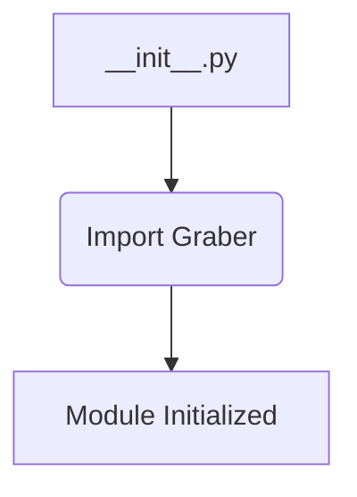
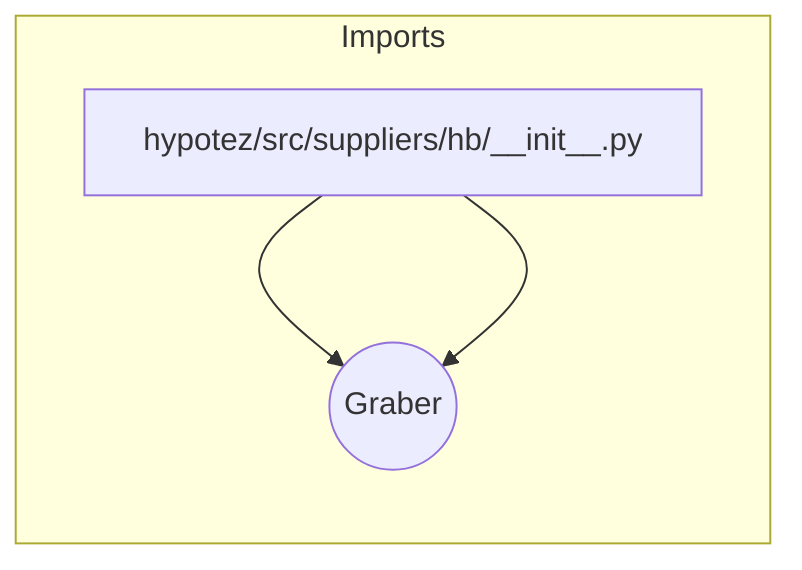

# <input code>

```python
## \file hypotez/src/suppliers/hb/__init__.py
# -*- coding: utf-8 -*-
#! venv/Scripts/python.exe
#! venv/bin/python/python3.12

"""
.. module: src.suppliers.hb 
	:platform: Windows, Unix
	:synopsis:

"""


from .graber import Graber
```

# <algorithm>

В данном файле `__init__.py` (часть пакета `suppliers.hb`) инициализируется модуль.  Он не содержит собственных функций или классов, но импортирует класс `Graber` из подпапки `.graber`.  В этом случае, алгоритм работы сводится к импорту.  Данные не перемещаются между функциями/классами в этом файле.

**Пример (блок-схема):**




# <mermaid>



**Объяснение диаграммы:**

Диаграмма демонстрирует единственную зависимость: модуль `__init__.py` в пакете `hypotez/src/suppliers/hb` импортирует класс `Graber` из модуля `graber.py` в подпапке `.graber`.  Отношение - импорт.


# <explanation>

* **Импорты:**
   - `from .graber import Graber`:  Эта строка импортирует класс `Graber` из модуля `graber.py`, который находится в той же директории, что и `__init__.py`.  Символ `.` означает, что импорт происходит из текущей директории. Это типичная практика для организации модулей внутри пакета.  Без дополнительных данных трудно понять функциональность самого `Graber`.  Связь с другими частями проекта неясна без доступа к `graber.py`.

* **Классы:**
   - `Graber`:  Класс `Graber` определен в `hypotez/src/suppliers/hb/graber.py`.  `__init__.py` не содержит информации о его атрибутах и методах.  Без `graber.py` нельзя сказать, как `Graber` взаимодействует с другими частями проекта.

* **Функции:**
   - Нет функций, определенных в данном файле.  Логика работы с данными, если она присутствует, скрыта внутри `Graber` и доступна только через `graber.py`.

* **Переменные:**
   - ``:  Эта переменная, вероятно, определяет режим работы (например, режим разработки `dev`, или `prod`), который может влиять на поведение других частей кода в рамках `Graber` или связанных с ним модулей.

* **Возможные ошибки или улучшения:**

   - Необходимо предоставить `graber.py` для более глубокого анализа.
   - Если `MODE` будет использоваться в `Graber`, лучше будет использовать константу (например, `CONST_MODE_DEV = 'dev'`) для повышения читаемости и возможности модификации в одном месте.
   - Нет явного указания, как класс `Graber` или модуль `graber.py` взаимодействуют с другими частями приложения. Без контекста невозможно оценить корректность и эффективность реализации.

* **Цепочка взаимосвязей:**

   - `__init__.py` зависит от `graber.py` (импорт).
   - `graber.py`, вероятнее всего, зависит от других модулей (например, для работы с данными или подключения к внешним сервисам), но эта информация отсутствует.  Чтобы увидеть полную картину, необходим доступ к другим модулям в проекте.


**Вывод:**

`__init__.py` выполняет базовую инициализацию для пакета `hb`.  Для более детального анализа необходимо предоставить код `hypotez/src/suppliers/hb/graber.py` и контекст его использования в проекте.