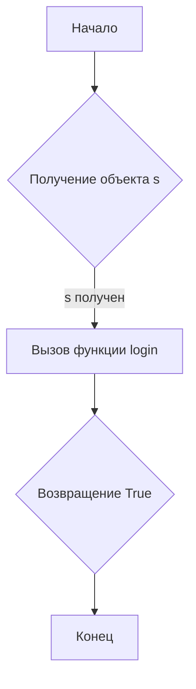

# <input code>

```python
## \file hypotez/src/suppliers/hb/login.py
# -*- coding: utf-8 -*-\n\n#! venv/bin/python/python3.12\n\n"""
.. module: src.suppliers.hb 
	:platform: Windows, Unix
	:synopsis:

"""


"""
	:platform: Windows, Unix
	:synopsis:

"""

"""
	:platform: Windows, Unix
	:synopsis:

"""


"""
  :platform: Windows, Unix

"""
"""
  :platform: Windows, Unix
  :platform: Windows, Unix
  :synopsis:
"""
  
""" module: src.suppliers.hb """


"""  Функции авторизации поставщика """
...
from src.logger import logger

def login(s) -> bool:
    """ Функция логин. 
   @param
        s - Supplier
    @returns
        True if login else False

   """
    return True
```

# <algorithm>



**Пример:**

Объект `s` (предположительно, представляющий поставщика) передается в функцию `login`. Функция `login` возвращает `True`, что означает успешную авторизацию.

# <mermaid>

```mermaid
graph LR
    subgraph "Модуль login.py"
        A[login(s)] --> B{Возвращение True};
    end
    subgraph "Модуль logger.py"
        C[logger]
    end
    A --> C;
```

**Объяснение диаграммы:**

Диаграмма показывает, что функция `login` (в файле `login.py`) использует объект `logger` из модуля `logger.py`.  Это указывает на зависимость функции `login` от логирования, которое происходит через объект `logger`.

# <explanation>

**Импорты:**

- `from src.logger import logger`:  Импортирует объект `logger` из модуля `logger`, расположенного в подпапке `src/` проекта.  Это указывает на то, что код использует систему логирования, предоставляемую другим модулем.  `src` скорее всего является корневой директорией проекта.

**Классы:**

Код не содержит определений классов.

**Функции:**

- `login(s) -> bool`:
    - **Аргументы:**
        - `s`: объект типа `Supplier` (предположительно).  Предполагается, что этот объект содержит информацию о поставщике, необходимую для аутентификации.
    - **Возвращаемое значение:**
        - `True`: если аутентификация прошла успешно.
        - `False`: если аутентификация не удалась.  Однако, в текущей реализации функция всегда возвращает `True`.
    - **Назначение:** Функция предназначена для проверки подлинности поставщика.
    - **Пример:** `login(supplier_object)` - вызов функции с объектом поставщика.

**Переменные:**

- ``:  Глобальная переменная, хранящая строку 'dev', возможно, для обозначения режима работы (разработки).

**Возможные ошибки и области для улучшений:**

- **Отсутствует реализация логики аутентификации:** Функция `login` в текущем виде возвращает всегда `True`, игнорируя фактический процесс аутентификации.  Необходимо добавить код, проверяющий данные поставщика.
- **Не определен тип Supplier:**  Код использует переменную `s`, предполагая, что это объект типа `Supplier`.  Необходимо определить класс `Supplier` и реализовать метод аутентификации в нем.
- **Недостаточное документирование:** Не хватает более подробных комментариев к функциональности и возможностям `Supplier`
- **Нет обработки ошибок:**  Функция `login` не обрабатывает ошибки, которые могут возникнуть при аутентификации (например, неверный логин или пароль).
- **Не используется логирование:**  Импортируется `logger`, но не используется.  Необходимо добавить использование `logger` для записи событий в журнал.

**Взаимосвязь с другими частями проекта:**

Функция `login` зависит от модуля `logger` для записи сообщений.  Проект likely состоит из нескольких модулей, взаимодействующих между собой для обработки операций с поставщиками.


```