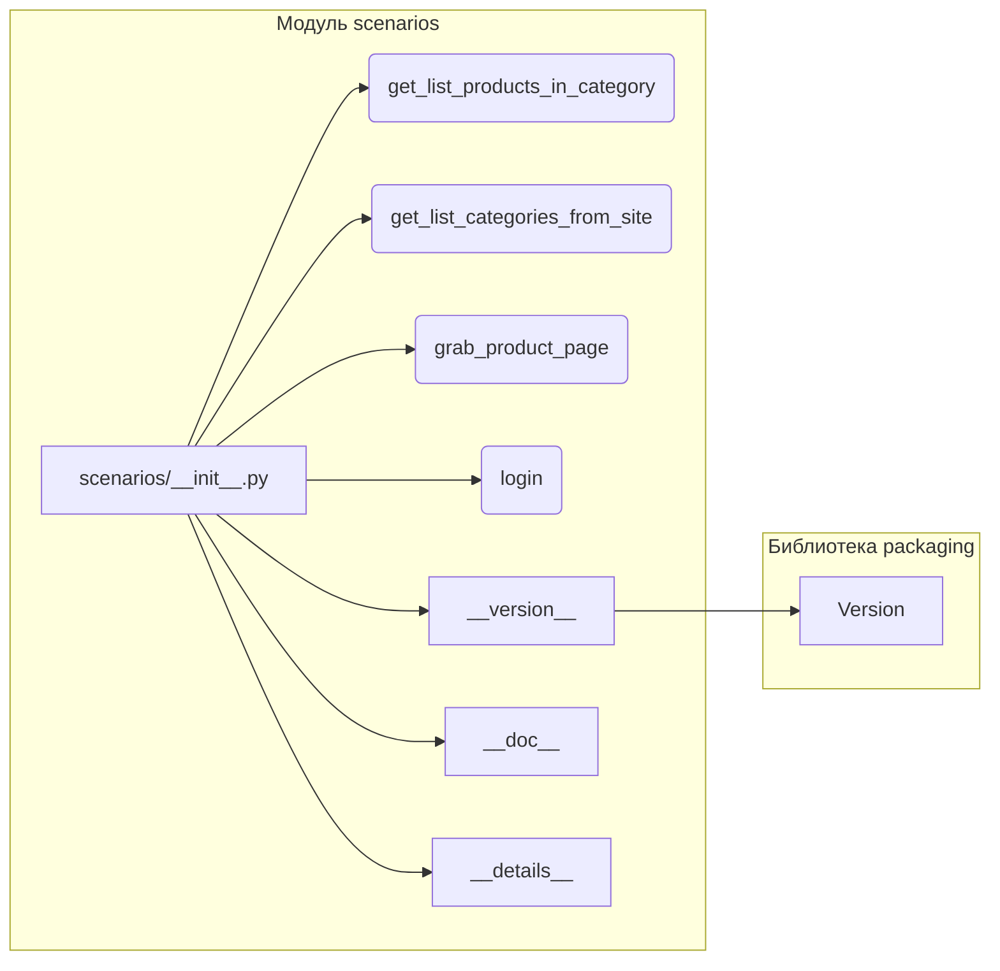

1. **<input code>**:

```python
## \file hypotez/src/suppliers/hb/scenarios/__init__.py
# -*- coding: utf-8 -*-

#! venv/bin/python/python3.12

"""
.. module: src.suppliers.hb.scenarios 
	:platform: Windows, Unix
	:synopsis:

"""


"""
	:platform: Windows, Unix
	:synopsis:

"""


"""
	:platform: Windows, Unix
	:synopsis:

"""


"""
  :platform: Windows, Unix

"""
"""
  :platform: Windows, Unix
  :platform: Windows, Unix
  :synopsis:
"""
  
""" module: src.suppliers.hb.scenarios """


"""  Поставщик <I>hb.co.il</I> """
...

from packaging.version import Version
from .version import __version__, __doc__, __details__  

from .categories import get_list_products_in_category, get_list_categories_from_site
from .grabber import grab_product_page
from .login import login
```

2. **<algorithm>**:

Этот код представляет собой инициализацию модуля `src.suppliers.hb.scenarios`.  Поскольку это `__init__.py` файл, он определяет интерфейс и импорты для всего пакета.  Алгебраическая структура отсутствует, так как нет циклов, рекурсии или сложных вычислений.  Алгоритм сводится к импорту функций и переменных из подмодулей.


3. **<mermaid>**:



**Описание диаграммы:**

Диаграмма показывает структуру импорта. Модуль `scenarios/__init__.py` импортирует функции и переменные из подмодулей (`.categories`, `.grabber`, `.login` и `.version`).  Важно, что модуль `packaging.version` импортируется через `__init__.py` и используется для работы с версиями.  

4. **<explanation>**:

* **Импорты**:
    * `from packaging.version import Version`: Импортирует класс `Version` из библиотеки `packaging`.  Эта библиотека, скорее всего, используется для работы с версиями пакетов, что типично для проектов, требующих совместимости с различными версиями зависимостей.  `src` - это корневая директория проекта.
    * `from .version import __version__, __doc__, __details__`: Импортирует переменные `__version__`, `__doc__`, `__details__` из модуля `.version` внутри текущего пакета. Это, скорее всего, метаданные о версии модуля (для использования в документации, управлении зависимостями и т.п.).
    * `from .categories import get_list_products_in_category, get_list_categories_from_site`: Импортирует функции `get_list_products_in_category` и `get_list_categories_from_site` из подмодуля `.categories`.  Предполагается, что эти функции отвечают за получение данных о продуктах и категориях из источника (например, веб-сайта).
    * `from .grabber import grab_product_page`: Импортирует функцию `grab_product_page` из модуля `.grabber`. Эта функция, вероятно, отвечает за получение данных о конкретной странице продукта.
    * `from .login import login`: Импортирует функцию `login` из модуля `.login`. Она, скорее всего, предназначена для аутентификации в системе.

* **Классы**:  В данном коде нет объявлений классов.

* **Функции**:
    * Функции `get_list_products_in_category`, `get_list_categories_from_site`, `grab_product_page`, и `login` описаны в отдельных модулях (`categories`, `grabber`, `login` соответственно) и доступны для использования в модуле `scenarios`.  У них нет явных определений в этом файле. Подробности о их аргументах, возвращаемых значениях и логике требуют анализа соответствующих файлов.

* **Переменные**:
    * ``: Переменная, хранящая строковое значение режима работы. Скорее всего, используется для определения конфигурации (например,  `dev`, `prod`).
    * `__version__`, `__doc__`, `__details__`: Переменные, представляющие собой атрибуты пакета, определённые в `version.py`

* **Возможные ошибки/улучшения**:
    * Не хватает комментариев к функциям и переменным.
    * Код сильно комментарий,  `...` предполагает наличие других не отображённых строк кода.
    * Отсутствуют проверки ошибок и обработка исключений.
    * Необходимо добавить больше информации о структуре данных, которые обрабатываются функциями.
    * Отсутствие примеров использования функций в `__init__.py`

**Связь с другими частями проекта**:

Этот `__init__.py` файл служит точкой входа для модулей, связанных с поставщиком `hb.co.il`.  Эти модули (`categories`, `grabber`, `login`) скорее всего содержат логику взаимодействия с API или веб-сайтом поставщика, а также логику обработки данных.  Для полного понимания необходимы эти файлы.