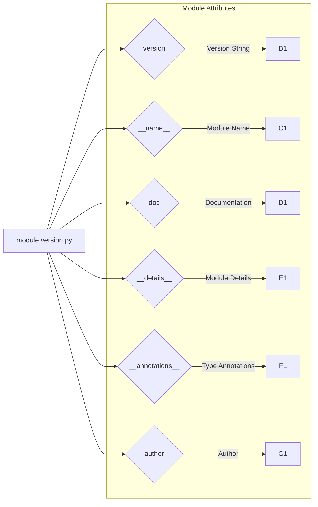

# <input code>

```python
## \file hypotez/src/suppliers/hb/scenarios/version.py
# -*- coding: utf-8 -*-\
#! venv/Scripts/python.exe
#! venv/bin/python/python3.12

"""
.. module: src.suppliers.hb.scenarios 
	:platform: Windows, Unix
	:synopsis:

"""


"""
	:platform: Windows, Unix
	:synopsis:

"""


"""
	:platform: Windows, Unix
	:synopsis:

"""


"""
  :platform: Windows, Unix

"""
"""
  :platform: Windows, Unix
  :platform: Windows, Unix
  :synopsis:
"""
  
""" module: src.suppliers.hb.scenarios """


"""
- `__version__`: This variable holds the version of the module or package.
- `__name__`: Contains the name of the module. If the script is being run directly, the value will be `"__main__"`.
- `__doc__`: The module's documentation string.
- `__details__`: This variable likely contains additional details about the module, but the exact purpose depends on the specific module or package.
- `__annotations__`: Contains type annotations for variables and functions in the module.
- `__author__`: The name(s) of the author(s) of the module.
"""
__name__:str
__version__="3.12.0.0.0.4"
__doc__:str
__details__:str="Details about version for module or class"
__annotations__

__author__='hypotez '
```

# <algorithm>

Этот код не содержит алгоритма в привычном понимании. Он определяет переменные, описывающие модуль (например, __version__), и содержит документацию, но не выполняет действий, управляющих потоком.  Вместо этого он  определяет атрибуты модуля `src.suppliers.hb.scenarios`.

# <mermaid>



# <explanation>

**Импорты**: Нет импортов в этом файле. Код определяет переменные и строки документации внутри модуля.

**Классы**: Нет классов в этом файле.

**Функции**: Нет функций в этом файле.

**Переменные**:
- `MODE`: Строковая переменная, содержащая значение 'dev'. Вероятно, используется для определения режима работы модуля.
- `__version__`: Строковая переменная, хранящая версию модуля (3.12.0.0.0.4).
- `__name__`: Строковая переменная, имя текущего модуля.
- `__doc__`: Строковая переменная, документирующая строка модуля.
- `__details__`: Строковая переменная, дополнительно описывающая модуль.
- `__annotations__`: Неиспользуемая переменная.
- `__author__`: Строковая переменная, имя автора модуля.

**Возможные ошибки или области для улучшений**:
- **Неиспользуемые переменные**: Переменная `__annotations__` объявлена, но не используется.  Возможно, в будущем будет добавлена функциональность, связанная с анотациями типов.
- **Документация**: Документация (строки `"""..."""`) очень подробная, но избыточна. Вероятно, нужно сократить излишнее многословие в документации.
- **Стандартизация**: Имена переменных `__version__`, `__name__` и т.д. — это стандартные для Python переменные, используемые для обозначения метаданных модуля. Следует использовать эти соглашения, чтобы код был понятен другим разработчикам, использующим его в других частях проекта.

**Цепочка взаимосвязей с другими частями проекта**:  Этот файл является частью проекта `hypotez`, и его переменные `MODE`, `__version__`, `__author__` могут быть использованы для конфигурации, управления версиями и авторами в других частях проекта. Без контекста всего проекта сложно сказать точно, как это будет применяться.