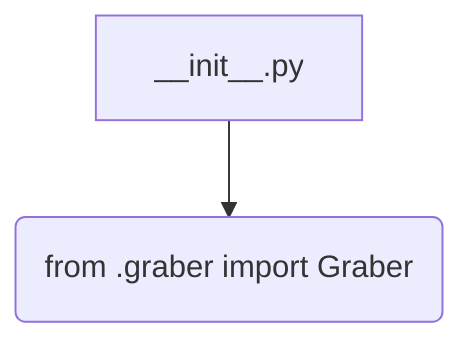
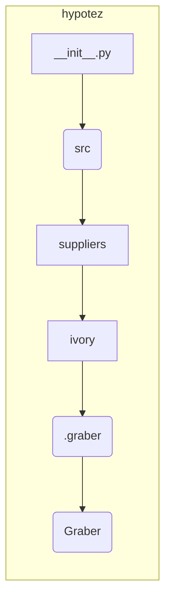

1. **<input code>**

```python
## \file hypotez/src/suppliers/ivory/__init__.py
# -*- coding: utf-8 -*-\
#! venv/Scripts/python.exe
#! venv/bin/python/python3.12

"""
.. module: src.suppliers.ivory 
	:platform: Windows, Unix
	:synopsis:

"""


from .graber import Graber
```

2. **<algorithm>**

Этот код представляет собой модуль `__init__.py` для пакета `ivory` внутри пакета `suppliers` в проекте `hypotez`.  Поскольку он пустой, кроме импорта, то блок-схема будет очень простой:



В этом случае алгоритм работы сводится к импорту класса `Graber` из модуля `graber.py`, находящегося в подпапке `ivory` пакета `suppliers` внутри пакета `src`.  Данные при этом не перемещаются, так как просто происходит импорт,  без вызова каких-либо функций.


3. **<mermaid>**



4. **<explanation>**

* **Импорты**:  `from .graber import Graber` импортирует класс `Graber` из модуля `graber.py`, который находится в той же директории (`ivory`).  Символ `.` указывает, что модуль `graber.py` находится в подпапке `ivory` пакета `suppliers`. Эта строка импортирует класс `Graber` из подпапки `graber` пакета `suppliers/ivory`.   Важно понимать, что `__init__.py` файлы нужны для того, чтобы папки python воспринимались как пакеты.

* **Классы**:  Код импортирует класс `Graber`, но сам класс `Graber` не определен в текущем файле `__init__.py`. Этот класс, скорее всего, определен в файле `graber.py`, находящемся внутри папки `ivory`.  Без доступа к коду `graber.py` невозможно полноценно описать функциональность `Graber`.

* **Функции**:  В `__init__.py` нет определенных функций.  Все функции, которые могут быть, находятся в классе `Graber`, который импортирован.

* **Переменные**:  ``  определяет переменную, скорее всего, для настройки режима работы программы (например, 'dev', 'prod').  Это константное значение типа `str`.

* **Возможные ошибки или области для улучшений**:

    * Нет явной обработки ошибок при импорте `Graber`. Если `graber.py` не существует или в нем нет определения класса `Graber`, то произойдет ошибка `ImportError`.  Это можно улучшить, добавив проверку существования файла или блока `try...except`.

    * Отсутствие документации для переменной `MODE`.  Стоит добавить строку документации (docstring) для пояснения ее назначения.

* **Цепочка взаимосвязей**:

    Модуль `__init__.py` из пакета `ivory` импортирует класс `Graber` из подпапки `graber` этого же пакета.  Это указывает на то, что класс `Graber` и связанный с ним функционал в файле `graber.py` предназначен для использования другими частями проекта, которые могут импортировать его через `ivory`.

    Например, `ivory` может быть частью системы сбора данных, и `Graber` является классом, отвечающим за чтение данных от поставщика `Ivory`.

    Для детального понимания, необходимо проанализировать код `graber.py`.