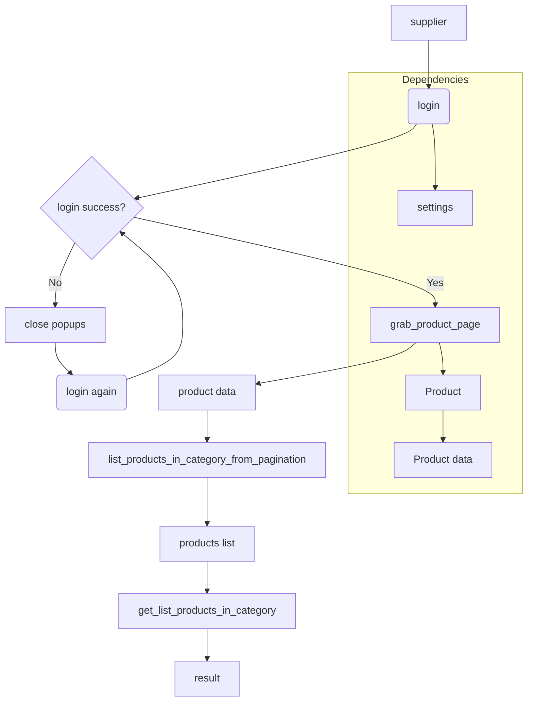

# <input code>

```python
## \file hypotez/src/suppliers/ivory/__morlevi__.py
# -*- coding: utf-8 -*-\
#! venv/Scripts/python.exe
#! venv/bin/python/python3.12

"""
.. module: src.suppliers.ivory 
	:platform: Windows, Unix
	:synopsis:

"""


"""
	:platform: Windows, Unix
	:synopsis:

"""


"""
	:platform: Windows, Unix
	:synopsis:

"""


"""
  :platform: Windows, Unix

"""
"""
  :platform: Windows, Unix
  :platform: Windows, Unix
  :synopsis:
"""
  
""" module: src.suppliers.ivory """


"""    Supplier: morlevi


@namespace src: src
 \package src.suppliers.morlevi
\file __morlevi__.py
 
 @section libs imports:
  - pathlib 
  - requests 
  - pandas 
  - selenium.webdriver.remote.webelement 
  - selenium.webdriver.common.keys 
  - gs 
  - gs 
  - suppliers.Product 
  
Author(s):
  - Created by [Name] [Last Name] on 07.11.2023 .
"""


from pathlib import Path
import requests
import pandas as pd

from selenium.webdriver.remote.webelement import WebElement 
from selenium.webdriver.common.keys import Keys

import settings 
from src.settings import StringFormatter
json_loads = settings.json_loads
logger = settings.logger
from src.suppliers.Product import Product 


def login(supplier):
    # ... (login function code)
    pass

def _login(_s):
    # ... (_login function code)
    pass

def grab_product_page(s):
    # ... (grab_product_page function code)
    pass

def list_products_in_category_from_pagination(supplier):
    # ... (list_products_in_category_from_pagination function code)
    pass

def get_list_products_in_category(s, scenario, presath):
    # ... (get_list_products_in_category function code)
    pass

def get_list_categories_from_site(s,scenario_file,brand=''):
    # ... (get_list_categories_from_site function code)
    pass
```

# <algorithm>

**Функция `login`:**

1. Принимает объект `supplier` (предположительно, содержащий информацию о поставщике, включая драйвер браузера).
2. Передает управление функции `_login`.
3. Если `_login` возвращает `True`, возвращает `True`.
4. Если `_login` возвращает `None` или невозвращает значения, выполняет попытку закрыть модальные окна сайта, используя локеры.
5. Если после попыток закрытия модальных окон функция `_login` возвращает `True`, возвращает `True`.
6. В противном случае выводит ошибку в `logger` и возвращает `None`.

**Функция `_login`:**

1. Выводит в лог сообщение о начале процесса логина.
2. Обновляет страницу браузера.
3. Поиск элементов на странице, используя локеры.
4. Выполняет операции с элементами (ввод данных, нажатие кнопок).
5. Выводит в лог сообщение о успешном логине.
6. Возвращает `True`.
7. Обрабатывает исключения и записывает ошибку в лог. Возвращает `None`.


**Функция `grab_product_page`:**

1. Создает объект `Product` с переданным поставщиком.
2. Получает локеры для элементов страницы продукта.
3. Закрывает всплывающее окно, если оно есть.
4. Выполняет ряд функций, которые устанавливают значения атрибутов объекта `Product` (id, sku, название, цену, описание и т.д.)
5. Возвращает объект `Product`.


**Функция `list_products_in_category_from_pagination`:**

1. Принимает объект `supplier` (поставщик).
2. Получает список ссылок на продукты в текущей категории.
3. Если список пустой или `None`, возвращает пустой список.
4. Перебирает ссылки на продукты.
5. Получает список продуктов с новой страницы.
6. Добавляет новые продукты в общий список.
7. Получает ссылки на следующие страницы.
8. Переходит на следующую страницу.
9. Если ссылки на следующую страницу отсутствуют или переход не изменил текущую страницу, прерывает цикл.
10. Возвращает отфильтрованный список продуктов.


**Функция `get_list_products_in_category`:**

1. Вызывает функцию `list_products_in_category_from_pagination`.
2. Возвращает результат.


# <mermaid>



**Объяснение диаграммы:**

Диаграмма показывает основные функции и их взаимосвязь.

- **`supplier`:** Начальная точка входа.
- **`login`:**  Функция для авторизации у поставщика.
- **`grab_product_page`:**  Обработка данных конкретного продукта.
- **`list_products_in_category_from_pagination`:** Получение списка продуктов из категории (с постраничной навигацией).
- **`get_list_products_in_category`:**  Объединение результата перебора страниц.
- **`Product`:** Класс для работы с продуктами.

**Подключаемые зависимости:**

- **`settings`:**  Файл настроек, содержит конфигурационные параметры.
- **`Product`:** Класс для обработки данных о продукте, вероятно, из другого модуля.


# <explanation>

**Импорты:**

- `pathlib`:  Для работы с путями к файлам.
- `requests`:  Для отправки HTTP-запросов (вероятно, для работы с API).
- `pandas`:  Для работы с таблицами данных.
- `selenium.webdriver.remote.webelement`:  Для работы с элементами веб-страницы.
- `selenium.webdriver.common.keys`:  Для работы с нажатием клавиш.
- `settings`:  Импорт файла настроек, вероятно с логированием.
- `StringFormatter`:  Для обработки строк, возможно форматирования цен или URL.
- `Product`:  Из модуля `src.suppliers`.  Предполагается, что `Product` хранит данные о продукте и имеет методы для работы с этими данными.

**Классы:**

- `Product`:  Представляет собой продукт. Содержит атрибуты для хранения информации о продукте, и вероятно методы для её обработки.
- `StringFormatter`:  Управляет обработкой строк.


**Функции:**

- `login`:  Авторизуется на сайте поставщика.  Принимает объект `supplier` (вероятно, содержащий информацию о поставщике и сессии браузера). Возвращает `True` при успешной авторизации, `None` в противном случае.
- `_login`:  Внутренняя функция для выполнения самого процесса логина.
- `grab_product_page`:  Получает данные о конкретном продукте.
- `list_products_in_category_from_pagination`:  Получает список продуктов из категории с постраничной навигацией.
- `get_list_products_in_category`:  Обрабатывает результат перебора.
- `get_list_categories_from_site`:  Не реализована, но функция для получения списка категорий.


**Переменные:**

- `MODE`:  Флаг режима работы, `dev` или `prod`.
- `supplier`:  Объект, содержащий информацию о поставщике,  логично, что `supplier` содержит драйвер браузера и другие данные для работы с поставщиком.
- `s`, `_s`, `_d`:  Обычно используются в качестве сокращений для объекта `supplier`.

**Возможные ошибки и улучшения:**

- Недостаточно комментариев. Необходимо улучшить документирование кода.
- Не указаны локеры для поиска элементов на сайте.  Их наличие является критичным.
- Нет проверки на ошибки при работе с веб-элементами.  Необходимо использовать `try-except` блоки для предотвращения аварийных остановок.
- В коде есть фрагменты, которые напоминают "заглушки" (например, `set_combinations`, `set_qty`), что требует дальнейшей разработки.
- Нет ясной структуры организации данных.  Необходимо тщательнее продумать структуру хранения данных.
- Возможны проблемы с обработкой исключений, например, `Exception as ex` - ловит все исключения, и не позволяет понять, какое исключение.
- Отсутствие ясности в функциональности `StringFormatter`.
- Неизвестно, какие данные хранятся в `scenario` и `presath`.

**Взаимосвязи с другими частями проекта:**

Код использует классы и функции из других модулей (например, `settings`, `Product`).   Это указывает на наличие других модулей, которые обеспечивают поддержку для работы с поставщиком данных.