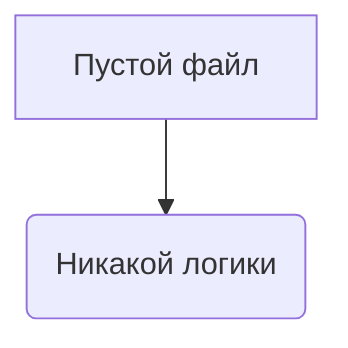

## <input code>

```python
## \file hypotez/src/suppliers/ivory/login.py
# -*- coding: utf-8 -*-\

#! venv/bin/python/python3.12

"""
.. module: src.suppliers.ivory 
	:platform: Windows, Unix
	:synopsis:

"""


"""
	:platform: Windows, Unix
	:synopsis:

"""


"""
	:platform: Windows, Unix
	:synopsis:

"""


"""
  :platform: Windows, Unix

"""
"""
  :platform: Windows, Unix
  :platform: Windows, Unix
  :synopsis:
"""
  
""" module: src.suppliers.ivory """


""" supplier: IVORY """

```

## <algorithm>

Этот код представляет собой пустой файл. Он не содержит никакой логики, а только комментарии.  Блок-схема в этом случае не применима.

## <mermaid>



## <explanation>

Этот Python-файл `login.py` в директории `hypotez/src/suppliers/ivory` является пустым, за исключением большого количества комментариев.  Комментарии документации (`"""Docstrings"""`) описывают модуль, но не содержат никакого функционального кода.

**Импорты**: Отсутствуют.  Файл не использует импорт других модулей.

**Классы**: Нет.  Файл не определяет классы.

**Функции**: Нет.  Файл не содержит функций.

**Переменные**: Единственная переменная `MODE`, имеющая строковое значение `'dev'`, определена внутри файла и не используется.  Это, вероятно, константа, задающая режим работы.

**Возможные ошибки или области для улучшений**:

* **Потенциальная путаница**: Наличие множества пустых комментариев может сбить с толку.  Если эта пустота не преднамеренная, то файл нужно очистить или задокументировать, что он предназначен быть пустым.
* **Неиспользуемые переменные**: Переменная `MODE` определена, но не используется.

**Взаимосвязь с другими частями проекта**:  Так как файл пустой, то нет никакой связи с другими частями проекта.  Вероятно, он предназначен для будущей разработки функций авторизации для поставщика услуг "IVORY".  Итоговая цепочка взаимосвязи пуста, кроме упоминания о необходимости последующей реализации логики в нем.