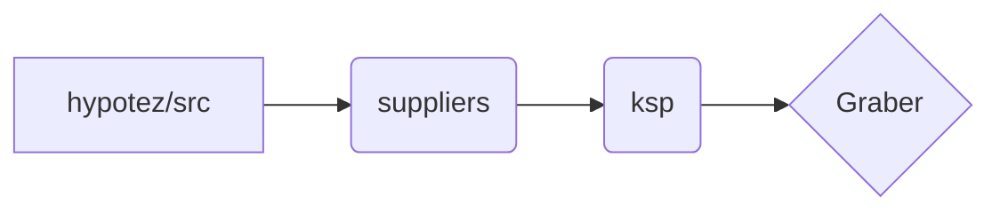

```MD
# <input code>

```python
## \file hypotez/src/suppliers/ksp/__init__.py
# -*- coding: utf-8 -*-
#! venv/Scripts/python.exe
#! venv/bin/python/python3.12

"""
.. module: src.suppliers.ksp 
	:platform: Windows, Unix
	:synopsis:

"""


from .graber import Graber
```

# <algorithm>

Этот код представляет собой начальную точку входа для модуля `ksp` внутри пакета `suppliers` в проекте `hypotez`. Алгоритм очень прост: он импортирует класс `Graber` из подмодуля `graber`.  В данном случае,  алгоритм сводится к импорту и не содержит вычислений или действий, влияющих на состояние системы.

**Пример:**

Нет необходимости в блок-схеме, так как код не содержит циклов или сложных условных выражений.

**Передача данных:**

Нет передачи данных. Импорт не изменяет состояние программы, он лишь делает класс `Graber` доступным для использования в других частях проекта.


# <mermaid>



**Объяснение диаграммы:**

* `hypotez/src`: Корневая директория проекта.
* `suppliers`: Подпапка, содержащая поставщики данных.
* `ksp`: Подпапка для поставщика данных `ksp`.
* `Graber`:  Класс, определённый в файле `graber.py` внутри папки `ksp`.  Диаграмма показывает импорт `Graber` из модуля `ksp`.

# <explanation>

* **Импорты:**
    * `from .graber import Graber`:  Импортирует класс `Graber` из файла `graber.py`, который находится в подпапке `ksp` внутри пакета `suppliers`.  Символ `.` перед `graber` указывает на то, что модуль `graber` находится в той же директории, что и текущий файл. Этот импорт делает класс `Graber` доступным для использования в текущем файле `__init__.py`.  В рамках пакета `src` это гарантирует корректную работу импорта без необходимости использования абсолютных путей.

* **Классы:**
    * `Graber`: Класс, вероятно, определён в файле `graber.py`.  Данный файл, судя по контексту, содержит реализацию логики получения данных от источника `ksp`. Определяющие особенности этого класса, его атрибуты и методы,  неизвестны без рассмотрения  `graber.py`.

* **Функции:**
    * Нет определённых функций в данном файле.

* **Переменные:**
    * ``: Строковая константа, которая, вероятно, определяет режим работы,  например, `dev` (разработка) или `prod` (производство). Она используется для конфигурации приложения.

* **Возможные ошибки или области для улучшений:**
    * Нет явного указания предназначения переменной `MODE`.  Необходимо добавить комментарий, поясняющий, как эта константа используется в других частях проекта.
    * Необходимо, чтобы `graber.py` содержал полную реализацию класса `Graber`.

* **Взаимосвязи с другими частями проекта:**
    * Этот файл `__init__.py`  служит для импорта `Graber`.   Логика работы `Graber` находится в `graber.py` и, вероятно, зависит от других модулей для работы с источником данных `ksp`, но без `graber.py` это не определить. Код  напрямую взаимодействует с функциональностью `Graber`, но неизвестно с какими еще компонентами проекта.
    *  Неясно, как используется `Graber` в других частях проекта.  Чтобы оценить его взаимодействие с другими компонентами, необходим дальнейший анализ.

**Общий вывод:**

Файл `__init__.py` для модуля `ksp` служит лишь для экспорта класса `Graber` без явных вычислений.  Следующий шаг — анализ содержимого `graber.py` для понимания полной функциональности и взаимосвязей с другими частями проекта.