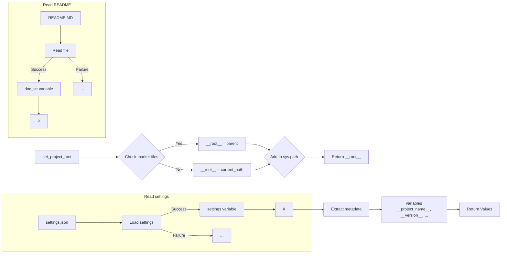

```MD
# <input code>

```python
## \file hypotez/src/suppliers/ksp/header.py
# -*- coding: utf-8 -*-\
#! venv/Scripts/python.exe
#! venv/bin/python/python3.12

"""
.. module: src.suppliers.ksp 
	:platform: Windows, Unix
	:synopsis:

"""


import sys
import json
from packaging.version import Version

from pathlib import Path
def set_project_root(marker_files=('__root__')) -> Path:
    """
    Finds the root directory of the project starting from the current file's directory,
    searching upwards and stopping at the first directory containing any of the marker files.

    Args:
        marker_files (tuple): Filenames or directory names to identify the project root.
    
    Returns:
        Path: Path to the root directory if found, otherwise the directory where the script is located.
    """
    __root__:Path
    current_path:Path = Path(__file__).resolve().parent
    __root__ = current_path
    for parent in [current_path] + list(current_path.parents):
        if any((parent / marker).exists() for marker in marker_files):
            __root__ = parent
            break
    if __root__ not in sys.path:
        sys.path.insert(0, str(__root__))
    return __root__


# Get the root directory of the project
__root__ = set_project_root()
"""__root__ (Path): Path to the root directory of the project"""

from src import gs

settings:dict = None
try:
    with open(gs.path.root / 'src' / 'settings.json', 'r') as settings_file:
        settings = json.load(settings_file)
except (FileNotFoundError, json.JSONDecodeError):
    ...

doc_str:str = None
try:
    with open(gs.path.root / 'src' / 'README.MD', 'r') as settings_file:
        doc_str = settings_file.read()
except (FileNotFoundError, json.JSONDecodeError):
    ...


__project_name__ = settings.get("project_name", 'hypotez') if settings  else 'hypotez'
__version__: str = settings.get("version", '')  if settings  else ''
__doc__: str = doc_str if doc_str else ''
__details__: str = ''
__author__: str = settings.get("author", '')  if settings  else ''
__copyright__: str = settings.get("copyrihgnt", '')  if settings  else ''
__cofee__: str = settings.get("cofee", "Treat the developer to a cup of coffee for boosting enthusiasm in development: https://boosty.to/hypo69")  if settings  else "Treat the developer to a cup of coffee for boosting enthusiasm in development: https://boosty.to/hypo69"
```

# <algorithm>

**Шаг 1:** Определение корневой директории проекта.
    * Функция `set_project_root` ищет корень проекта, начиная с текущей директории и поднимаясь по иерархии каталогов.
    * Она проверяет наличие файлов `pyproject.toml`, `requirements.txt` и `.git` в родительских директориях.
    * Первый найденный каталог, содержащий хотя бы один из указанных файлов, считается корнем проекта.
    * Если корень не найден, возвращается текущая директория.
    * Корневая директория добавляется в `sys.path`.

**Шаг 2:** Чтение настроек из файла `settings.json`.
    * Используется модуль `json` для чтения файла `settings.json` в переменную `settings`.
    * Обработка исключений `FileNotFoundError` и `json.JSONDecodeError` в случае проблем с чтением.

**Шаг 3:** Чтение документации из файла `README.MD`.
    * Используется модуль `json` для чтения файла `README.MD` в переменную `doc_str`.
    * Обработка исключений `FileNotFoundError` и `json.JSONDecodeError` в случае проблем с чтением.

**Шаг 4:** Получение метаданных проекта.
    * Из переменной `settings` извлекаются значения для `project_name`, `version`, `author`, `copyright`, `cofee` при наличии.
    * В случае отсутствия соответствующих значений в файле `settings.json`, используются значения по умолчанию.
    * Значения записываются в соответствующие переменные.

**Пример:**
Предположим, файл `settings.json` в директории `project/src/` содержит:
```json
{
  "project_name": "MyProject",
  "version": "1.0.0",
  "author": "John Doe"
}
```
В этом случае переменные `__project_name__`, `__version__`, `__author__` будут содержать соответствующие значения.

# <mermaid>



**Объяснение диаграммы:**

Диаграмма иллюстрирует взаимосвязь функций и классов в коде. Функция `set_project_root` ищет корень проекта, считывает `settings.json` и `README.MD`, а затем использует полученные данные для заполнения метаданных проекта.

# <explanation>

**Импорты:**

* `sys`: Используется для управления переменной `sys.path` и работы с аргументами командной строки.
* `json`:  Для работы с файлами JSON (чтение/запись настроек).
* `packaging.version`:  Для работы с версиями пакетов.
* `pathlib`: Для работы с путями к файлам и каталогам.
* `src.gs`:  Связь с другим модулем в `src` (вероятно, содержит утилиты для работы с путями).


**Классы:**

В коде нет классов, только функции.


**Функции:**

* `set_project_root(marker_files=...)`:  Находит корневую директорию проекта, начиная с текущего файла и проходя вверх по дереву каталогов.  Возвращает `Path` к корневой директории.  Этот метод важен для корректного импортирования и поиска файлов во время выполнения.
* `load_settings()` (неявная): Не имеет отдельной функции для считывания настроек, но включает логику чтения файла `settings.json` с использованием `try-except` для обработки ошибок.
* `load_documentation()` (неявная): Не имеет отдельной функции для считывания документации, но включает логику чтения файла `README.MD` с использованием `try-except` для обработки ошибок.

**Переменные:**

* `MODE`:  Строковая переменная, вероятно, задаёт режим работы (например, "dev" или "prod").
* `settings`: Словарь, хранящий настройки из `settings.json`.
* `doc_str`: Строка, хранящая содержимое `README.MD`.
* `__root__`, `__project_name__`, `__version__`, `__doc__`, `__details__`, `__author__`, `__copyright__`, `__cofee__`:  Переменные, хранящие метаданные проекта.

**Возможные ошибки и улучшения:**

* **Обработка ошибок:**  Обработка ошибок `FileNotFoundError` и `json.JSONDecodeError` неплоха, но рекомендуется более детальная диагностика (например, выводить сообщения об ошибках в `stderr` для лучшей отладки).
* **Использование `__all__`:** В модуле не указан список импортируемых переменных, что может привести к проблемам с динамической загрузкой.
* **Документация:** Документация внутри модуля, хотя и используется, не так подробна, как могла бы быть.  Сделайте её более понятной для последующего использования.


**Взаимосвязи с другими частями проекта:**

Модуль `gs` (с помощью `gs.path.root`) указывает на наличие других компонентов в `src`, скорее всего, это набор общих утилит для работы с файлами и директориями.  Указание на наличие корневой директории в `gs` полезно для создания относительно независимого кода.