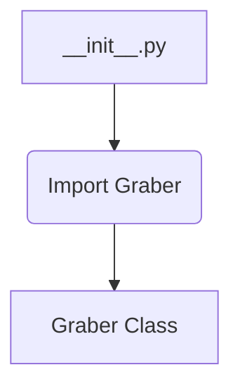

# <input code>

```python
## \file hypotez/src/suppliers/kualastyle/__init__.py
# -*- coding: utf-8 -*-
#! venv/Scripts/python.exe
#! venv/bin/python/python3.12

"""
.. module: src.suppliers.kualastyle 
	:platform: Windows, Unix
	:synopsis:

"""


from .graber import Graber
```

# <algorithm>

В этом файле `__init__.py` модуля `kualastyle` происходит импорт класса `Graber` из подмодуля `graber`.  Алгоритм состоит из единственной операции – импорта. Нет циклов, ветвлений, вычислений – только импорт.

**Пример:**

На вход подаётся имя модуля `graber`. Результатом является доступ к классу `Graber` в текущем пространстве имён.

**Блок-схема:**



# <mermaid>


**Объяснение диаграммы:**

Диаграмма показывает единственную зависимость: файл `__init__.py` импортирует класс `Graber` из модуля `graber`, который находится в том же каталоге.  Это стандартная практика для организации кода в Python.


# <explanation>

* **Импорты**:
   `from .graber import Graber`:  Этот импорт подключает класс `Graber` из модуля `graber`, который находится в той же директории, что и `__init__.py`.  `.` указывает, что импортируемый модуль находится в подпапке `graber` текущего модуля `kualastyle`.  Это характерно для организации Python-проектов с иерархией пакетов.


* **Классы**:
   Нет объявления классов внутри `__init__.py`.  Данный файл лишь предоставляет доступ к классу `Graber` из модуля `graber`.  Фактическое определение `Graber` находится в `hypotez/src/suppliers/kualastyle/graber.py`.

* **Функции**:
    Нет функций в данном файле.

* **Переменные**:
    ``:  Это строковая переменная, вероятно, хранит режим работы (например, `dev`, `prod`), но без дальнейшего контекста её назначение сложно определить.

* **Возможные ошибки или области для улучшений**:
   - Файл `__init__.py` очень прост, и его назначение не столь очевидно. Для улучшения, можно добавить комментарии о назначении этого файла.
   - Отсутствует документация, описывающая класс `Graber` или его методы.

**Цепочка взаимосвязей:**

Файл `__init__.py` связывает пользователя с классом `Graber`.  `Graber` , скорее всего, предназначен для работы с данными, собираемыми  из внешних источников (например, веб-сайтов).  Следующий шаг для анализа – просмотреть код в `graber.py`.