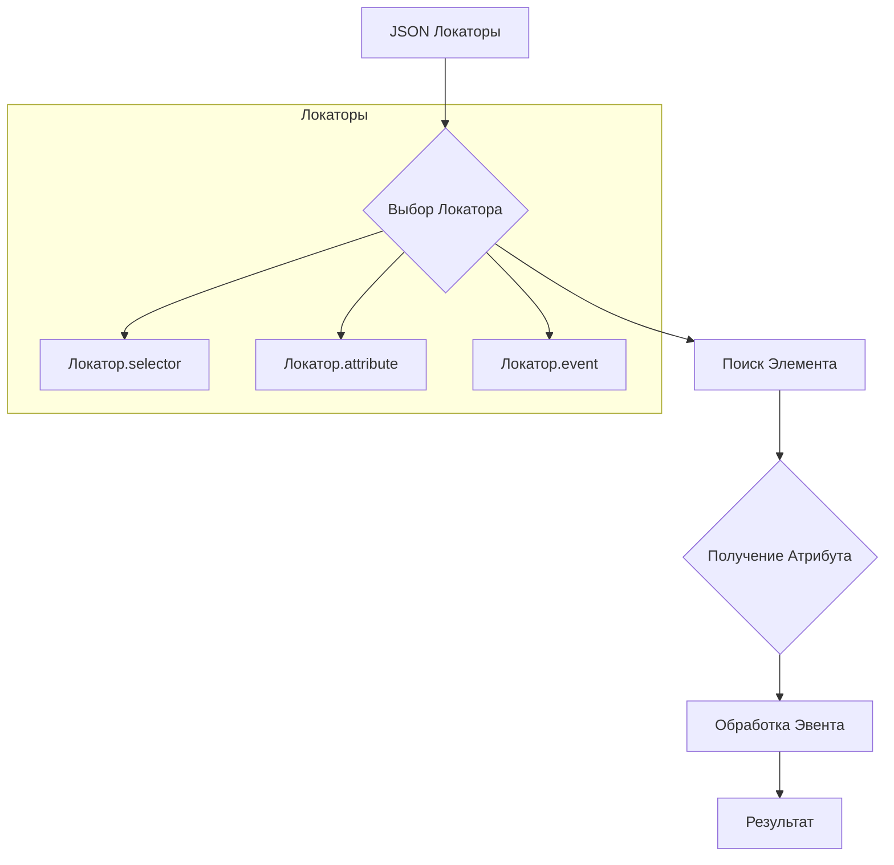

# Локаторы полей на HTML-странице

```markdown
### Пример локатора:

```json
"close_banner": {
    "attribute": null,
    "by": "XPATH",
    "selector": "//button[@id = 'closeXButton']",
    "if_list": "first",
    "use_mouse": false,
    "mandatory": false,
    "timeout": 0,
    "timeout_for_event": "presence_of_element_located",
    "event": "click()",
    "locator_description": "Закрываю pop-up окно. Если оно не появилось — не страшно (`mandatory`: `false`)."
  },
  "additional_images_urls": {
    "attribute": "src",
    "by": "XPATH",
    "selector": "//ol[contains(@class, 'flex-control-thumbs')]//img",
    "if_list": "all",
    "use_mouse": false,
    "mandatory": false,
    "timeout": 0,
    "timeout_for_event": "presence_of_element_located",
    "event": null,
    "locator_description": "Получает список `url` дополнительных изображений."
  },
  "id_supplier": {
    "attribute": "innerText",
    "by": "XPATH",
    "selector": "//span[@class = 'ltr sku-copy']",
    "if_list": "first",
    "use_mouse": false,
    "mandatory": true,
    "timeout": 0,
    "timeout_for_event": "presence_of_element_located",
    "event": null,
    "locator_description": "SKU Morlevi."
  },
  "default_image_url": {
    "attribute": null,
    "by": "XPATH",
    "selector": "//a[@id = 'mainpic']//img",
    "if_list": "first",
    "use_mouse": false,
    "timeout": 0,
    "timeout_for_event": "presence_of_element_located",
    "event": "screenshot()",
    "mandatory": true,
    "locator_description": "Внимание! В Morlevi картинка получается через screenshot и возвращается как PNG (`bytes`)."
  }
```
```

## <algorithm>

**Шаг 1:**  Чтение локатора из JSON файла.
```
[JSON файл] -> [Локаторы]
```
**Пример:** Файл `product.json` содержит определения локаторов.

**Шаг 2:**  Выбор локатора по имени.
```
[Имя поля] -> [Локатор]
```
**Пример:**  По имени поля `default_image_url` выбирается соответствующий локатор.

**Шаг 3:** Выполнение события (event).
```
[Локатор.event] -> [Действие с элементом]
```
**Пример:** Если `event` равно `click()`, клик по элементу. Если `event` равно `screenshot()`, создание скриншота.

**Шаг 4:** Поиск элемента по селектору (selector).
```
[Локатор.selector] -> [Найденный элемент]
```
**Пример:** Используя XPath выражение `"//a[@id = 'mainpic']//img"` находим изображение.

**Шаг 5:** Получение атрибута (attribute).
```
[Найденный элемент] -> [Атрибут]
```
**Пример:** Если `attribute` равно `'src'`, то получаем значение атрибута `src`.

**Шаг 6:** Возврат результата.
```
[Атрибут] -> [Функция]
```
**Пример:** Значение атрибута (например, URL изображения) возвращается вызывающей функции.


## <mermaid>



## <explanation>

**Импорты:** Нет импортов.  Код представляет собой JSON-описания локаторов для веб-элементов, используемых, вероятно, в скрипте автоматизации тестирования веб-приложений.

**Классы:**  Нет классов.  Код определяет лишь данные, а не код для их использования.  Скорее всего, эти данные используются для инстанцирования Web-драйвера и взаимодействия с веб-страницей.


**Функции:** Нет функций.  Код содержит только данные JSON.  Функции, обрабатывающие эти локаторы, должны находиться в другом месте (например, в коде Python, Java или других языках программирования).


**Переменные:**  Ключи JSON (например, `attribute`, `by`, `selector`) являются именами переменных, содержащих значения для нахождения элементов на веб-странице.  Значения этих переменных (например, `null`, `"XPATH"`, `"//button[@id = 'closeXButton']"`) определяют, как и что искать.


**Возможные ошибки и улучшения:**

* **Жесткая привязка к структуре:** Локаторы основаны на XPath и CSS-селекторах, которые могут быть нестабильными при изменении структуры веб-страницы. Рекомендуется использовать более устойчивые локаторы (например, `id`, `name`).
* **Отсутствие валидации данных:**  Нет механизмов проверки корректности данных локаторов (например, тип данных `selector`, наличие обязательных полей).
* **Масштабирование:**  Для большого количества локаторов желательно использовать структурированный способ хранения (например, база данных), чтобы упростить поддержание и обновление.
* **Ошибки во время выполнения:**  Если элемент не найден, может возникнуть исключение, которое не обрабатывается в данном примере.  Обработка таких исключений (например, ожидание элемента, проверка наличия элемента) важна для устойчивости скрипта.
* **Тип данных:**  В JSON используются строки для хранения типов данных (например, `"XPATH"`), что делает код менее гибким и менее удобным для обработки.  Использование перечислений или типов данных Python может сделать код более читабельным и устойчивым.


**Взаимосвязи с другими частями проекта:**

Локаторы связаны с классом `ProductFields` (см. ссылку в исходном коде). Это указывает на то, что данные локаторов используются для поиска и работы с данными о продуктах (или другими элементами).  Локаторы необходимы для скриптов автоматизации (граберы или тестирующие программы), которые работают с веб-страницами.  Взаимосвязь может заключаться в вызове функций, которые используют эти локаторы, из классов или скриптов, которые обрабатывают данные о продуктах.


**Дополнительные замечания:**

Для лучшей практики рекомендуется использовать файлы локаторов по отдельности (например, `product.json`, `product_mobile.json`) в зависимости от текущей версии или разновидности страницы, с которой работают ваши скрипты.  Это сделает процесс обновления и поддержания локаторов более управляемым и менее сложным.