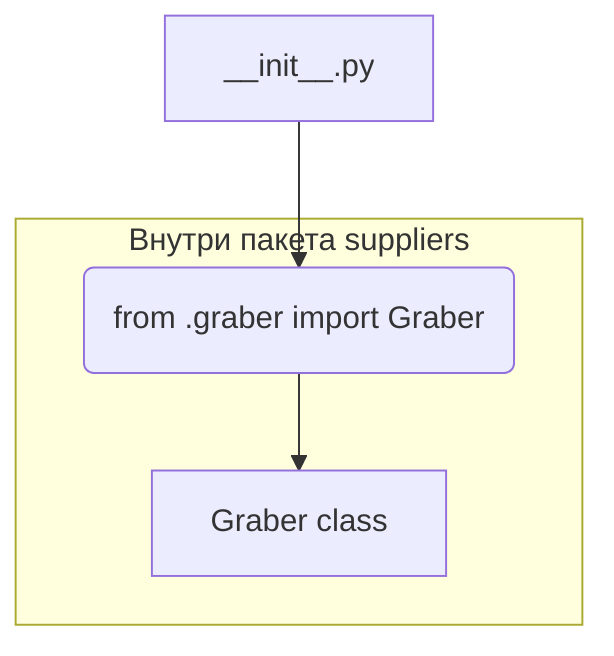

# <input code>

```python
## \file hypotez/src/suppliers/wallashop/__init__.py
# -*- coding: utf-8 -*-
#! venv/Scripts/python.exe
#! venv/bin/python/python3.12

"""
.. module: src.suppliers.wallashop 
	:platform: Windows, Unix
	:synopsis:

"""
MODE = 'dev'

from .graber import Graber
```

# <algorithm>

Этот код является инициализационной частью модуля `wallashop` внутри пакета `suppliers`.  Алгоритм прост: он импортирует класс `Graber` из подмодуля `graber`.  Дальнейшая логика, вероятно, будет реализована в файлах, которые импортируют этот модуль, а не внутри него самого.



Пример:  Если в другом модуле (например, `main.py`) импортируется `wallashop`, то он получит доступ к классу `Graber` для дальнейшего использования.

# <mermaid>

```mermaid
graph LR
    A[wallashop/__init__.py] --> B(Graber);
    subgraph "Внутренние зависимости"
        B -- импорт -- C(.graber);
    end
```

# <explanation>

* **Импорты**:
    * `from .graber import Graber`:  Этот импорт достает класс `Graber` из файла `graber.py`, который находится в той же директории (`.`)  относительно текущего файла `__init__.py`.  Это стандартная Python-система импорта модулей внутри пакета.  Связь с другими пакетами через `src.` подразумевает, что этот код является частью более крупного проекта, где `src` — корневая директория проекта.  `suppliers` – это вероятно, папка, содержащая код, связанный с различными поставщиками данных.


* **Классы**:
    * `Graber`:  Этот класс, определённый в файле `graber.py`, является ключевым элементом и, скорее всего, отвечает за извлечение данных от поставщика WallaShop.  Подробная информация о его атрибутах и методах отсутствует, поскольку `__init__.py` сам по себе не содержит реализации класса.

* **Функции**:
    * Нет функций в текущем файле.

* **Переменные**:
    * `MODE = 'dev'`: Эта переменная, вероятно, используется для определения режима работы (например, "разработка", "производство").  Её значение будет доступно в других частях проекта, где импортирован этот модуль.

* **Возможные ошибки/улучшения**:
    * Отсутствует документация к классу `Graber`, что затрудняет понимание его использования.  Лучше добавить docstrings к классу и его методам для описания поведения.
    * Отсутствие проверок на существование файлов или каталогов при импорте (например, если файл `graber.py` отсутствует).
    * Нет примеров использования.  Добавление примеров в этом файле значительно улучшит понимание.

* **Взаимосвязь с другими частями проекта**:  Модуль `wallashop`  является частью пакета `suppliers`, который, скорее всего, взаимодействует с другими частями проекта, такими как классы для обработки данных, сохранения в базу данных, анализа или отображения.  Без знания полного проекта, невозможно определить точные взаимосвязи.