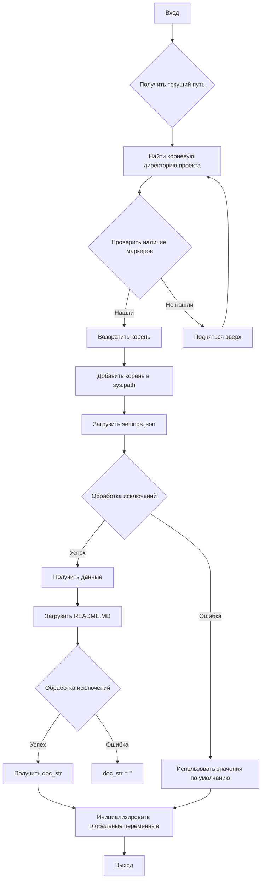

```MD
# <input code>

```python
## \file hypotez/src/suppliers/wallashop/header.py
# -*- coding: utf-8 -*-
#! venv/Scripts/python.exe
#! venv/bin/python/python3.12

"""
.. module: src.suppliers.wallashop 
	:platform: Windows, Unix
	:synopsis:

"""


import sys
import json
from packaging.version import Version

from pathlib import Path
def set_project_root(marker_files=('__root__')) -> Path:
    """
    Finds the root directory of the project starting from the current file's directory,
    searching upwards and stopping at the first directory containing any of the marker files.

    Args:
        marker_files (tuple): Filenames or directory names to identify the project root.
    
    Returns:
        Path: Path to the root directory if found, otherwise the directory where the script is located.
    """
    __root__:Path
    current_path:Path = Path(__file__).resolve().parent
    __root__ = current_path
    for parent in [current_path] + list(current_path.parents):
        if any((parent / marker).exists() for marker in marker_files):
            __root__ = parent
            break
    if __root__ not in sys.path:
        sys.path.insert(0, str(__root__))
    return __root__


# Get the root directory of the project
__root__ = set_project_root()
"""__root__ (Path): Path to the root directory of the project"""

from src import gs

settings:dict = None
try:
    with open(gs.path.root / 'src' /  'settings.json', 'r') as settings_file:
        settings = json.load(settings_file)
except (FileNotFoundError, json.JSONDecodeError):
    ...

doc_str:str = None
try:
    with open(gs.path.root / 'src' /  'README.MD', 'r') as settings_file:
        doc_str = settings_file.read()
except (FileNotFoundError, json.JSONDecodeError):
    ...


__project_name__ = settings.get("project_name", 'hypotez') if settings  else 'hypotez'
__version__: str = settings.get("version", '')  if settings  else ''
__doc__: str = doc_str if doc_str else ''
__details__: str = ''
__author__: str = settings.get("author", '')  if settings  else ''
__copyright__: str = settings.get("copyrihgnt", '')  if settings  else ''
__cofee__: str = settings.get("cofee", "Treat the developer to a cup of coffee for boosting enthusiasm in development: https://boosty.to/hypo69")  if settings  else "Treat the developer to a cup of coffee for boosting enthusiasm in development: https://boosty.to/hypo69"
```

# <algorithm>

**Алгоритм работы:**

1. **Получение корневой директории проекта:**
   - Функция `set_project_root` ищет корневую директорию проекта, начиная с текущей директории и поднимаясь вверх по дереву каталогов.
   - Она проверяет наличие файлов `pyproject.toml`, `requirements.txt`, `.git` в каждой родительской директории.
   - Если один из этих файлов найден, функция возвращает путь к этой директории. Иначе возвращается директория текущего файла.
   -  Если корневая директория не находится в пути поиска (`sys.path`), она добавляется в начало этого списка.

2. **Загрузка настроек из файла `settings.json`:**
   -  Читает файл `settings.json` в корне проекта.
   -  Парсит файл JSON, используя `json.load()`.
   -  Перехватывает возможные исключения `FileNotFoundError` и `json.JSONDecodeError` для обработки случаев, когда файл отсутствует или содержит невалидный JSON.

3. **Загрузка документации из файла `README.MD`:**
    -  Аналогично, пытается прочитать файл `README.MD` в корне проекта.
    -  Перехватывает возможные исключения для обработки случаев отсутствия файла.

4. **Установка глобальных переменных проекта:**
   -  Глобальные переменные (`__project_name__`, `__version__`, и т.д.) инициализируются значениями из загруженных настроек (если они существуют) или принимают значения по умолчанию, если нет.
   -  Если файл `settings.json` не найден, все глобальные переменные будут иметь значения по умолчанию.
   -  Если файл `README.MD` не найден, `__doc__`  будет пустой строкой.

**Пример:**

Если файл `settings.json` содержит `{ "project_name": "MyProject", "version": "1.0.0" }`,  `__project_name__` будет равен "MyProject", а `__version__` — "1.0.0".


# <mermaid>



**Описание зависимостей**:

- Файл `header.py` зависит от модуля `gs`, находящегося в директории `src`.
- Модуль `gs` скорее всего, содержит вспомогательные функции для работы с путями и настройками проекта.
- `json` и `pathlib` необходимы для работы с файлами.
- `packaging.version` используется для работы с версиями.

# <explanation>

**Импорты:**

- `sys`: для работы со списком путей.
- `json`: для работы с JSON файлами.
- `packaging.version`: для работы с версиями.
- `pathlib`: для работы с путями файлов.
- `src.gs`: модуль, скорее всего, содержит вспомогательные функции для работы с путями и другими ресурсами проекта, расположенный внутри проекта.


**Классы:**

В данном коде нет классов.

**Функции:**

- `set_project_root(marker_files=...)`:  Находит корневую директорию проекта, начиная с текущего файла, проходя вверх по дереву каталогов.
  - `marker_files`: кортеж с файлами или директориями для поиска корня проекта.
  - Возвращает `Path` объект, указывающий на корень проекта, или текущую директорию, если корень не найден.

**Переменные:**

- `MODE`: Строковая переменная, вероятно, для указания режима работы (например, 'dev' или 'prod').
- `__root__`: `Path` объект, содержащий путь к корню проекта.
- `settings`: Словарь (`dict`), содержащий настройки, загруженные из файла `settings.json`.
- `doc_str`: Строковая переменная, содержащая текст из файла `README.MD`.
- Глобальные переменные `__project_name__`, `__version__`, `__doc__`, `__details__`, `__author__`, `__copyright__`, `__cofee__`:  Содержат информацию о проекте, полученные из файла `settings.json` (или значения по умолчанию, если файл не найден или отсутствуют необходимые ключи).

**Возможные ошибки и улучшения:**

- **Обработка ошибок:** Хороший подход к обработке `FileNotFoundError` и `json.JSONDecodeError`.
- **Документация:** Документация кода (`"""Docstring"""`) написана хорошо, но можно добавить описание типов аргументов и возвращаемых значений для большей ясности.


**Взаимосвязь с другими частями проекта:**

Код явно использует модуль `gs` из пакета `src`, что предполагает, что он предоставляет функциональность для работы с путями и другими ресурсами проекта.  Также, значения глобальных переменных, вероятно, используются другими модулями проекта для настройки различных компонентов. Код извлекает информацию из `settings.json` и `README.MD`, предполагая, что эти файлы содержат важную информацию о проекте, которая используется в других частях программы.