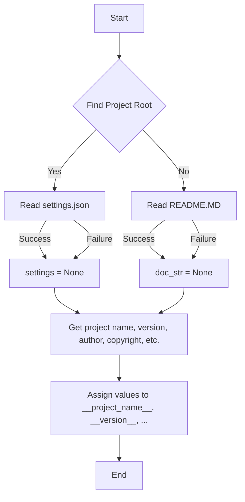

# <input code>

```python
## \file hypotez/src/suppliers/wallmart/header.py
# -*- coding: utf-8 -*-
#! venv/Scripts/python.exe
#! venv/bin/python/python3.12

"""
.. module: src.suppliers.wallmart 
	:platform: Windows, Unix
	:synopsis:

"""
MODE = 'dev'


import sys
import json
from packaging.version import Version

from pathlib import Path
def set_project_root(marker_files=('__root__')) -> Path:
    """
    Finds the root directory of the project starting from the current file's directory,
    searching upwards and stopping at the first directory containing any of the marker files.

    Args:
        marker_files (tuple): Filenames or directory names to identify the project root.
    
    Returns:
        Path: Path to the root directory if found, otherwise the directory where the script is located.
    """
    __root__:Path
    current_path:Path = Path(__file__).resolve().parent
    __root__ = current_path
    for parent in [current_path] + list(current_path.parents):
        if any((parent / marker).exists() for marker in marker_files):
            __root__ = parent
            break
    if __root__ not in sys.path:
        sys.path.insert(0, str(__root__))
    return __root__


# Get the root directory of the project
__root__ = set_project_root()
"""__root__ (Path): Path to the root directory of the project"""

from src import gs

settings:dict = None
try:
    with open(gs.path.root / 'src' /  'settings.json', 'r') as settings_file:
        settings = json.load(settings_file)
except (FileNotFoundError, json.JSONDecodeError):
    ...

doc_str:str = None
try:
    with open(gs.path.root / 'src' /  'README.MD', 'r') as settings_file:
        doc_str = settings_file.read()
except (FileNotFoundError, json.JSONDecodeError):
    ...


__project_name__ = settings.get("project_name", 'hypotez') if settings  else 'hypotez'
__version__: str = settings.get("version", '')  if settings  else ''
__doc__: str = doc_str if doc_str else ''
__details__: str = ''
__author__: str = settings.get("author", '')  if settings  else ''
__copyright__: str = settings.get("copyrihgnt", '')  if settings  else ''
__cofee__: str = settings.get("cofee", "Treat the developer to a cup of coffee for boosting enthusiasm in development: https://boosty.to/hypo69")  if settings  else "Treat the developer to a cup of coffee for boosting enthusiasm in development: https://boosty.to/hypo69"
```

# <algorithm>



This algorithm describes the steps taken by the Python code:

1. **Find Project Root:** The `set_project_root` function searches upwards from the current file's directory to locate the project root directory using marker files (e.g., `pyproject.toml`, `requirements.txt`, `.git`).
2. **Read settings.json:** It attempts to open and load the `settings.json` file, which likely contains configuration data about the project.
3. **Read README.MD:** It attempts to read the `README.MD` file to get documentation for the project.
4. **Load settings:** If `settings.json` is found and parsed successfully, the loaded data is stored in the `settings` variable.
5. **Get project data:** Using the `settings` dictionary, values for project name, version, author, etc. are retrieved using `get()` to handle cases where the keys might be missing.
6. **Assign values:** Final values are assigned to the corresponding variables (`__project_name__`, `__version__`, etc.). If no `settings.json` or `README.MD` is found, default values are used instead.

# <mermaid>

```mermaid
graph LR
    subgraph Project Root Finding
        A[__file__ (header.py)] --> B(Path(__file__).resolve().parent);
        B --> C[iterate through parents];
        C --> D{marker file exists?};
        D -- Yes --> E[__root__ = parent];
        D -- No --> C;
        E --> F[sys.path.insert(0, str(__root__))];
    end
    F --> G[__root__];
    subgraph Loading Settings
        G --> H[gs.path.root / 'src' / 'settings.json'];
        H --> I{File exists and json is valid?};
        I -- Yes --> J[settings = json.load];
        I -- No --> K[settings = None];
    end
    J --> L[settings.get("project_name", "hypotez")];
    L --> M[__project_name__];
    K --> M;
    subgraph Loading README
        G --> N[gs.path.root / 'src' / 'README.MD'];
        N --> O{File exists?};
        O -- Yes --> P[doc_str = settings_file.read()];
        O -- No --> Q[doc_str = None];
    end
    P --> R[__doc__];
    Q --> R;
    M --> S[__version__];
    R --> T[__doc__];

    M --> U[__author__];
    T --> V[__details__];
    U --> W[__copyright__];
    W --> X[__cofee__];
```
The diagram shows the dependencies:
* `set_project_root` function finds the project root and updates `sys.path`.
* `gs.path.root` likely represents a module or class within the `src` package, providing access to the project's root directory.
* `settings.json` and `README.MD` are files in the project root directory containing essential project information.
* `json.load` parses the JSON data from `settings.json`.


# <explanation>

**Импорты:**

* `sys`: Предоставляет доступ к системам и переменным Python.  В данном случае используется для добавления корневой директории проекта в `sys.path`.
* `json`: Используется для работы с файлами в формате JSON, в частности для загрузки настроек проекта из `settings.json`.
* `packaging.version`: Для работы с версиями пакетов (не используется в текущем коде).
* `pathlib`: Предоставляет удобный способ работы с файлами и каталогами.
* `src.gs`:  Представляет собой модуль, содержащий информацию о пути к корневой директории проекта (`gs.path.root`). Его импорт указывает на то, что проект имеет структурированную архитектуру с модулем, который отвечает за управление путями.  Необходимо уточнить, где определен этот модуль.

**Классы:**

В коде нет классов.

**Функции:**

* `set_project_root(marker_files)`: Ищет корневой каталог проекта, начиная с текущей директории и двигаясь вверх по дереву каталогов.  Аргумент `marker_files` задает список файлов или папок, которые используются в качестве маркеров для определения корневой директории. Возвращает объект `Path` к корневой директории.

**Переменные:**

* `__root__`: Путь к корневому каталогу проекта.
* `settings`: Словарь, содержащий данные из файла `settings.json` (настройки проекта).
* `doc_str`: Содержимое файла `README.MD` (документация проекта).
* `MODE`: Переменная, вероятно, хранит режим работы (например, 'dev', 'prod').


**Возможные ошибки и улучшения:**

* **Обработка ошибок:**  Используются `try...except` блоки для обработки `FileNotFoundError` и `json.JSONDecodeError`. Это предотвращает аварийную остановку программы, если файлы не найдены или имеют неверный формат.  Но обработка слишком общая. Стоит разделить на более конкретные типы исключений.
* **Типы:** Не явные типы данных. Например, переменная `__root__` имеет тип `Path`, а затем присваивание строки к переменной `sys.path.insert(0, str(__root__))` вызывает неявно преобразование к строковому типу.
* **`gs.path.root`:** Необходимо знать определение `gs.path.root`. Если это внутренняя функция/класс, необходимо понять его логику для лучшего анализа.


**Взаимосвязи с другими частями проекта:**

Код использует модуль `gs`, находящийся в пакете `src`, что предполагает его связь с другими частями приложения, отвечающими за управление путями и ресурсами проекта.  Без знания конкретной реализации `gs` трудно проследить полную цепочку взаимосвязей.


**Дополнительные замечания:**

* Стилистически код оформлен неплохо.
* Код четко настроен для поиска корневого каталога проекта и загрузки настроек из JSON-файла.

В целом, код хорошо структурирован и выполняет свою задачу.