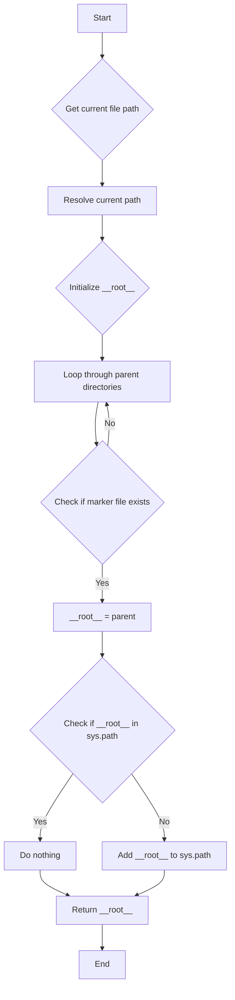

# <input code>

```python
## \file hypotez/src/templates/header.py
# -*- coding: utf-8 -*-

#! venv/bin/python/python3.12

"""
.. module: src.templates 
	:platform: Windows, Unix
	:synopsis:

"""


import sys
import json
from packaging.version import Version

from pathlib import Path
def set_project_root(marker_files=(\'pyproject.toml\', \'requirements.txt\', \'.git\')) -> Path:
    """
    Finds the root directory of the project starting from the current file's directory,
    searching upwards and stopping at the first directory containing any of the marker files.

    Args:
        marker_files (tuple): Filenames or directory names to identify the project root.
    
    Returns:
        Path: Path to the root directory if found, otherwise the directory where the script is located.
    """
    __root__:Path
    current_path:Path = Path(__file__).resolve().parent
    __root__ = current_path
    for parent in [current_path] + list(current_path.parents):
        if any((parent / marker).exists() for marker in marker_files):
            __root__ = parent
            break
    if __root__ not in sys.path:
        sys.path.insert(0, str(__root__))
    return __root__


# Get the root directory of the project
__root__ = set_project_root()
"""__root__ (Path): Path to the root directory of the project"""

from src import gs
```

# <algorithm>



**Пример:**

Предположим, что файл `header.py` находится в директории `hypotez/src/templates`.  Функция `set_project_root` будет искать `pyproject.toml`, `requirements.txt` и `.git` вверх по дереву каталогов. Если `pyproject.toml` найдет в директории `hypotez`, то `__root__` будет устанавливаться в `hypotez`, и функция вернет `Path('hypotez')`.  Если эти файлы не найдены в текущем каталоге или вышестоящих директориях, то вернет `Path('hypotez/src/templates')`.


# <mermaid>

```mermaid
graph LR
    subgraph Project Structure
        A[hypotez] --> B(src);
        B --> C(templates);
        C --> D[header.py];
    end
    D --> E[set_project_root];
    E --> F[pathlib];
    E --> G[sys];
    E --> H[packaging.version];
    E --> I[json];
    E --> J[gs(src)];
    F -- current directory --> K[__root__];
    K -- parent directories --> L;
```

**Объяснение диаграммы:**

Диаграмма показывает структуру проекта и зависимости `header.py`.  `header.py` использует модули из стандартной библиотеки Python (`pathlib`, `sys`), из `packaging.version` (для работы с версиями пакетов), и `json`.  Самое важное - `header.py` импортирует модуль `gs` из пакета `src`, что указывает на то, что `gs` находится в `src` и `header.py` использует его функции.

# <explanation>

* **Импорты**:
    * `sys`: Предоставляет доступ к системным переменным и функциям Python, в данном случае используется для добавления директории проекта в `sys.path`.
    * `json`: Для работы с данными в формате JSON (хотя в данном случае не используется напрямую).
    * `packaging.version`: Используется для работы с версиями пакетов.
    * `pathlib`: Предоставляет объекты пути к файлам и каталогам. Это важно для манипуляции с путями и поиска корня проекта.
    * `src.gs`: Импортирует модуль `gs`, который, вероятно, содержит функции и классы, относящиеся к обработке данных или другим компонентам проекта. `src` – это директория в проекте, где размещены дополнительные модули и классы.


* **Классы**: В данном коде нет определённых классов.

* **Функции**:
    * `set_project_root(marker_files=...) -> Path`:  Функция находит корень проекта, начиная с текущей директории и идя вверх по дереву каталогов.  Она проверяет существование указанных маркеров файлов (`pyproject.toml`, `requirements.txt`, `.git`) в родительских директориях. Если такой файл найден, то функция возвращает `Path` к родительской директории, иначе - к текущей директории.
        * **Аргументы**: `marker_files` - кортеж строк, представляющих имена файлов или каталогов, которые указывают на корень проекта. По умолчанию проверяются `pyproject.toml`, `requirements.txt` и `.git`.
        * **Возвращаемое значение**: `Path` к корню проекта.
        * **Пример**: Если `pyproject.toml` есть в `hypotez`, то функция вернёт `Path('hypotez')`.

* **Переменные**:
    * `__root__`:  Переменная, хранящая путь к корню проекта, типа `Path`.
    * `MODE`: Строковая константа, вероятно, для выбора режима работы приложения ('dev' - вероятно, режим разработки).
    * `current_path`: Path к текущему файлу.

* **Возможные ошибки и улучшения**:
    * **Необязательный `sys.path.insert`**: Если корень проекта уже присутствует в `sys.path`, эта операция бесполезна и может вызвать проблемы при импорте. Возможно, стоит использовать `if __root__ not in sys.path and not __root__.exists()`.
    * **Улучшение обработки ошибок**: Можно добавить обработку ситуаций, когда маркеры файлов не найдены.  Возможно, нужно возвращать ошибку или `None`.
    * **Более гибкая система маркеров**: Добавление опций для выбора других файлов, указывающих на корень.

* **Взаимосвязь с другими частями проекта**: Функция `set_project_root` критична для правильной работы импорта (`from src import gs`). Если корень проекта не найден, то импорт `gs` может завершиться ошибкой `ModuleNotFoundError`.   Это указывает на то, что `gs` находится где-то в структуре проекта, что и должно быть определено `set_project_root()`.