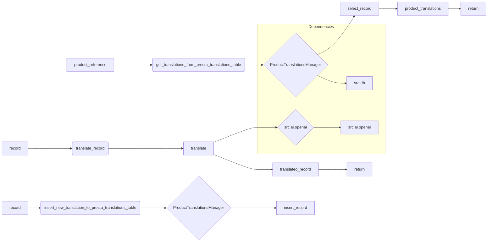

# <input code>

```python
## \file hypotez/src/translators/product_translator.py
# -*- coding: utf-8 -*-\
#! venv/Scripts/python.exe
#! venv/bin/python/python3.12

"""
.. module: src.translators 
	:platform: Windows, Unix
	:synopsis:

"""


"""
	:platform: Windows, Unix
	:synopsis:

"""


"""
	:platform: Windows, Unix
	:synopsis:

"""


"""
  :platform: Windows, Unix

"""
"""
  :platform: Windows, Unix
  :platform: Windows, Unix
  :synopsis:
"""
  
""" module: src.translators """


""" Модуль управления переводами.
Слой связи между словарем полей товара, таблицей переводов и переводчиками

`get_translations_from_presta_translations_table(product_reference, credentials, i18n)`
    1. получает референс товара, параметры подключения к базе переводов престашоп и язык перевода в формате en_EN, he_HE, ru-RU 
    2. созадет условуе запроса
    3. возвращает результат
    

@todo
    1. Продумать какой нибудж парсер для en_EN, he_HE, ru-RU
"""


from pathlib import Path
from typing import List, Dict
...
from src import gs
from src.logger import logger
from src.utils.jjson import j_loads_ns, j_dumps,  pprint
from src.db import ProductTranslationsManager
from src.ai.openai import translate
from src.endpoints.PrestaShop import PrestaShop

# def record(presta_fields:Dict, i18n:str = None, i:int = 0) -> Dict:
#     """ Вытаскивает из словаря полей престашоп 
#     `dict_product_fields` значения мультиязычных полей 
#     @param dict_product_fields престашоп словарь полей товара
#     @param i18n Локаль: en-US, ru-RU, he-IL
#     @param i индекс языка в мультиязычных полях
#     """
#     ...
#     # ... (остальной код функции record)


def get_translations_from_presta_translations_table(product_reference: str, i18n: str = None) -> list:
    """Функция возвращает словарь переводов полей товара."""
    with ProductTranslationsManager() as translations_manager:
        search_filter = {'product_reference': product_reference}
        product_translations = translations_manager.select_record(**search_filter)
    return product_translations


def insert_new_translation_to_presta_translations_table(record):
    with ProductTranslationsManager() as translations_manager:
        translations_manager.insert_record(record)


def translate_record(record: dict, from_locale: str, to_locale: str) -> dict:
    """Функция для перевода полей товара."""
    translated_record = translate(record, from_locale, to_locale)
    ... # Добавить обработку переведенной записи
    return translated_record
```

# <algorithm>

**Алгоритм работы модуля:**

1. **`get_translations_from_presta_translations_table(product_reference, i18n)`:**
   - Принимает `product_reference` (идентификатор товара) и необязательный параметр `i18n` (язык).
   - Создает словарь `search_filter` для поиска в базе данных.
   - Использует `ProductTranslationsManager` для выполнения запроса к базе данных (`select_record`).
   - Возвращает список `product_translations` с результатами запроса (или пустой список, если ничего не найдено).

2. **`insert_new_translation_to_presta_translations_table(record)`:**
   - Принимает словарь `record` с данными для вставки в базу.
   - Использует `ProductTranslationsManager` для вставки данных в таблицу переводов.

3. **`translate_record(record, from_locale, to_locale)`:**
   - Принимает словарь `record` для перевода, исходный язык `from_locale` и целевой язык `to_locale`.
   - Использует функцию `translate` из модуля `src.ai.openai` для перевода данных в `record`.
   - Возвращает переведенный словарь.
   - **Важная деталь:**  код содержит `...` после вызова `translate`. Это означает, что в реальной реализации ожидается дальнейшая обработка результата перевода (например, запись в базу данных, валидация или логгирование).


**Пример:**

Предположим, мы хотим получить переводы для товара с `product_reference = '12345'`. Функция `get_translations_from_presta_translations_table` обращается к базе данных, выполняет запрос и возвращает список переводов, если они есть.


# <mermaid>



**Объяснение зависимостей диаграммы:**

*   `get_translations_from_presta_translations_table`: Зависит от `ProductTranslationsManager` (из `src.db`).
*   `insert_new_translation_to_presta_translations_table`: Зависит от `ProductTranslationsManager` (из `src.db`).
*   `translate_record`: Зависит от `translate` (из `src.ai.openai`).

# <explanation>

**Импорты:**

*   `from pathlib import Path`: Импортирует класс `Path` для работы с путями к файлам. Необязательно, но может использоваться в других частях проекта.
*   `from typing import List, Dict`:  Импортирует типы данных `List` и `Dict` для явной типизации параметров и возвращаемых значений.
*   `from src import gs`: Импортирует пакет `gs`, вероятно, содержащий вспомогательные функции или классы из `src` пакета.
*   `from src.logger import logger`: Импортирует логгер из пакета `logger`, использующийся для ведения журналов.
*   `from src.utils.jjson import j_loads_ns, j_dumps, pprint`: Импортирует функции для работы с JSON,  вероятно, с поддержкой `namespace`.
*   `from src.db import ProductTranslationsManager`: Импортирует класс `ProductTranslationsManager` из пакета `db`, предназначенный для работы с базой данных переводов.
*   `from src.ai.openai import translate`: Импортирует функцию `translate` для перевода текста с использованием API OpenAI.
*   `from src.endpoints.PrestaShop import PrestaShop`: Импортирует класс `PrestaShop`, вероятно, для взаимодействия с API Престашоп.


**Классы:**

*   `ProductTranslationsManager`: Этот класс управляет взаимодействием с базой данных переводов. Пока не видно его реализации, но по имени можно предположить, что он имеет методы для выборки (`select_record`) и вставки (`insert_record`) записей в таблицу.


**Функции:**

*   `get_translations_from_presta_translations_table`: Ищет переводы для товара в базе данных и возвращает их.
*   `insert_new_translation_to_presta_translations_table`: Добавляет новые переводы в базу данных.
*   `translate_record`: Переводит текст из исходного языка на целевой с помощью API OpenAI.  Важный недостаток - отсутствие обработки возвращаемых результатов `translate`, а также `try...except` блоков, которые важны для работы с внешними API.


**Переменные:**

*   `MODE`:  Переменная, вероятно, задает режим работы (например, `dev` или `prod`).
*   `product_reference`: Строка, представляющая идентификатор товара.
*   `i18n`:  Строка, представляющая локаль.
*   `search_filter`: Словарь, используемый для фильтрации запроса к базе данных.
*   `product_translations`: Список, который хранит результаты запроса к базе данных.

**Возможные ошибки и улучшения:**

*   **Обработка ошибок:** Функции взаимодействия с базой данных и внешними API должны содержать `try...except` блоки для обработки потенциальных ошибок (например, проблемы с подключением к базе, ошибки API).
*   **Обработка результатов `translate`:**  Важно добавить обработку результата функции `translate`.  Если API вернет ошибку, программа должна реагировать (например, логгировать ошибку).
*   **Типизация:** Добавьте явную типизацию для значений, которые возвращаются из функций (`record`, `translate`).
*   **Логирование:**  Дополните код функциями `logging` для отслеживания progress и ошибок.
*   **Управление ресурсами:** Используйте `with`-блоки для `ProductTranslationsManager`, чтобы гарантировать корректное освобождение ресурсов.
*   **Валидация входящих данных:**  Дополните код проверками входных данных (проверка на пустые строки или неверные форматы).