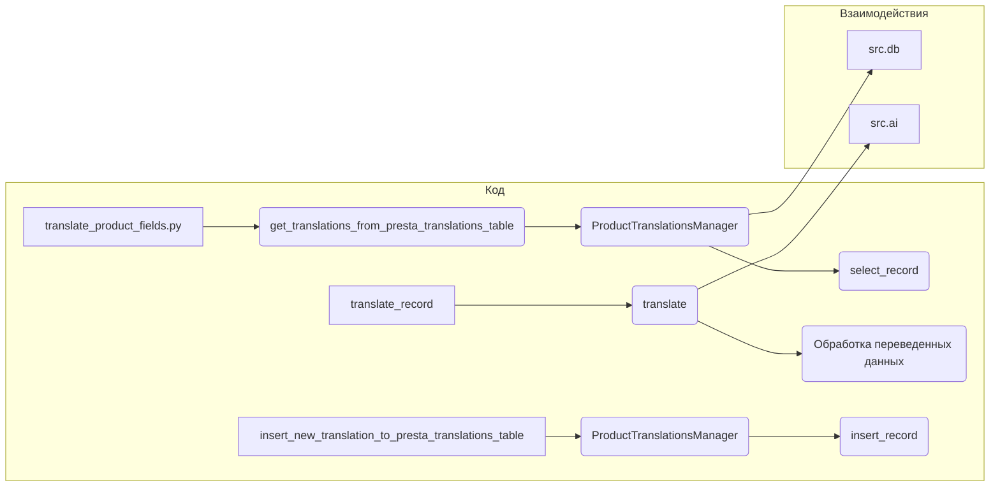

```MD
# <input code>

```python
## \file hypotez/src/translators/translate_product_fields.py
# -*- coding: utf-8 -*-\
#! venv/Scripts/python.exe
#! venv/bin/python/python3.12

"""
.. module: src.translators 
	:platform: Windows, Unix
	:synopsis:

"""


"""
	:platform: Windows, Unix
	:synopsis:

"""


"""
	:platform: Windows, Unix
	:synopsis:

"""


"""
  :platform: Windows, Unix

"""
"""
  :platform: Windows, Unix
  :platform: Windows, Unix
  :synopsis:
"""
  
""" module: src.translators """


""" Модуль управления переводами.
Слой связи между словарем полей товара, таблицей переводов и переводчиками

`get_translations_from_presta_translations_table(product_reference, credentials, i18n)`
    1. получает референс товара, параметры подключения к базе переводов престашоп и язык перевода в формате en_EN, he_HE, ru-RU 
    2. созадет условуе запроса
    3. возвращает результат
    
@todo
    1. Продумать какой нибудж парсер для en_EN, he_HE, ru-RU
"""
...
from pathlib import Path
from typing import List, Dict
...
from src import gs
from src.utils.printer import  pprint
from src.product.product_fields.product_fields import record
from src.db import ProductTranslationsManager
from src.ai import translate
from src.endpoints.PrestaShop import PrestaShop
from src import gs
from src.product.product_fields.product_fields import record
from src.db import ProductTranslationsManager
from src.ai import translate
from src.endpoints.PrestaShop import PrestaShop

def get_translations_from_presta_translations_table(product_reference: str, credentials: dict, i18n: str = None) -> list:
    """Функция возвращает словарь переводов полей товара."""
    with ProductTranslationsManager(credentials) as translations_manager:
        search_filter = {'product_reference': product_reference}
        product_translations = translations_manager.select_record(**search_filter)
    return product_translations

def insert_new_translation_to_presta_translations_table(record, credentials):
    with ProductTranslationsManager(credentials) as translations_manager:
        translations_manager.insert_record(record)

def translate_record(record: dict, from_locale: str, to_locale: str) -> dict:
    """Функция для перевода полей товара."""
    translated_record = translate(record, from_locale, to_locale)
    ... # Добавить обработку переведенной записи
    return translated_record
```

# <algorithm>

**Алгоритм**

1. **`get_translations_from_presta_translations_table`:**
    * Принимает `product_reference`, `credentials`, и `i18n`.
    * Создаёт словарь `search_filter` с ключом `product_reference` и значением из входных данных.
    * Использует `ProductTranslationsManager` для получения переводов, используя `select_record` с `search_filter`.
    * Возвращает список переводов.

    **Пример:**
    Вход: `product_reference = "12345"`, `credentials = {"host": "localhost", ...}`, `i18n = "ru-RU"`.
    Выход: Список словарей с переводами для товара с `product_reference = "12345"` (если такие существуют).


2. **`insert_new_translation_to_presta_translations_table`:**
    * Принимает `record` (словарь с новой записью) и `credentials`.
    * Использует `ProductTranslationsManager` для вставки записи с помощью `insert_record`.

    **Пример:**
    Вход: `record = {"product_reference": "67890", "field1": "value1", ...}`, `credentials = {"host": "localhost", ...}`.
    Вставка записи в базу данных.


3. **`translate_record`:**
    * Принимает `record`, `from_locale`, `to_locale`.
    * Использует функцию `translate` из модуля `src.ai` для перевода данных `record`.
    * Возвращает переведённую запись.


**Пошаговая блок-схема (в упрощённом виде):**


```mermaid
graph TD
    A[get_translations_from_presta_translations_table] --> B{Получить ProductTranslationsManager};
    B --> C[Создать search_filter];
    C --> D[select_record(search_filter)];
    D --> E[Возвратить product_translations];
    
    F[insert_new_translation_to_presta_translations_table] --> G{Получить ProductTranslationsManager};
    G --> H[insert_record(record)];
    
    I[translate_record] --> J[translate(record, from_locale, to_locale)];
    J --> K[обработка переведенной записи];
    K --> L[Возвратить translated_record];
```

# <mermaid>



# <explanation>

**Импорты:**

- `from pathlib import Path`:  Импортирует класс `Path` для работы с файловыми путями, но в данном коде он не используется.
- `from typing import List, Dict`:  Импортирует типы данных `List` и `Dict` для аннотаций типов, улучшая читаемость и поддержание кода.
- `from src import gs`: Импортирует модуль `gs` из пакета `src`. Необходимо для определения `gs`.
- `from src.utils.printer import pprint`: Импортирует функцию `pprint` из модуля `printer` в папке `utils` пакета `src`. Вероятно, используется для отладки и вывода информации.
- `from src.product.product_fields.product_fields import record`: Импортирует определение `record` (предположительно, класс или структура данных) из пакета `product`, подпапки `product_fields` и файла `product_fields.py`.
- `from src.db import ProductTranslationsManager`: Импортирует класс `ProductTranslationsManager` из пакета `db`, вероятно, отвечающий за взаимодействие с базой данных для работы с таблицами переводов.
- `from src.ai import translate`: Импортирует функцию `translate` из пакета `ai`, которая отвечает за перевод данных.
- `from src.endpoints.PrestaShop import PrestaShop`: Импортирует класс `PrestaShop` из пакета `endpoints`. Вероятно, этот класс предоставляет методы для взаимодействия с API PrestaShop.

**Классы:**

- `ProductTranslationsManager`:  Ответственный за взаимодействие с базой данных для работы с таблицами переводов.  У него есть метод `select_record` для выбора данных и `insert_record` для добавления.  В коде используется с `with`-блоком для автоматического закрытия соединения с базой.


**Функции:**

- `get_translations_from_presta_translations_table(product_reference, credentials, i18n=None)`: Получает переводы для товара по `product_reference` из базы данных, используя `ProductTranslationsManager`.  Возвращает список словарей с переводами.
- `insert_new_translation_to_presta_translations_table(record, credentials)`: Добавляет новую запись в базу данных переводов.
- `translate_record(record, from_locale, to_locale)`:  Переводит запись `record` с языка `from_locale` на `to_locale` с использованием функции `translate` из модуля `src.ai`. Возвращает переведённую запись.  В коде есть не реализованная часть - `... # Добавить обработку переведенной записи`.

**Переменные:**

- `MODE`:  Глобальная переменная, вероятно, хранит режим работы (например, `dev`, `prod`).


**Возможные ошибки и улучшения:**

- Не хватает реализации `... # Добавить обработку переведенной записи` в функции `translate_record`. Это критическая часть, которая должна обрабатывать результат перевода.
- Отсутствует проверка ошибок при работе с базой данных (`ProductTranslationsManager`).
- Не указаны типы `record` и `credentials` в функциях `insert_new_translation_to_presta_translations_table` и `get_translations_from_presta_translations_table`.


**Взаимосвязи:**

Функции из файла `translate_product_fields.py` взаимодействуют с классом `ProductTranslationsManager` (в `src.db`) для работы с базой данных и с функцией `translate` (в `src.ai`) для перевода.  Функция `translate_product_fields`  находится в слое "переводчиков", и он связывает словарь полей товара (`record`), таблицу переводов и переводчиками.