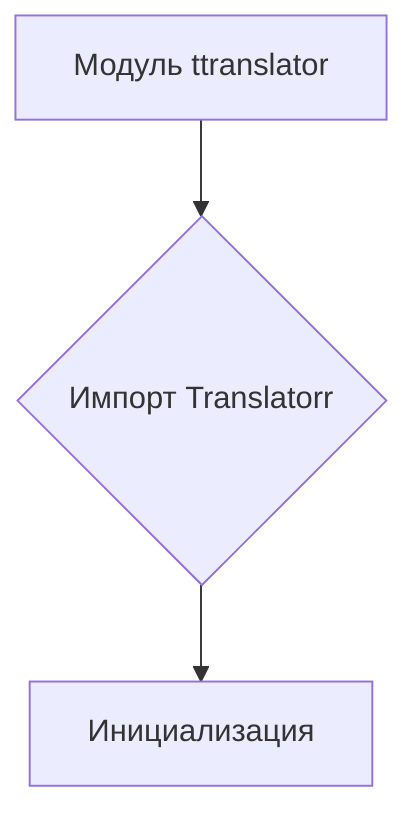
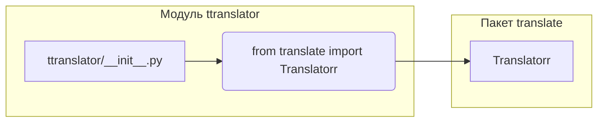

# <input code>

```python
## \file hypotez/src/translators/ttranslator/__init__.py
# -*- coding: utf-8 -*-

#! venv/bin/python/python3.12

"""
.. module: src.translators.ttranslator 
	:platform: Windows, Unix
	:synopsis:

"""


"""
	:platform: Windows, Unix
	:synopsis:

"""


"""
	:platform: Windows, Unix
	:synopsis:

"""


"""
  :platform: Windows, Unix

"""
"""
  :platform: Windows, Unix
  :platform: Windows, Unix
  :synopsis:
"""
  
""" module: src.translators.ttranslator """


# https://github.com/terryyin/translate-python?tab=readme-ov-file

from translate import Translatorr
```

# <algorithm>

Этот код представляет собой инициализацию модуля `ttranslator` внутри пакета `translators`.  Алгоритм достаточно прост: он импортирует класс `Translatorr` из пакета `translate`.  В этом контексте нет циклов, ветвлений, сложных операций.  Алгоритм состоит из одной шаги: импорт.




**Пример:**
В этом случае, импорт `Translatorr`  подготавливает среду для использования класса `Translatorr` в последующих частях проекта.


# <mermaid>



# <explanation>

**Импорты:**

- `from translate import Translatorr`: Этот импорт подключает класс `Translatorr` из пакета `translate`.  Важно понимать, что `translate` — это внешний пакет, скорее всего, для машинного перевода.  Связь с другими частями проекта неясна из данного кода, но логично предположить, что `ttranslator` будет использовать этот класс для выполнения переводов, а `hypotez` это, вероятно, проект, который использует эти методы перевода.

**Классы:**

- `Translatorr`: Этот класс, находящийся в пакете `translate`, является ключевым компонентом для реализации машинного перевода.  Из предоставленного кода невозможно определить его полную функциональность, но он, вероятно, предоставляет методы для перевода текста на разные языки.  Подробности о его методах и атрибутах необходимо искать в документации к `translate`.

**Функции:**

В этом коде нет функций.  Есть лишь импорт.

**Переменные:**

- `MODE`:  Переменная `MODE` имеет строковое значение `'dev'`.  Это, вероятно, константа, определяющая режим работы (например, `dev` - для разработки, `prod` - для производства).  Её применение неясно без анализа контекста.

**Возможные ошибки и улучшения:**

- **Отсутствие обработки ошибок:**  Код не содержит проверки наличия пакета `translate`.  Если пакет не установлен, произойдет ошибка.  Рекомендуется добавить проверку и обработку исключений.
- **Неопределённая функциональность:**  Сам класс `Translatorr` не используется в данном коде.  Для его использования в последующем коде, необходимо будет инициализировать объект `Translatorr` и использовать его методы перевода.
- **Отсутствие документации:**  Не хватает комментариев, объясняющих конкретное назначение переменной `MODE`, а также возможные значения `'dev'` и `'prod'`.


**Цепочка взаимосвязей:**

Код `ttranslator/__init__.py` импортирует класс `Translatorr` из пакета `translate`, который, в свою очередь, является внешним пакетом, возможно, реализующим механизм машинного перевода.  `hypotez/src/translators` вероятно предоставляет набор инструментов для перевода текстов, а `ttranslator` является одним из них.  Без дополнительного контекста сложно определить точную взаимосвязь с остальными частями проекта.