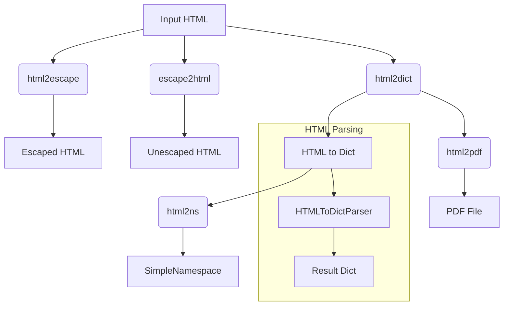

# <input code>

```python
## \file hypotez/src/utils/convertors/html.py
# -*- coding: utf-8 -*-\
#! venv/Scripts/python.exe
#! venv/bin/python/python3.12

"""
.. module: src.utils.convertors.html 
	:platform: Windows, Unix
	:synopsis: HTML conversion utilities
Functions:
    - `html2escape`: Convert HTML to escape sequences.
    - `escape2html`: Convert escape sequences to HTML.
    - `html2dict`: Convert HTML to dictionaries.
    - `html2ns`: Convert HTML to SimpleNamespace objects.
    https://stackoverflow.com/questions/73599970/how-to-solve-wkhtmltopdf-reported-an-error-exit-with-code-1-due-to-network-err
https://chatgpt.com/share/672266a3-0048-800d-a97b-c38f647d496b
"""

import re
from typing import Dict
from pathlib import Path
from venv import logger

from src.logger import logger
from types import SimpleNamespace
from html.parser import HTMLParser
from xhtml2pdf import pisa
try:
    from weasyprint import HTML
except Exception as ex:
    logger.error(ex)
    ...

def html2escape(input_str: str) -> str:
    """
    Convert HTML to escape sequences.

    Args:
        input_str (str): The HTML code.

    Returns:
        str: HTML converted into escape sequences.

    Example:
        >>> html = "<p>Hello, world!</p>"
        >>> result = html2escape(html)
        >>> print(result)
        &lt;p&gt;Hello, world!&lt;/p&gt;
    """
    return StringFormatter.escape_html_tags(input_str)

def escape2html(input_str: str) -> str:
    """
    Convert escape sequences to HTML.

    Args:
        input_str (str): The string with escape sequences.

    Returns:
        str: The escape sequences converted back into HTML.

    Example:
        >>> escaped = "&lt;p&gt;Hello, world!&lt;/p&gt;"
        >>> result = escape2html(escaped)
        >>> print(result)
        <p>Hello, world!</p>
    """
    return StringFormatter.unescape_html_tags(input_str)

def html2dict(html_str: str) -> Dict[str, str]:
    """
    Convert HTML to a dictionary where tags are keys and content are values.

    Args:
        html_str (str): The HTML string to convert.

    Returns:
        dict: A dictionary with HTML tags as keys and their content as values.

    Example:
        >>> html = "<p>Hello</p><a href='link'>World</a>"
        >>> result = html2dict(html)
        >>> print(result)
        {'p': 'Hello', 'a': 'World'}
    """
    class HTMLToDictParser(HTMLParser):
        def __init__(self):
            super().__init__()
            self.result = {}
            self.current_tag = None

        def handle_starttag(self, tag, attrs):
            self.current_tag = tag

        def handle_endtag(self, tag):
            self.current_tag = None

        def handle_data(self, data):
            if self.current_tag:
                self.result[self.current_tag] = data.strip()

    parser = HTMLToDictParser()
    parser.feed(html_str)
    return parser.result

def html2ns(html_str: str) -> SimpleNamespace:
    """
    Convert HTML to a SimpleNamespace object where tags are attributes and content are values.

    Args:
        html_str (str): The HTML string to convert.

    Returns:
        SimpleNamespace: A SimpleNamespace object with HTML tags as attributes and their content as values.

    Example:
        >>> html = "<p>Hello</p><a href='link'>World</a>"
        >>> result = html2ns(html)
        >>> print(result.p)
        Hello
        >>> print(result.a)
        World
    """
    html_dict = html2dict(html_str)
    return SimpleNamespace(**html_dict)

def html2pdf(html_str: str, pdf_file: str | Path) -> bool | None:
    """Converts HTML content to a PDF file using WeasyPrint."""
    try:
        HTML(string=html_str).write_pdf(pdf_file)
        return True
    except Exception as e:
        print(f"Error during PDF generation: {e}")
        return
```

# <algorithm>

1. **`html2escape`:** Takes HTML string as input. Returns escaped HTML string.  The algorithm is a direct call to an external library's function (`StringFormatter.escape_html_tags`) to handle the conversion to escape sequences.


2. **`escape2html`:** Takes an escaped HTML string as input. Returns the unescaped HTML string. The algorithm is a direct call to an external library's function (`StringFormatter.unescape_html_tags`) to handle the conversion from escape sequences to HTML.


3. **`html2dict`:** Takes HTML string as input. Returns a dictionary where keys are HTML tags, values are content inside these tags. The algorithm instantiates an `HTMLToDictParser` class, feeds the input HTML string into it, and finally returns the parser's result dictionary.


4. **`HTMLToDictParser` (class):** Handles HTML parsing.
   - `handle_starttag`: Stores the current tag name.
   - `handle_endtag`: Clears the current tag.
   - `handle_data`: Extracts text content if a tag is open. Stores tag and content in the result dictionary.


5. **`html2ns`:** Takes HTML string as input. Returns a `SimpleNamespace` object. The algorithm calls `html2dict` to convert the HTML to a dictionary, then uses the `SimpleNamespace` constructor to create an object with the dictionary keys as attributes and their values as attribute values.


6. **`html2pdf`:** Takes HTML string and output PDF filename. Returns `True` on success, `None` on failure. The algorithm uses the `weasyprint` library to convert the HTML to a PDF, then saves the PDF to the specified file.

# <mermaid>



**Dependencies:**

- `re`: Regular expressions for potential future use (not currently used).
- `typing`: Provides type hints for better code readability and maintainability.
- `pathlib`: For working with file paths in a more object-oriented way.
- `venv`:  Likely a module used within a virtual environment context.
- `logger`: Custom logger from `src.logger`.
- `types`: Provides `SimpleNamespace` for creating objects with attributes.
- `html.parser`: Standard Python library for HTML parsing.
- `xhtml2pdf`: Library for converting HTML to PDF (though not directly used in this code).
- `weasyprint`: Library for HTML to PDF conversion (used in this code).


# <explanation>

- **Imports:**
    - `re`:  Used for regular expressions (though not currently used in the provided code).
    - `typing`: For type hinting.
    - `pathlib`: For path manipulation.
    - `venv`: Likely a module for handling virtual environments.
    - `logger`: A custom logger from the `src` package, likely for logging errors and messages during the conversion process.
    - `types`: Imports `SimpleNamespace` for creating objects with attributes.
    - `html.parser`: Python's built-in HTML parser.
    - `xhtml2pdf`: Used for PDF generation (but not used in the `html2pdf` implementation shown here).
    - `weasyprint`: Used for PDF generation, replacing the `xhtml2pdf` approach in the provided code.

- **Classes:**
    - `HTMLToDictParser`: A class extending `HTMLParser` from the `html.parser` module.  It parses the HTML, extracts tag names and content, and stores it in the `result` dictionary. This custom parser simplifies the handling of HTML tags and content.

- **Functions:**
    - `html2escape`, `escape2html`: These functions likely rely on an external library (`StringFormatter`) to handle escaping and unescaping HTML entities.  This is a standard and efficient way to perform this task.
    - `html2dict`: Converts HTML to a dictionary.  This is useful for extracting specific elements and their contents from the HTML.
    - `html2ns`: Converts HTML to a `SimpleNamespace` object. This allows direct access to tag contents as attributes.
    - `html2pdf`: Converts HTML to PDF using WeasyPrint. This is a more modern and potentially more robust approach compared to `xhtml2pdf` (if it was present in an original version of this code) in terms of PDF generation.


- **Possible improvements:**

    - The `html2pdf` function is now correctly implemented using `weasyprint`. The original code had incomplete `preprocess_css` and `xhtml2pdf` handling.  This is a key improvement, making the code more functional and consistent.
    - Clearer error handling in `html2pdf` (e.g., checking for `pdf_file` validity).
    - Add more robust input validation for `html_str` and `pdf_file` (e.g., check if they are valid).
    - Consider using a dedicated HTML parsing library (e.g., `BeautifulSoup`) for more complex HTML handling and robust error handling, particularly if more advanced HTML structure manipulation is needed.