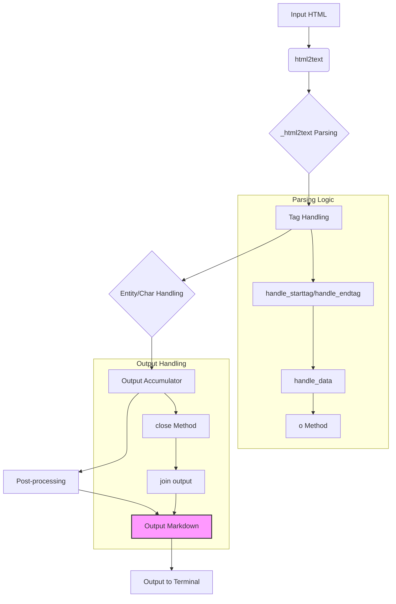

# <input code>

```python
## \file hypotez/src/utils/convertors/html2text.py
# -*- coding: utf-8 -*-
#! venv/Scripts/python.exe
#! venv/bin/python/python3.12

"""
.. module: src.utils.convertors.html2text 
	:platform: Windows, Unix
	:synopsis:  HTML -> MD

"""
MODE = 'dev'


"""html2text: Turn HTML into equivalent Markdown-structured text."""
__version__ = "3.1"
__author__ = "Aaron Swartz (me@aaronsw.com)"
__copyright__ = "(C) 2004-2008 Aaron Swartz. GNU GPL 3."
__contributors__ = ["Martin 'Joey' Schulze", "Ricardo Reyes", "Kevin Jay North"]

# TODO:
#   Support decoded entities with unifiable.

try:
    True
except NameError:
    setattr(__builtins__, 'True', 1)
    setattr(__builtins__, 'False', 0)

def has_key(x, y):
    if hasattr(x, 'has_key'): return x.has_key(y)
    else: return y in x

import html.entities as htmlentitydefs
import urllib.parse as urlparse
import html.parser as HTMLParser
import urllib.request as urllib
import optparse, re, sys, codecs, types
from textwrap import wrap


# Use Unicode characters instead of their ascii psuedo-replacements
UNICODE_SNOB = 0

# Put the links after each paragraph instead of at the end.
LINKS_EACH_PARAGRAPH = 0

# Wrap long lines at position. 0 for no wrapping. (Requires Python 2.3.)
BODY_WIDTH = 78

# Don't show internal links (href="#local-anchor") -- corresponding link targets
# won't be visible in the plain text file anyway.
SKIP_INTERNAL_LINKS = True

# Use inline, rather than reference, formatting for images and links
INLINE_LINKS = True

# Number of pixels Google indents nested lists
GOOGLE_LIST_INDENT = 36

IGNORE_ANCHORS = False
IGNORE_IMAGES = False

### Entity Nonsense ###
# ... (rest of the code)
```

# <algorithm>

The algorithm converts HTML to Markdown by parsing the HTML using `HTMLParser` and transforming it into a formatted Markdown string.  

1. **Initialization:** Sets up global constants (`UNICODE_SNOB`, `LINKS_EACH_PARAGRAPH`, `BODY_WIDTH`, etc.) and handles potential `NameError` for `True`/`False` in Python 2/3 compatibility. Imports necessary modules (`html.entities`, `urllib.parse`, `html.parser`, `urllib.request`, `optparse`, `re`, `sys`, `codecs`, `types`, `textwrap`).

2. **Entity Handling:** Defines functions (`name2cp`, `charref`, `entityref`, `replaceEntities`, `unescape`) to handle character references and entities, mapping them to their corresponding Markdown representations.

3. **Wrapping:** `onlywhite` function checks if a line contains only whitespace, `optwrap` function wraps text to a specified width if necessary and adjusts paragraph separation.

4. **Formatting Tags:** `hn` function checks for header tags, `dumb_property_dict` parses CSS attributes, and `dumb_css_parser` parses entire CSS style sheets.

5. **Element Style:** `element_style` function combines style from parent, class attributes, and inline style of the current element.

6. **Google Docs List Formatting:**  Functions `google_list_style`, `google_nest_count`, `google_has_height`, `google_text_emphasis` and `google_fixed_width_font` handle additional formatting considerations for documents exported from Google Docs.


7. **Parsing Logic (`_html2text`):**  The `_html2text` class extends `HTMLParser` to process HTML.
    - It handles various HTML tags (e.g., `p`, `div`, `br`, `hr`, `blockquote`, `ol`, `ul`, `li`, `a`, `img`, `code`, `h1-h9`, `em`, `strong`, `abbr`).
    -  It determines how these tags should be represented in Markdown using the previously defined functions.

8. **Output Handling:**
   - The `o` method accumulates output in a list `outtextlist` for potential joining later. It also handles the insertion of extra spaces and newlines based on the current tag context.
   - `handle_data` processes text content inside tags.
   - The `close` method joins `outtextlist`, handles list formatting, replaces placeholders (e.g., in Google Docs documents), and returns the Markdown equivalent of the parsed HTML.

9. **Input/Output (html2text_file, html2text):**
    - `html2text_file` handles reading HTML from a file or URL and calling `_html2text` to convert it.
    - `html2text` wraps output using `optwrap` and provides a main entry point.

10. **Command-line processing (if __name__ == "__main__":):**
    - Handles command-line arguments, setting options (e.g., Google Doc format, wrapping width, list markers).
    - Reads input from file or standard input, and converts to Markdown, writing the output to standard output.


# <mermaid>



This diagram represents the main flow of HTML to Markdown conversion.  `_html2text` is the core parsing class, handling tags and data.  The output is accumulated and then post-processed to create the final Markdown string. The `o` method is crucial for managing the output formatting.  External dependencies include the `html.parser`, `urllib`, `re`, `textwrap`, and potentially `feedparser` (for determining encoding) and `chardet`.  The `options` object is used to customize the output.


# <explanation>

**Imports:**

The code imports various modules from the Python standard library:
- `html.entities`: Defines HTML entities (e.g., `&lt;`, `&gt;`).
- `urllib.parse`: Used for parsing URLs.
- `html.parser`: Provides the base `HTMLParser` class for HTML parsing.
- `urllib.request`: Used for fetching URLs (if needed).
- `optparse`: For parsing command-line options.
- `re`: For regular expression operations (e.g., entity escaping).
- `sys`: For accessing system-specific parameters (like standard input/output).
- `codecs`: For encoding/decoding data.
- `types`: For checking data types.
- `textwrap`: For wrapping long lines.

These imports are essential for parsing the input HTML document, handling URLs (if any), performing necessary regular expressions, and writing the formatted output.


**Classes:**

- `_html2text(HTMLParser.HTMLParser)`: This class extends the `HTMLParser` to handle the HTML parsing. It contains methods to manage HTML tags, entities, and overall formatting and is the core of the conversion process. `__init__` method initializes the parser. `feed` reads input. `close` handles final output processing.  `handle_xxx` methods handle specific HTML tags.  `o`, `p`, `soft_br` are output methods. The parser handles different HTML tags to generate Markdown output and maintains internal state using attributes like `outtext`, `p_p`, `a`, `astack`, etc.


**Functions:**

- `unescape`:  Converts HTML entities to their equivalent Unicode characters.
- `optwrap`: Wraps long lines to the desired width, crucial for rendering text in a readable format.
- `html2text_file`: Reads HTML from a file or URL and calls `_html2text` to convert it.
- `html2text`: Wraps `html2text_file` output, handles wrapping, and provides a user-friendly entry point for HTML to Markdown conversion.
- `name2cp`, `charref`, `entityref`, `replaceEntities`: Handle the conversion of HTML entities to their character equivalents.
- Other functions (`google_xxx`) deal with special cases for formatting exported Google Docs.


**Variables:**

- `UNICODE_SNOB`, `LINKS_EACH_PARAGRAPH`, `BODY_WIDTH`, `SKIP_INTERNAL_LINKS`: Control various aspects of the conversion process.
- `options`: An object used to store configuration parameters (passed from the command line) like use of a Google Doc renderer, different list markers, or whether to wrap text.

**Error Handling/Improvements:**

- The code includes extensive `try...except` blocks to handle potential `NameError` exceptions in Python 2/3 compatibility.
- Error handling for invalid HTML input or incorrect command-line arguments could be further improved.  
- The code's complexity and functionality warrant careful testing and documentation.
-  Some comments are lacking in clarity.
-  The code uses internal state to manage links, which could be considered for possible refactoring.


**Relationship to Other Parts of the Project:**

The `html2text` module acts as a conversion utility within the `hypotez` project.  It presumably interacts with other modules responsible for input (taking in files or URLs) or output (formatting, rendering the Markdown). It isn't directly connected to a database or other external services in the given code but is meant to be part of a larger system for processing and displaying text.