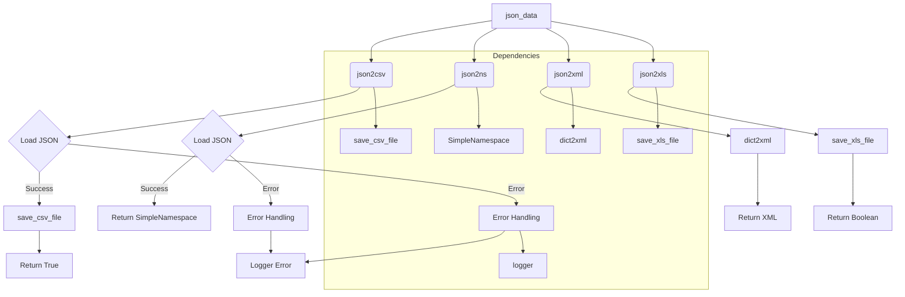

# <input code>

```python
## \file hypotez/src/utils/convertors/json.py
# -*- coding: utf-8 -*-\
#! venv/Scripts/python.exe
#! venv/bin/python/python3.12

"""
.. module: src.utils.convertors.json 
	:platform: Windows, Unix
	:synopsis: convert JSON data into various formats: CSV, SimpleNamespace, XML, and XLS

Functions:
    - `json2csv`: Convert JSON data to CSV format.
    - `json2ns`: Convert JSON data to SimpleNamespace object.
    - `json2xml`: Convert JSON data to XML format.
    - `json2xls`: Convert JSON data to XLS format.
"""
MODE = 'dev'
import json
import csv
from types import SimpleNamespace
from pathlib import Path
from typing import List, Dict

from src.utils.csv import save_csv_file
from src.utils.jjson import j_dumps
from src.utils.xls import save_xls_file
from src.utils.convertors.dict import dict2xml
from src.logger import logger


def json2csv(json_data: str | list | dict | Path, csv_file_path: str | Path) -> bool:
    """
    Convert JSON data or JSON file to CSV format with a comma delimiter.

    Args:
        json_data (str | list | dict | Path): JSON data as a string, list of dictionaries, or file path to a JSON file.
        csv_file_path (str | Path): Path to the CSV file to write.

    Returns:
        bool: True if successful, False otherwise.

    Raises:
        ValueError: If unsupported type for json_data.
        Exception: If unable to parse JSON or write CSV.
    """
    try:
        # Load JSON data
        if isinstance(json_data, dict):
            data = [json_data]
        elif isinstance(json_data, str):
            data = json.loads(json_data)
        elif isinstance(json_data, list):
            data = json_data
        elif isinstance(json_data, Path):
            with open(json_data, 'r', encoding='utf-8') as json_file:
                data = json.load(json_file)
        else:
            raise ValueError("Unsupported type for json_data")

        save_csv_file(data, csv_file_path)
        return True
    except Exception as ex:
        logger.error(f"json2csv failed", ex, True)
        ...


def json2ns(json_data: str | dict | Path) -> SimpleNamespace:
    """
    Convert JSON data or JSON file to SimpleNamespace object.

    Args:
        json_data (str | dict | Path): JSON data as a string, dictionary, or file path to a JSON file.

    Returns:
        SimpleNamespace: Parsed JSON data as a SimpleNamespace object.
    
    Raises:
        ValueError: If unsupported type for json_data.
        Exception: If unable to parse JSON.
    """
    try:
        if isinstance(json_data, dict):
            data = json_data
        elif isinstance(json_data, str):
            data = json.loads(json_data)
        elif isinstance(json_data, Path):
            with open(json_data, 'r', encoding='utf-8') as json_file:
                data = json.load(json_file)
        else:
            raise ValueError("Unsupported type for json_data")
        
        return SimpleNamespace(**data)
    except Exception as ex:
        logger.error(f"json2ns failed", ex, True)


def json2xml(json_data: str | dict | Path, root_tag: str = "root") -> str:
    """
    Convert JSON data or JSON file to XML format.

    Args:
        json_data (str | dict | Path): JSON data as a string, dictionary, or file path to a JSON file.
        root_tag (str): The root element tag for the XML.

    Returns:
        str: The resulting XML string.

    Raises:
        ValueError: If unsupported type for json_data.
        Exception: If unable to parse JSON or convert to XML.
    """
    return dict2xml(json_data)


def json2xls(json_data: str | list | dict | Path, xls_file_path: str | Path) -> bool:
    """
    Convert JSON data or JSON file to XLS format.

    Args:
        json_data (str | list | dict | Path): JSON data as a string, list of dictionaries, or file path to a JSON file.
        xls_file_path (str | Path): Path to the XLS file to write.

    Returns:
        bool: True if successful, False otherwise.

    Raises:
        ValueError: If unsupported type for json_data.
        Exception: If unable to parse JSON or write XLS.
    """
    return save_xls_file(json_data, file_path)
```

# <algorithm>

**Шаг 1:** Функция `json2csv` принимает JSON-данные и путь к CSV-файлу.
* **Пример:** `json2csv('{"name": "John", "age": 30}', 'output.csv')`
* **Описание:** Если входные данные - словарь, то данные конвертируются в массив.  Загружает JSON-данные из файла или строки, если требуется.
* **Передача данных:** Входные данные `json_data` передаются для обработки в функцию `save_csv_file`.

**Шаг 2:** `save_csv_file` записывает данные в CSV-файл.
* **Пример:** `save_csv_file([{'name': 'John', 'age': 30}], 'output.csv')`
* **Описание:** Функция использует библиотеку `csv` для сохранения данных.
* **Передача данных:**  Данные, загруженные в `data`, передаются для записи в функцию `save_csv_file`.

**Шаг 3:** Функция возвращает `True` в случае успеха, `False` - в случае ошибки.
* **Пример:** Возвращает `True`, если данные были успешно записаны.
* **Описание:** Обработка исключений.


**Шаг 1:** Функция `json2ns` принимает JSON-данные.
* **Пример:** `json2ns('{"name": "John", "age": 30}')`
* **Описание:** Принимает JSON-данные и конвертирует их в `SimpleNamespace`.

**Шаг 2:** Функция возвращает `SimpleNamespace` с загруженными данными.
* **Пример:** Возвращает `SimpleNamespace(name='John', age=30)`.
* **Описание:** Обработка исключений.


**Шаг 1:** Функция `json2xml` конвертирует JSON в XML, использует функцию `dict2xml`.
* **Пример:** `json2xml('{"name": "John", "age": 30}')`
* **Описание:**  Функция конвертирует JSON в XML, использует уже готовую функцию `dict2xml`.
* **Передача данных:** Входные JSON данные передаются в функцию `dict2xml`, которая возвращает строку XML.

**Шаг 1:** Функция `json2xls` конвертирует JSON в XLS, используя `save_xls_file`.
* **Пример:** `json2xls('{"name": "John", "age": 30}', 'output.xls')`
* **Описание:**  Функция конвертирует JSON в XLS, используя  функцию `save_xls_file`.  Здесь нужно уточнить, как именно происходит запись в xls, т.к. код для этой функции неполный.
* **Передача данных:** Входные JSON данные передаются в функцию `save_xls_file`.


# <mermaid>



# <explanation>

**Импорты:**

* `json`: Библиотека для работы с JSON-данными.
* `csv`: Библиотека для работы с CSV-данными.
* `types.SimpleNamespace`:  Класс для создания объекта, имитирующего именованный кортеж.
* `pathlib.Path`: Для работы с путями к файлам.
* `typing.List`, `typing.Dict`: Типы данных для ясности.
* `src.utils.csv`: Функция `save_csv_file`, вероятно, для сохранения данных в CSV-файл (из внешнего модуля).
* `src.utils.jjson`: Функция `j_dumps`, скорее всего, для работы с JSON-строками (из внешнего модуля).
* `src.utils.xls`: Функция `save_xls_file`, для сохранения данных в XLS-файл (из внешнего модуля).
* `src.utils.convertors.dict`: Функция `dict2xml`, для преобразования словаря в XML.
* `src.logger`: Модуль для логгирования ошибок и сообщений.

**Классы:**

* `SimpleNamespace`: Имянованный кортеж, используемый для представления JSON-данных.

**Функции:**

* `json2csv`: Принимает JSON-данные (строка, список, словарь, путь к файлу) и путь к CSV-файлу. Возвращает `True` при успехе и обрабатывает исключения.
* `json2ns`: Принимает JSON-данные (строка, словарь, путь к файлу). Возвращает `SimpleNamespace` объект, содержащий данные. Обрабатывает исключения.
* `json2xml`: Принимает JSON-данные (строка, словарь, путь к файлу). Возвращает XML-представление данных. Использует `dict2xml`. Обрабатывает исключения.
* `json2xls`: Принимает JSON-данные (строка, список, словарь, путь к файлу) и путь к XLS-файлу. Возвращает `True` при успехе, обрабатывает исключения.  Код неполный,  нужна информация о `save_xls_file`.

**Переменные:**

* `MODE`: Строковая константа, скорее всего, для обозначения режима работы (например, 'dev', 'prod').

**Возможные ошибки и улучшения:**

* Функция `json2xls` неполная, необходимо знать, как используется `save_xls_file` (входные параметры и поведение).
* Не указаны типы данных, которые ожидаются в качестве аргументов для `save_csv_file` и `save_xls_file`.
* Обработка ошибок могла бы быть более подробной (например, использование разных типов исключений).
* Необходимо добавить обработку потенциальных проблем с кодировкой.
* Лучше использовать аннотации типов для всех функций и методов для большей читабельности.
* Документация могла бы быть улучшена, включая примеры использования функций.


**Взаимосвязи с другими частями проекта:**

* `json.py` зависит от `src.utils.csv`, `src.utils.jjson`, `src.utils.xls`, `src.utils.convertors.dict`, `src.logger` для работы.
* `save_csv_file`, `save_xls_file` и `dict2xml` — это функции из других модулей, находящихся в подпапке `utils`, `utils.convertors`, `utils.xls`, которые, видимо, обеспечивают обработку файлов CSV, XLS и преобразование словаря в XML соответственно.
* `logger` — это механизм логгирования, обеспечивающий запись сообщений об ошибках, логи и т.д.