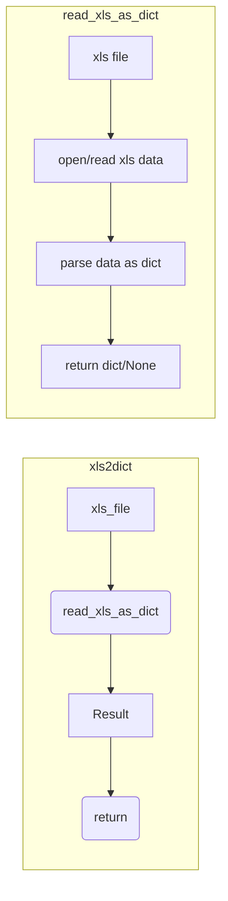

1. <input code>
```python
## \file hypotez/src/utils/convertors/xls.py
# -*- coding: utf-8 -*-\
#! venv/Scripts/python.exe
#! venv/bin/python/python3.12

"""
.. module: src.utils.convertors 
	:platform: Windows, Unix
	:synopsis:

"""


from pathlib import Path

from src.utils.xls import read_xls_as_dict, save_xls_file


def xls2dict(xls_file: str | Path) -> dict | None:
    """"""
    return read_xls_as_dict(xls_file = xls_file)

```

2. <algorithm>

```mermaid
graph TD
    A[xls_file (str/Path)] --> B(read_xls_as_dict);
    B --> C{Result (dict/None)};
    C --> D[Return Value];
```

**Пример:**

Пусть `xls_file` содержит путь к файлу `data.xls`. Функция `read_xls_as_dict` читает этот файл, преобразует его в словарь и возвращает результат. Если чтение файла или преобразование данных не удается, функция возвращает `None`.

3. <mermaid>



**Объяснение диаграммы:**

Функция `xls2dict` принимает `xls_file` и передаёт его в функцию `read_xls_as_dict`.  `read_xls_as_dict`  открывает и читает файл, затем парсит его содержимое как словарь. Результат (словарь или `None` в случае ошибки) возвращается в функцию `xls2dict`, которая, в свою очередь, возвращает его вызывающей функции.

4. <explanation>

* **Импорты:**
    * `from pathlib import Path`: Импортирует класс `Path` для работы с путями к файлам, обеспечивая кроссплатформенность.  Связь с остальным кодом: `Path` позволяет обрабатывать пути независимо от операционной системы, что критически важно для обработки файлов.
    * `from src.utils.xls import read_xls_as_dict, save_xls_file`:  Импортирует функции `read_xls_as_dict` и `save_xls_file` из модуля `xls` внутри пакета `utils`. Это указывает на то, что эти функции, скорее всего, отвечают за чтение и запись файлов в формате xls.  Связь с остальным кодом: этот модуль предоставляет необходимые инструменты для работы с файлами xls, абстрагируя детальности чтения/записи.

* **Функция `xls2dict`:**
    * **Аргументы:** `xls_file: str | Path`: принимает путь к файлу xls в виде строки или объекта `Path`.
    * **Возвращаемое значение:** `dict | None`: возвращает словарь, содержащий данные из xls-файла, или `None` в случае ошибки.
    * **Назначение:**  Выполняет чтение xls-файла и преобразование его содержимого в словарь.
    * **Пример:**
      ```python
      data = xls2dict("data.xls")
      if data:
          print(data)
      else:
          print("Error reading file")
      ```

* **Переменные:**
    * ``: Переменная, вероятно, определяет режим работы (например, разработка/производство), но пока не понятно её конкретное применение в этом фрагменте кода.


* **Возможные ошибки/улучшения:**
    * Нет обработки ошибок: функция `read_xls_as_dict` не обрабатывает потенциальные исключения (например, если файла не существует, формат не поддерживается или произошла ошибка ввода-вывода).  Это требует добавления обработки `try...except` блоков.
    * Нет ясности о формате данных в `xls_file`: Нет информации о том, какой формат данных используется в xls-файле (например, какой пакет используется для работы с xls).

* **Взаимосвязи с другими частями проекта:**
   Функции из `src.utils.xls`  вероятно используются в других модулях приложения для обработки данных из файлов xls.  Эта функция `xls2dict` является частью более широкого набора инструментов для работы с данными и их преобразований.


**Важно:** Для более глубокого анализа необходимо видеть содержимое модуля `src.utils.xls`.