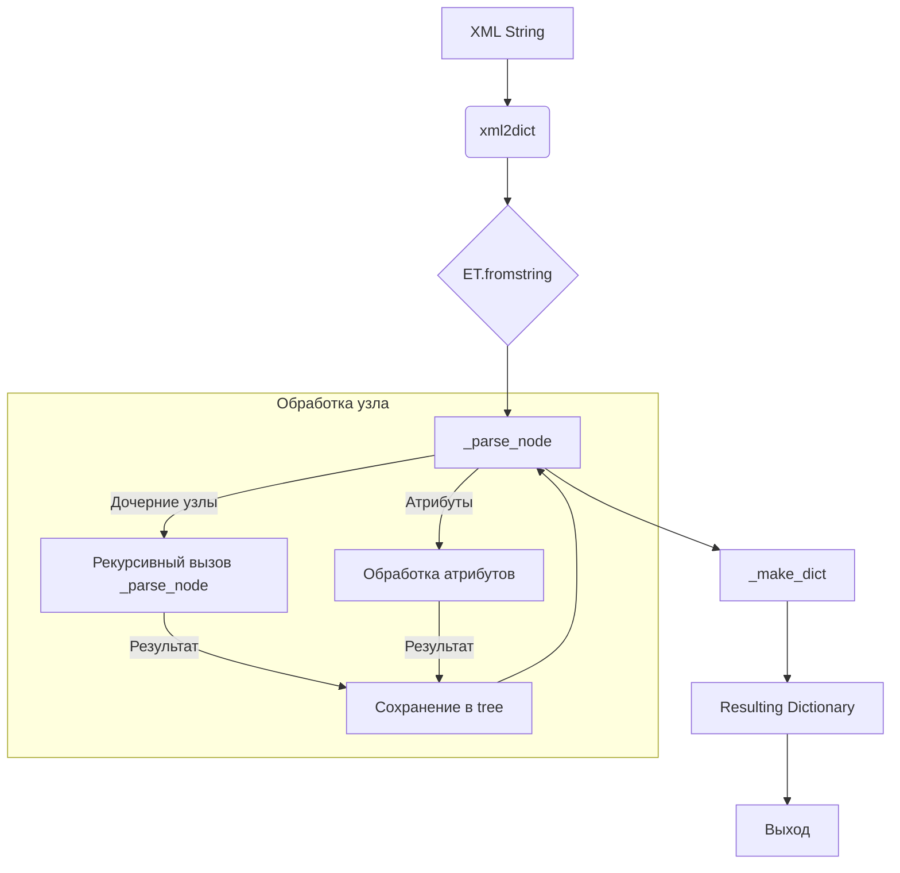

# <input code>

```python
## \file hypotez/src/utils/convertors/xml2dict.py
# -*- coding: utf-8 -*-\
#! venv/Scripts/python.exe
#! venv/bin/python/python3.12

"""
.. module: src.utils.convertors 
	:platform: Windows, Unix
	:synopsis: provides utilities for converting XML data into dictionaries. It includes functions for parsing XML strings and converting XML element trees into dictionary representations.

Functions:
- `_parse_node`: Parses an XML node into a dictionary.
- `_make_dict`: Generates a dictionary with the tag name and value.
- `xml2dict`: Parses an XML string into a dictionary.
- `ET2dict`: Converts an XML element tree into a dictionary.
"""

import re

try:
    import xml.etree.cElementTree as ET
except ImportError as err:
    import xml.etree.ElementTree as ET

def _parse_node(node: ET.Element) -> dict | str:
    """Parse an XML node into a dictionary.

    Args:
        node (ET.Element): The XML element to parse.

    Returns:
        dict | str: A dictionary representation of the XML node, or a string if the node has no attributes or children.
    """
    tree = {}
    attrs = {}
    for attr_tag, attr_value in node.attrib.items():
        if attr_tag == '{http://www.w3.org/1999/xlink}href':
            continue
        attrs.update(_make_dict(attr_tag, attr_value))

    value = node.text.strip() if node.text is not None else ''

    if attrs:
        tree['attrs'] = attrs

    has_child = False
    for child in list(node):
        has_child = True
        ctag = child.tag
        ctree = _parse_node(child)
        cdict = _make_dict(ctag, ctree)

        if ctree:
            value = ''

        if ctag not in tree:
            tree.update(cdict)
            continue

        old = tree[ctag]
        if not isinstance(old, list):
            tree[ctag] = [old]
        tree[ctag].append(ctree)

    if not has_child:
        tree['value'] = value

    if list(tree.keys()) == ['value']:
        tree = tree['value']
    return tree

def _make_dict(tag: str, value: any) -> dict:
    """Generate a new dictionary with tag and value.

    Args:
        tag (str): The tag name of the XML element.
        value (any): The value associated with the tag.

    Returns:
        dict: A dictionary with the tag name as the key and the value as the dictionary value.
    """
    tag_values = value
    result = re.compile(r'\{(.*)\}(.*)').search(tag)
    if result:
        tag_values = {'value': value}
        tag_values['xmlns'], tag = result.groups()
    return {tag: tag_values}

def xml2dict(xml: str) -> dict:
    """Parse XML string into a dictionary.

    Args:
        xml (str): The XML string to parse.

    Returns:
        dict: The dictionary representation of the XML.
    """
    element_tree = ET.fromstring(xml)
    return ET2dict(element_tree)

def ET2dict(element_tree: ET.Element) -> dict:
    """Convert an XML element tree into a dictionary.

    Args:
        element_tree (ET.Element): The XML element tree.

    Returns:
        dict: The dictionary representation of the XML element tree.
    """
    return _make_dict(element_tree.tag, _parse_node(element_tree))
```

# <algorithm>

**Алгоритм работы кода (пошаговая блок-схема):**

1. **Вход:** Строка XML (xml2dict) или элемент дерева XML (ET2dict).
2. **ET.fromstring(xml):** Преобразование строки XML в объект `xml.etree.ElementTree` (элемент дерева).
3. **_parse_node(node):** Рекурсивная функция для обработки каждого элемента:
   * **Обработка атрибутов:** Игнорирование атрибута `{http://www.w3.org/1999/xlink}href`. Иначе добавление атрибутов в `attrs`.
   * **Обработка текста:** Сохранение текстового значения узла в `value`.
   * **Обработка дочерних узлов:** Рекурсивный вызов `_parse_node` для каждого дочернего элемента, формируя словарь с соответствующими тегами.
   * **Объединение результатов:** Если у узла есть дочерние элементы, то значение `value` устанавливается в пустую строку. Если у узла есть атрибуты, то они складываются в словарь `attrs`.  Если дочерние элементы одинаковые, они собираются в список в `tree`.
   * **Возврат результата:** Возврат словаря `tree`, который содержит атрибуты, значения и значения дочерних узлов.  Если в `tree` только поле 'value', возвращается значение `value`.

4. **_make_dict(tag, value):** Формирование словаря, где ключ - тег, а значение -  `value` (или словарь, если тег содержит префикс namespace).

5. **Возвращение результата:**  `xml2dict` возвращает результирующий словарь, полученный после обработки дерева. `ET2dict` возвращает тот же словарь.


**Примеры данных и перемещение данных:**

Ввод: `<root><tag1 attr1="value1">text1</tag1><tag2>text2</tag2></root>`

1. `xml2dict` преобразует строку в `ET.Element`.
2. `_parse_node` рекурсивно обрабатывает `root`, `tag1`, `tag2`.
3. `_parse_node` для `tag1`: `attrs` = {'attr1': 'value1'}, `value` = 'text1', сохраняется в `tree`
4. `_parse_node` для `tag2`: `value` = 'text2',  сохраняется в `tree`
5. `_make_dict` формирует итоговый словарь: `{'root': {'tag1': {'attrs': {'attr1': 'value1'}, 'value': 'text1'}, 'tag2': {'value': 'text2'}}}`.

# <mermaid>



**Зависимости:**

* `xml.etree.ElementTree`: Библиотека Python для работы с XML.  `cElementTree` — более эффективная реализация для большинства случаев.
* `re`: Библиотека для регулярных выражений, используемая для обработки тегов с префиксом namespace.
* `hypotez.src`:  Проект, в котором находится `hypotez`.

# <explanation>

**Импорты:**

* `import xml.etree.cElementTree as ET`: Импортирует модуль `cElementTree` для обработки XML. `cElementTree` обычно предпочтительнее, так как он более производителен, чем `xml.etree.ElementTree`. Если `cElementTree` недоступен, используется `xml.etree.ElementTree`.
* `import re`: Импортирует модуль для работы с регулярными выражениями, необходимыми для обработки namespace.


**Классы:**

* Нет явных классов, используется только `xml.etree.Element` для работы с узлами XML.


**Функции:**

* **`_parse_node(node: ET.Element)`**: Рекурсивно парсит XML-узел в словарь. Принимает XML-узел и возвращает словарь или строку. Обрабатывает атрибуты, текстовое содержимое и рекурсивно обрабатывает дочерние узлы. Игнорирует атрибут `{http://www.w3.org/1999/xlink}href`.
* **`_make_dict(tag: str, value: any)`**: Создаёт словарь с тегом и значением.  Обрабатывает теги, содержащие префикс namespace.
* **`xml2dict(xml: str)`**: Преобразует строку XML в словарь. Принимает строку XML и возвращает словарь.
* **`ET2dict(element_tree: ET.Element)`**: Преобразует элемент XML-дерева в словарь. Принимает элемент XML-дерева и возвращает словарь.

**Переменные:**

* `MODE`: Строковая переменная, хранящая режим работы (в данном случае, `'dev'`).
* Другие переменные, например, `tree`, `attrs`, `value`, `has_child` имеют стандартный смысл, связанный с обработкой XML узлов и формированием итогового словаря.


**Возможные ошибки или улучшения:**

* **Обработка ошибок:** Функции не содержат обработки исключений, которые могут возникнуть при работе с XML, например, некорректные XML-строки. Добавление проверок на правильность формата XML улучшит устойчивость.
* **Документация:**  Комментарии в коде не полностью соответствуют стандартам. Дополнительные пояснения к использованию и обработке особых случаев (например, пустых тегов) могут улучшить понимание.
* **Обобщение:** Можно было бы обобщить обработку атрибутов, что сделает код более гибким, например, добавление функции для настройки игнорируемых атрибутов.


**Взаимосвязь с другими частями проекта:**

Эти функции являются частью модуля `utils.convertors` и вероятно используются в других частях проекта для преобразования XML-данных в структурированные данные Python.  Возможная цепочка вызовов:
1. Получение данных XML из стороннего источника (API, файл).
2. Обработка XML-строки с помощью `xml2dict`.
3. Обработка полученного словаря для дальнейшей обработки или сохранения в базе данных.