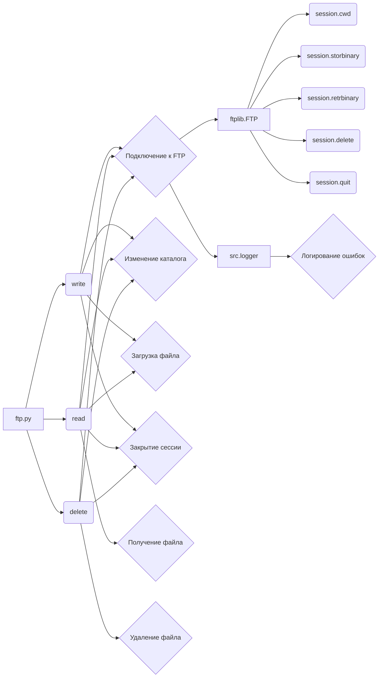

```MD
# <input code>

```python
## \file hypotez/src/utils/ftp.py
# -*- coding: utf-8 -*-\
#! venv/Scripts/python.exe
#! venv/bin/python/python3.12

"""
.. module: src.utils 
	:platform: Windows, Unix
	:synopsis: interface for interacting with FTP servers
This module provides an interface for interacting with FTP servers. It includes functions to send, receive, and delete files from an FTP server.

** Purpose **:
Allows for sending media files (images, videos), spreadsheets, and other files to and from an FTP server. 

** Modules **:
- helpers (local): Local helper utilities for FTP operations.
- typing: Type hints for function parameters and return values.
- ftplib: Provides FTP protocol client capabilities.
- pathlib: For handling file system paths.

Functions:
    - `write`: Sends a file to an FTP server.
    - `read`: Retrieves a file from an FTP server.
    - `delete`: Deletes a file from an FTP server.
"""
MODE = 'dev'
from src.logger import logger
from typing import Union
import ftplib
from pathlib import Path

# Connection configuration (assumed to be defined elsewhere)
_connection = {
    'server': 'ftp.example.com',
    'port': 21,
    'user': 'username',
    'password': 'password'
}

def write(source_file_path: str, dest_dir: str, dest_file_name: str) -> bool:
    """
    Sends a file to an FTP server.

    Args:
        source_file_path (str): The path of the file to be sent.
        dest_dir (str): The destination directory on the FTP server.
        dest_file_name (str): The name of the file on the FTP server.

    Returns:
        bool: True if the file is successfully sent, False otherwise.

    Example:
        >>> success = write('local_path/to/file.txt', '/remote/directory', 'file.txt')
        >>> print(success)
        True
    """
    try:
        # Establish connection to FTP server
        session = ftplib.FTP(
            _connection['server'],
            _connection['user'],
            _connection['password'])
        session.cwd(dest_dir)
    except Exception as ex:
        # Log error if connection to FTP server fails
        logger.error(f"Failed to connect to FTP server. Error: {ex}")
        return False

    try:
        # Open the file and send it to the FTP server
        with open(source_file_path, 'rb') as f:
            session.storbinary(f'STOR {dest_file_name}', f)
        return True
    except Exception as ex:
        # Log error if file transfer to FTP server fails
        logger.error(f"Failed to send file to FTP server. Error: {ex}")
        return False
    finally:
        try:
            # Close the FTP session
            session.quit()
        except Exception as ex:
            logger.error(f"Failed to close FTP session. Error: {ex}")


# ... (read and delete functions)
```

# <algorithm>

**Функция `write`:**

1. **Подключение к серверу:** Устанавливает соединение с FTP-сервером используя `ftplib.FTP`.  Проверяет успешность подключения, логгируя ошибки при необходимости.

2. **Переход в каталог:** Меняет текущий каталог на сервере на заданный `dest_dir`.

3. **Загрузка файла:** Открывает локальный файл для чтения в бинарном режиме (`'rb'`), отправляет его на сервер с помощью `session.storbinary`.  Логирует возможные ошибки при передаче.

4. **Закрытие сессии:** Закрывает сессию с FTP-сервером, логгируя ошибки.


**Функция `read`:**

1. **Подключение к серверу:** Аналогично `write`.

2. **Переход в каталог:** Аналогично `write`.

3. **Загрузка файла:** Открывает локальный файл для записи в бинарном режиме (`'wb'`).  Получает содержимое удаленного файла с помощью `session.retrbinary`, записывая его в локальный файл. Читает содержимое из локального файла и возвращает его.

4. **Закрытие сессии:** Аналогично `write`.


**Функция `delete`:**

1. **Подключение к серверу:** Аналогично `write` и `read`.

2. **Переход в каталог:** Аналогично `write` и `read`.

3. **Удаление файла:** Удаляет файл на сервере с помощью `session.delete`.

4. **Закрытие сессии:** Аналогично `write` и `read`.


# <mermaid>



**Подключаемые зависимости:**

* `src.logger`: Подключается для записи логов ошибок в случае неудачного выполнения операций с FTP-сервером.

* `ftplib`: Предоставляет возможности взаимодействия с FTP-серверами.

* `typing`: Используется для указания типов переменных, что улучшает читаемость и надежность кода.

* `pathlib`: Используется для работы с путями к файлам.


# <explanation>

**Импорты:**

* `from src.logger import logger`: Импортирует класс `logger` из модуля `logger`, находящегося в папке `src`.  Это указывает на использование системы логирования, определенной в другом модуле проекта.

* `from typing import Union`: Импортирует тип `Union` из модуля `typing`, используемый для указания возможности возвращать различные типы данных.

* `import ftplib`: Импортирует модуль `ftplib`, который предоставляет функции для взаимодействия с FTP-серверами.

* `from pathlib import Path`: Импортирует класс `Path` из модуля `pathlib`, который используется для работы с путями к файлам.  Этот импорт, хотя и используется, не используется в данном коде существенно.

**Классы:**

Нет определенных классов в этом файле.

**Функции:**

* **`write(source_file_path, dest_dir, dest_file_name)`:** Отправляет файл на FTP-сервер.
    * `source_file_path`: Путь к локальному файлу.
    * `dest_dir`: Директория на FTP-сервере.
    * `dest_file_name`: Имя файла на FTP-сервере.
    * Возвращает `True`, если отправка прошла успешно, `False` иначе.

* **`read(source_file_path, dest_dir, dest_file_name)`:** Скачивает файл с FTP-сервера.
    * `source_file_path`: Путь для сохранения локального файла.
    * `dest_dir`: Директория на FTP-сервере.
    * `dest_file_name`: Имя файла на FTP-сервере.
    * Возвращает содержимое файла, если загрузка успешна, и `None` иначе.

* **`delete(source_file_path, dest_dir, dest_file_name)`:** Удаляет файл с FTP-сервера.
    * `source_file_path`: Путь к локальному файлу (не используется).
    * `dest_dir`: Директория на FTP-сервере.
    * `dest_file_name`: Имя файла на FTP-сервере.
    * Возвращает `True`, если удаление прошло успешно, `False` иначе.


**Переменные:**

* `_connection`: Словарь, содержащий конфигурацию подключения к FTP-серверу.  Этот словарь неявно используется во всех функциях.  Он должен быть определен где-то в другом месте проекта.

* `MODE`:  Строковая константа, используемая для режима.  По умолчанию она имеет значение 'dev', что означает, что это код для разработки.


**Возможные ошибки и улучшения:**

* **Неустойчивое соединение:**  Код пытается закрыть соединение в блоке `finally`.  Однако, если произойдет ошибка внутри `try`, она не обработана.  В случае критической ошибки при подключении к FTP-серверу или во время операций с файлами, нужно использовать обработку исключений в `finally` блоке.

* **Обработка ошибок:**  Хотя код использует блоки `try...except`, логирование может быть улучшено.  Вместо простого вывода сообщения об ошибке, можно добавлять контекст, например, имя файла или путь, или использовать уровни логирования (error, warning, info).

* **Проверка параметров:**  Функции не проверяют, что входные параметры (`source_file_path`, `dest_dir`, `dest_file_name`) являются допустимыми.  Можно добавить проверки, чтобы убедиться, что файлы существуют (для `write`), или обработку возможных исключений (`FileNotFoundError` или исключений типов).

* **Возвращаемое значение `read`:**  Возвращаемое значение `None` не очень информативно. Лучше возвращать ошибку, например, `IOError` или `ftplib.error`  (если уместно).

* **Подключение к серверу:** Функции повторяют код подключения к FTP-серверу. Можно вынести это в отдельную функцию `connect_to_ftp` для повторного использования.

* **Обработка закрытия соединения:** При выходе из функции обязательно нужно закрывать соединение с FTP.  Сейчас это сделано в блоке finally, но это не идеальный вариант.

**Взаимосвязь с другими частями проекта:**

Этот модуль `ftp.py` взаимодействует с модулем `logger.py` для записи сообщений об ошибках.  Также он предполагает, что словарь `_connection` определен в другой части проекта и содержит информацию о подключении к FTP-серверу.