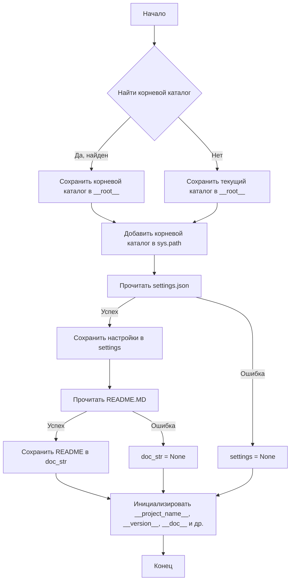
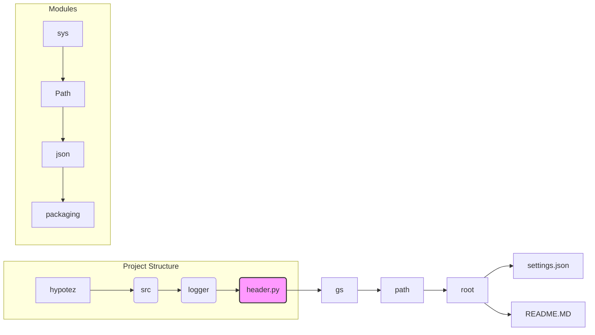

```MD
# Анализ кода из файла hypotez/src/logger/header.py

## <input code>

```python
## \file hypotez/src/logger/header.py
# -*- coding: utf-8 -*-\
#! venv/Scripts/python.exe
#! venv/bin/python/python3.12

"""
.. module: src.logger 
	:platform: Windows, Unix
	:synopsis:

"""


"""
	:platform: Windows, Unix
	:synopsis: Модуль определяющий корневой путь к проекту. Все импорты строятся относительно этого пути.
    :TODO: В дальнейшем перенести в системную переменную"""

import sys
import json
from packaging.version import Version

from pathlib import Path
def set_project_root(marker_files=('__root__','.git')) -> Path:
    """
    Finds the root directory of the project starting from the current file's directory,
    searching upwards and stopping at the first directory containing any of the marker files.

    Args:
        marker_files (tuple): Filenames or directory names to identify the project root.
    
    Returns:
        Path: Path to the root directory if found, otherwise the directory where the script is located.
    """
    __root__:Path
    current_path:Path = Path(__file__).resolve().parent
    __root__ = current_path
    for parent in [current_path] + list(current_path.parents):
        if any((parent / marker).exists() for marker in marker_files):
            __root__ = parent
            break
    if __root__ not in sys.path:
        sys.path.insert(0, str(__root__))
    return __root__


# Get the root directory of the project
__root__ = set_project_root()
"""__root__ (Path): Path to the root directory of the project"""

from src import gs

settings:dict = None
try:
    with open(gs.path.root / 'src' /  'settings.json', 'r') as settings_file:
        settings = json.load(settings_file)
except (FileNotFoundError, json.JSONDecodeError):
    ...

doc_str:str = None
try:
    with open(gs.path.root / 'src' /  'README.MD', 'r') as settings_file:
        doc_str = settings_file.read()
except (FileNotFoundError, json.JSONDecodeError):
    ...


__project_name__ = settings.get("project_name", 'hypotez') if settings  else 'hypotez'
__version__: str = settings.get("version", '')  if settings  else ''
__doc__: str = doc_str if doc_str else ''
__details__: str = ''
__author__: str = settings.get("author", '')  if settings  else ''
__copyright__: str = settings.get("copyrihgnt", '')  if settings  else ''
__cofee__: str = settings.get("cofee", "Treat the developer to a cup of coffee for boosting enthusiasm in development: https://boosty.to/hypo69")  if settings  else "Treat the developer to a cup of coffee for boosting enthusiasm in development: https://boosty.to/hypo69"
```

## <algorithm>



**Пример:**

Если файл `header.py` находится в каталоге `/home/user/project/hypotez/src/logger`, а файл `pyproject.toml` находится в `/home/user/project/hypotez`, то `set_project_root` вернёт `/home/user/project/hypotez`.


## <mermaid>



**Объяснение диаграммы:**

Код взаимодействует с модулями `sys`, `pathlib`, `json`, `packaging.version`. Он использует `gs` (предположительно, другой модуль, вероятно, из `src` или `utils`, но требует дополнительной информации).  Ключевым элементом является `gs.path.root`, который позволяет получить путь к корневому каталогу проекта, что важно для поиска файлов `settings.json` и `README.MD`.


## <explanation>

* **Импорты:**
    * `sys`: Предоставляет доступ к системным переменным, в частности, `sys.path`. Используется для добавления корневого каталога в путь поиска модулей.
    * `json`: Используется для работы с файлами JSON.
    * `packaging.version`: Позволяет работать с версиями пакетов. (Используется, но не ясно зачем).
    * `pathlib`: Для работы с путями файлов и каталогов, предоставляет объекты Path, позволяющие более удобно работать с файлами и каталогами.
    * `src.gs`: Предполагаемый модуль из пакета `src`, предоставляющий информацию о корневом каталоге проекта и пути к файлам настроек (`settings.json` и `README.MD`). Связь с другими частями проекта неясна без дополнительной информации.

* **Классы:**
    * Нет явных определений классов. Используется только `Path` из `pathlib`.

* **Функции:**
    * `set_project_root(marker_files=...)`: Находит корневой каталог проекта, начиная с текущего каталога и идя вверх по дереву каталогов.  Возвращает `Path` к корневому каталогу.
      * Аргумент `marker_files`: Кортеж названий файлов или каталогов, которые используются для определения корневого каталога проекта. По умолчанию: `('pyproject.toml', 'requirements.txt', '.git')`.
      * Возвращаемое значение: `Path` к корневому каталогу.
      * Пример: Если в родительском каталоге `current_path` есть файл `pyproject.toml`, функция вернет родительский каталог.

* **Переменные:**
    * `MODE`: Строковая константа, хранящая значение 'dev'.
    * `__root__`: `Path`-объект, хранящий путь к корневому каталогу проекта.
    * `settings`: Словарь, хранящий данные из `settings.json`. Если файл не найден или невалиден, `settings` остается `None`.
    * `doc_str`: Строка, хранящая содержимое `README.MD`. Если файл не найден или невалиден, `doc_str` остается `None`.
    * `__project_name__`, `__version__`, `__doc__`, `__details__`, `__author__`, `__copyright__`, `__cofee__`:  Переменные, содержащие информацию о проекте. Получаются из `settings`. Значения по умолчанию (например, `'hypotez'`) используются, если `settings`  равно `None` или соответствующий ключ отсутствует.

* **Возможные ошибки и улучшения:**
    * Обработка исключений `FileNotFoundError` и `json.JSONDecodeError` - хорошо, но можно добавить логирование или более информативные сообщения об ошибках.
    * Более гибкая обработка структуры проекта: добавление вариаций пути к файлам настроек, `settings.json`, для различного расположения проекта.
    * Использование `try...except` блоков для каждой операции с файлами (`settings.json`, `README.MD`) улучшает надежность кода.
    * Возможно, стоит использовать `typing` для более ясной типизации (например, `settings: Optional[dict]`).

* **Взаимосвязь с другими частями проекта:**
    * `gs`:  Ключевой компонент, позволяющий получить доступ к корневому каталогу проекта. Подробности о его реализации и предназначении необходимы для полного понимания проекта.