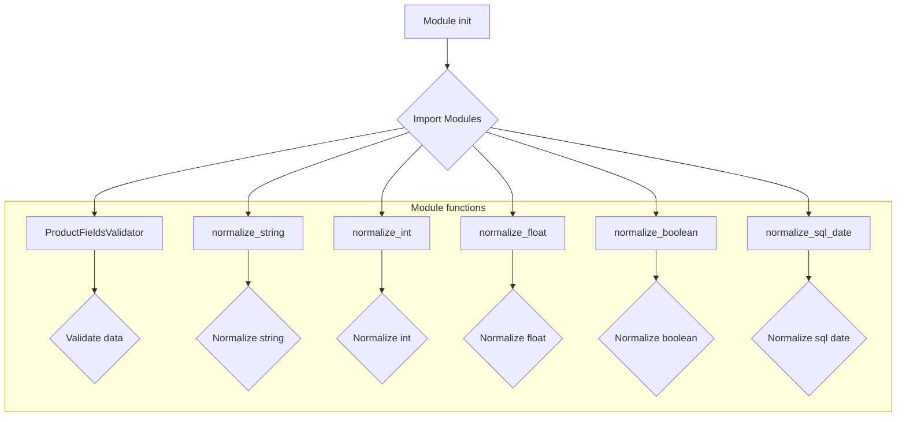
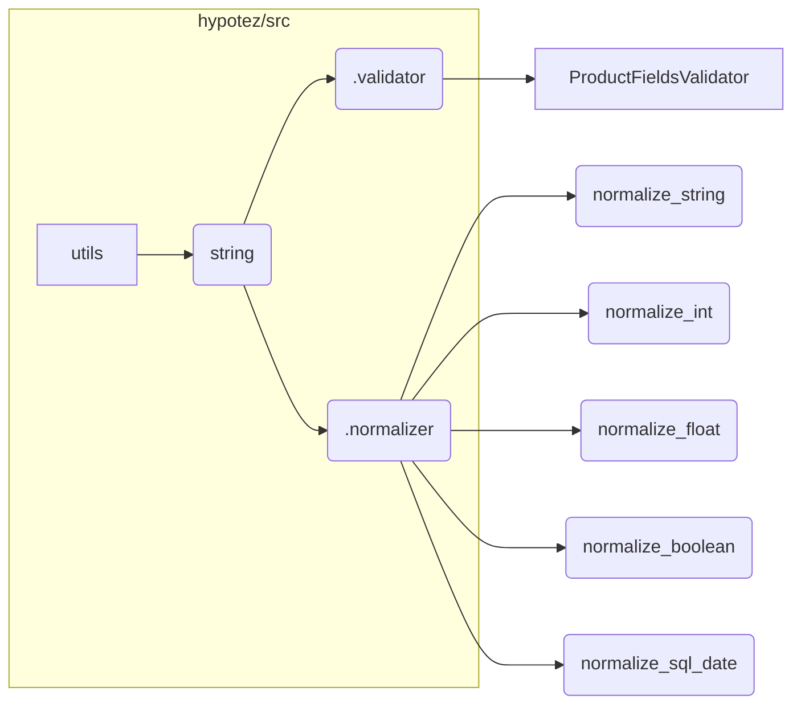

# <input code>

```python
## \file hypotez/src/utils/string/__init__.py
# -*- coding: utf-8 -*-\
#! venv/Scripts/python.exe
#! venv/bin/python/python3.12

"""
.. module: src.utils.string 
	:platform: Windows, Unix
	:synopsis:

"""


from .validator import ProductFieldsValidator
from .normalizer import (
		normalize_string,
		normalize_int,
		normalize_float,
		normalize_boolean,
		normalize_sql_date,
		)
```

# <algorithm>



**Пошаговое описание:**

1. Модуль `hypotez/src/utils/string/__init__.py` импортирует необходимые функции и классы из подмодулей `validator` и `normalizer`.
2. В модуле хранятся константы и импорты, необходимые для работы функций валидации и нормализации строк, чисел и других типов данных.


# <mermaid>



**Объяснение диаграммы:**

Диаграмма показывает структуру импортов. Модуль `hypotez/src/utils/string` импортирует из подмодулей `validator` и `normalizer` классы и функции.  `ProductFieldsValidator` и функции нормализации, такие как `normalize_string`,  `normalize_int`, предоставляют функциональность валидации и нормализации данных, соответственно.


# <explanation>

**Импорты:**

- `from .validator import ProductFieldsValidator`: Импортирует класс `ProductFieldsValidator` из подмодуля `validator` текущего каталога (`./validator`).  Предполагается, что этот класс отвечает за валидацию полей продукта.
- `from .normalizer import ...`: Импортирует несколько функций нормализации из подмодуля `normalizer`, такие как `normalize_string`, `normalize_int`, `normalize_float`, `normalize_boolean`, `normalize_sql_date`. Вероятно, эти функции отвечают за приведение данных к определенному формату.

**Классы:**

- `ProductFieldsValidator`:  Описание отсутствует, но предполагается, что этот класс имеет методы для валидации различных полей продукта (например, имя, цена, дата выпуска).


**Функции:**

- `normalize_string`, `normalize_int`, `normalize_float`, `normalize_boolean`, `normalize_sql_date`: Эти функции предназначены для преобразования входных данных к определённому формату.  Без кода этих функций трудно дать точное описание. Предполагается, что `normalize_string` может убирать пробелы, приводить к нижнему регистру, и так далее.


**Переменные:**

- ``:  Константа, вероятно, определяет режим работы (например, 'dev', 'prod').  Может влиять на поведение других частей кода.


**Возможные ошибки/улучшения:**

- Не указаны типы данных для аргументов и возвращаемых значений функций нормализации. Это может привести к ошибкам в работе.
- Отсутствуют реализации функций нормализации и валидации. Код требует реализации всех методов и функций для работы.


**Цепочка взаимосвязей:**

Код в `hypotez/src/utils/string/__init__.py` является частью более крупной системы. Он предоставляет функции, которые, вероятно, будут использоваться в других модулях (например, `hypotez/src/data_processing`) для валидации и нормализации данных, связанных с продуктами.

**Дополнительная информация:**

- Важно изучить `hypotez/src/utils/string/validator.py` и `hypotez/src/utils/string/normalizer.py` для детального понимания работы класса `ProductFieldsValidator` и функций нормализации.
- `#! venv/Scripts/python.exe` и `#! venv/bin/python/python3.12`:  Это магические строки, указывающие интерпретатор Python для запуска скрипта (вероятно, используется виртуальное окружение).