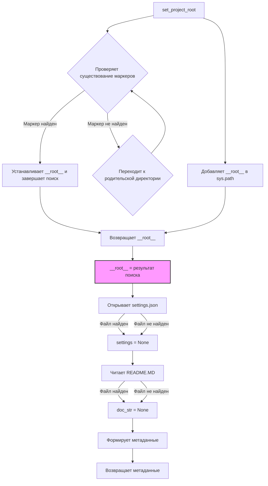

```MD
# Анализ кода из hypotez/src/logger/header.py

## <input code>

```python
## \file hypotez/src/logger/header.py
# -*- coding: utf-8 -*-\
#! venv/Scripts/python.exe
#! venv/bin/python/python3.12

"""
module: src.logger 
	:platform: Windows, Unix
	:synopsis: Модуль определяющий корневой путь к проекту. Все импорты строятся относительно этого пути.
    :TODO: В дальнейшем перенести в системную переменную"""


import sys
import json
from packaging.version import Version

from pathlib import Path
def set_project_root(marker_files=('__root__','.git')) -> Path:
    """
    Finds the root directory of the project starting from the current file's directory,
    searching upwards and stopping at the first directory containing any of the marker files.

    Args:
        marker_files (tuple): Filenames or directory names to identify the project root.
    
    Returns:
        Path: Path to the root directory if found, otherwise the directory where the script is located.
    """
    __root__:Path
    current_path:Path = Path(__file__).resolve().parent
    __root__ = current_path
    for parent in [current_path] + list(current_path.parents):
        if any((parent / marker).exists() for marker in marker_files):
            __root__ = parent
            break
    if __root__ not in sys.path:
        sys.path.insert(0, str(__root__))
    return __root__


# Get the root directory of the project
__root__ = set_project_root()
"""__root__ (Path): Path to the root directory of the project"""

from src import gs

settings:dict = None
try:
    with open(gs.path.root / 'src' /  'settings.json', 'r') as settings_file:
        settings = json.load(settings_file)
except (FileNotFoundError, json.JSONDecodeError):
    ...

doc_str:str = None
try:
    with open(gs.path.root / 'src' /  'README.MD', 'r') as settings_file:
        doc_str = settings_file.read()
except (FileNotFoundError, json.JSONDecodeError):
    ...


__project_name__ = settings.get("project_name", 'hypotez') if settings  else 'hypotez'
__version__: str = settings.get("version", '')  if settings  else ''
__doc__: str = doc_str if doc_str else ''
__details__: str = ''
__author__: str = settings.get("author", '')  if settings else ''
__copyright__: str = settings.get("copyrihgnt", '')  if settings else ''
__cofee__: str = settings.get("cofee", "Treat the developer to a cup of coffee for boosting enthusiasm in development: https://boosty.to/hypo69")  if settings else "Treat the developer to a cup of coffee for boosting enthusiasm in development: https://boosty.to/hypo69"
```

## <algorithm>

1. **`set_project_root(marker_files)`:**
   - Принимает кортеж `marker_files` (имена файлов/папок).
   - Начинает поиск корневой директории с текущей директории файла.
   - Итеративно поднимается по родительским директориям.
   - Проверяет существование файлов/папок из `marker_files` в текущей директории.
   - Если найден маркер, устанавливает `__root__` на текущую директорию и завершает поиск.
   - Если маркер не найден, продолжает поиск по родительским.
   - Добавляет корневую директорию в `sys.path`, если её там еще нет.
   - Возвращает `Path` к корневой директории.

   *Пример:* Если `__file__` указывает на `hypotez/src/logger/header.py`, поиск будет идти по `hypotez/src/logger`, `hypotez/src`, `hypotez`, ...


2. **Получение настроек:**
   - Инициализируются переменные `settings` и `doc_str` со значением `None`.
   - Попытка открыть `settings.json` и `README.MD` в корневой директории и загрузить JSON-данные/текстовую информацию.
   - Если файлы не найдены или содержимое некорректно, переменные остаются `None`.

3. **Получение метаданных:**
   - Используются методы `get` для получения значений из словаря `settings` с безопасным обращением.
   - Если `settings` равно `None`, используется значение по умолчанию.

*Пример:* Если `settings` содержит `{"project_name": "MyProject"}`, `__project_name__` примет значение `"MyProject"`. В противном случае – `"hypotez"`.


## <mermaid>



## <explanation>

**Импорты:**

- `sys`: предоставляет доступ к системным переменным, в частности, `sys.path`.
- `json`: используется для работы с JSON-файлами.
- `packaging.version`: используется для работы с версиями пакетов.  (важно для будущих проверок версий).
- `pathlib`: для работы с путями к файлам в системе.  (более удобный способ, чем `os.path`).
- `src.gs`:  Предполагает наличие модуля `gs` в подпапке `src`. Этот модуль, вероятно, содержит вспомогательные функции и классы, например, для работы с файловыми путями (по аналогии с `pathlib`). Необходимо больше информации, чтобы проанализировать его функциональность.


**Классы:**

- Нет классов в данном файле.

**Функции:**

- `set_project_root(marker_files)`: Находит корневой каталог проекта.
   - `marker_files`: Кортеж имен файлов или папок, по которым определяется корневой каталог.
   - Возвращает: `Path` к корневому каталогу.


**Переменные:**

- `MODE`: Строковая переменная, хранящая режим работы (например, 'dev' или 'prod').
- `__root__`: `Path` объект, хранящий путь к корневому каталогу проекта.
- `settings`: Словарь, хранящий настройки проекта (из `settings.json`).
- `doc_str`: Строка, хранящая содержимое файла `README.MD`.
- `__project_name__`, `__version__`, `__doc__`, `__details__`, `__author__`, `__copyright__`, `__cofee__`: Переменные, хранящие метаданные о проекте, полученные из настроек.

**Возможные ошибки/улучшения:**

- Обработка ошибок `FileNotFoundError` и `json.JSONDecodeError` важна, но может быть ещё более подробной (например, логгирование ошибок).
- Вместо `...` в блоках `try...except` стоит использовать более подробную обработку ошибок, например, выводить сообщения об ошибках.
- Улучшение структуры проекта: логика поиска корневого каталога может быть перенесена в отдельный модуль, что сделает код более модульным и повторно используемым.
- Важно определить, что делает `src.gs`. Должно быть уточнено в документации.

**Взаимосвязь с другими частями проекта:**

- `src.gs`: Модуль `gs` используется для доступа к корневому пути проекта. Это указывает на зависимость от других частей проекта, возможно, `gs` содержит инструменты работы с файлами и ресурсами.
- `settings.json`: Файл содержит настройки проекта. Это указывает на то, что проект использует конфигурационный файл, который, вероятно, нужен другим частям проекта.
- `README.MD`: Файл содержит документацию проекта.  Возможно, `README.MD` используется для генерации документации или других задач.  Необходима более глубокая информация, чтобы оценить взаимосвязь.