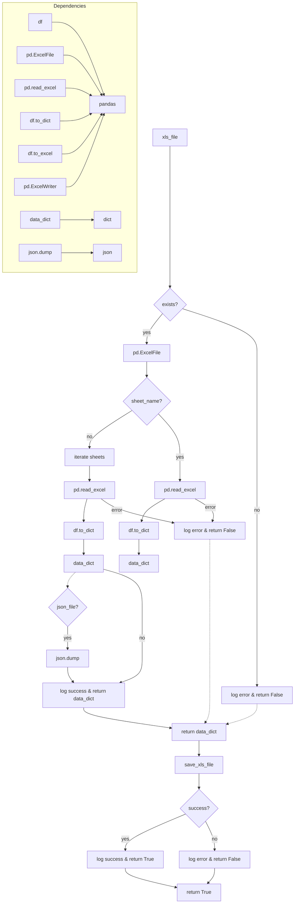

```MD
# <input code>

```python
## \file hypotez/src/utils/xls.py
# -*- coding: utf-8 -*-\
#! venv/Scripts/python.exe
#! venv/bin/python/python3.12

"""
.. module: src.utils 
	:platform: Windows, Unix
	:synopsis: Converter for Excel (`xls`) to JSON and JSON to Excel (`xls`)

"""
MODE = 'dev'

""" This module provides functions to convert Excel files to JSON format, handle multiple sheets, and save JSON data back to Excel files.

Functions:
    read_xls_as_dict(xls_file: str, json_file: str = None, sheet_name: Union[str, int] = None) -> Union[Dict, List[Dict], bool]:
        Reads an Excel file and converts it to JSON.  Optionally, converts a specific sheet and saves the result to a JSON file.  Handles errors gracefully.

    save_xls_file(data: Dict[str, List[Dict]], file_path: str) -> bool:
        Saves JSON data to an Excel file.  The data should be a dictionary where keys are sheet names and values are lists of dictionaries representing rows. Handles errors gracefully.

Examples:
    # Reading and optionally saving to JSON
    data = read_xls_as_dict('input.xlsx', 'output.json', 'Sheet1')  # Reads sheet named 'Sheet1'
    if data:
        print(data)  # Output will be {'Sheet1': [{...}]}

    # Saving from JSON data
    data_to_save = {'Sheet1': [{'column1': 'value1', 'column2': 'value2'}]}
    success = save_xls_file(data_to_save, 'output.xlsx')
    if success:
        print("Successfully saved to output.xlsx")
"""

import pandas as pd
import json
from typing import List, Dict, Union
from pathlib import Path
import logging

# Configure logging
logging.basicConfig(level=logging.INFO, format='%(asctime)s - %(levelname)s - %(message)s')


def read_xls_as_dict(
    xls_file: str,
    json_file: str = None,
    sheet_name: Union[str, int] = None
) -> Union[Dict, List[Dict], bool]:
    """
    Reads an Excel file and converts it to JSON.  Optionally, converts a specific sheet and saves the result to a JSON file.
    Handles errors gracefully.
    """
    try:
        xls_file_path = Path(xls_file)
        if not xls_file_path.exists():
            logging.error(f"Excel file not found: {xls_file}")
            return False  # Indicate failure

        xls = pd.ExcelFile(xls_file)

        if sheet_name is None:
            data_dict = {}
            for sheet in xls.sheet_names:
                try:
                    df = pd.read_excel(xls, sheet_name=sheet)
                    data_dict[sheet] = df.to_dict(orient='records')
                except Exception as e:
                    logging.error(f"Error processing sheet '{sheet}': {e}")
                    return False

        else:
            try:
                df = pd.read_excel(xls, sheet_name=sheet_name)
                data_dict = df.to_dict(orient='records')
            except Exception as e:
                logging.error(f"Error processing sheet '{sheet_name}': {e}")
                return False


        if json_file:
            with open(json_file, 'w', encoding='utf-8') as f:
                json.dump(data_dict, f, ensure_ascii=False, indent=4)
                logging.info(f"JSON data saved to {json_file}")

        return data_dict

    except FileNotFoundError as e:
        logging.error(f"File not found: {e}")
        return False
    except Exception as e:
        logging.error(f"An error occurred: {e}")
        return False


def save_xls_file(data: Dict[str, List[Dict]], file_path: str) -> bool:
    """Saves JSON data to an Excel file. Handles errors gracefully."""
    try:
        with pd.ExcelWriter(file_path, engine='xlsxwriter') as writer:
            for sheet_name, rows in data.items():
                df = pd.DataFrame(rows)
                df.to_excel(writer, sheet_name=sheet_name, index=False)
                logging.info(f"Sheet '{sheet_name}' saved to {file_path}")
        return True
    except Exception as e:
        logging.error(f"Error saving Excel file: {e}")
        return False
```

# <algorithm>

**Шаг 1:** Функция `read_xls_as_dict` принимает путь к Excel-файлу (`xls_file`), опциональный путь к файлу JSON (`json_file`) и имя листа (`sheet_name`).
**Шаг 2:** Проверяет существование файла (`xls_file`). Если файла нет, возвращает `False` и записывает ошибку в лог.
**Шаг 3:** Читает Excel-файл с помощью `pd.ExcelFile`.
**Шаг 4:** Если `sheet_name` не указан, проходит по всем листам в Excel-файле.
**Шаг 5:** Для каждого листа пытается прочитать данные с помощью `pd.read_excel`.
**Шаг 6:** Преобразует данные листа в словарь с помощью `df.to_dict(orient='records')`.
**Шаг 7:** Добавляет лист и его данные в `data_dict`.
**Шаг 8:** Если произошла ошибка при чтении или обработке листа, записывает ошибку в лог и возвращает `False`.
**Шаг 9:** Если указан `json_file`, сохраняет `data_dict` в JSON-файл.
**Шаг 10:** Возвращает `data_dict`.
**Шаг 11:** Функция `save_xls_file` принимает данные в формате словаря (`data`) и путь к Excel-файлу (`file_path`).
**Шаг 12:** Создает объект `pd.ExcelWriter` для записи в Excel-файл.
**Шаг 13:** Проходит по всем листам в данных (`data`).
**Шаг 14:** Создает DataFrame из данных листа.
**Шаг 15:** Сохраняет DataFrame на лист в Excel-файле с помощью `df.to_excel`.
**Шаг 16:** Возвращает `True`, если сохранение прошло успешно, и `False` в случае ошибки.


# <mermaid>



**Объяснение диаграммы:** Диаграмма показывает взаимосвязь между функциями `read_xls_as_dict` и `save_xls_file`.  Ключевые зависимости: `pandas`, `json`, `pathlib`, `logging`.


# <explanation>

**Импорты:**

- `pandas as pd`: Библиотека для работы с данными в формате DataFrame, которая используется для чтения и записи Excel-файлов.
- `json`: Библиотека для работы с JSON-форматом.
- `typing`: Модуль для указания типов данных. Используется для ясности и проверки типов.
- `pathlib`: Для работы с путями к файлам (объекты `Path`).
- `logging`: Библиотека для ведения журналов. Используется для вывода сообщений об успехе, ошибках и других важных событий.


**Классы:**

Нет классов в этом коде. Только функции.


**Функции:**

- `read_xls_as_dict(xls_file, json_file=None, sheet_name=None)`: Читает Excel-файл и преобразует его в JSON.  Функция обрабатывает несколько листов, а также возможность сохранения результата в файл JSON. Она возвращает словарь с данными Excel листа(ов), списком словарей или `False` в случае ошибки. 
    - Аргументы: 
        - `xls_file`: Путь к Excel-файлу.
        - `json_file`: (опциональный) Путь для сохранения JSON-файла.
        - `sheet_name`: (опциональный) Имя листа для чтения.
    - Возвращаемые значения:
        - `dict`:  Словарь с данными листа(ов) в формате, удобном для обработки.
        - `list`: Если `sheet_name` определен и данными является список словарей.
        - `bool`: `False` в случае возникновения ошибок.
- `save_xls_file(data, file_path)`: Сохраняет JSON-данные в Excel-файл.
    - Аргументы:
        - `data`: Словарь, где ключи — имена листов, а значения — списки словарей.
        - `file_path`: Путь к сохраняемому Excel-файлу.
    - Возвращаемые значения:
        - `bool`: `True` при успешном сохранении, `False` в противном случае.


**Переменные:**

- `MODE`: Строковая переменная, хранящая значение `'dev'`. Вполне вероятно, что данная переменная используется для управления режимом работы модуля (например, в `dev`-режиме включены дополнительные проверки и сообщения об ошибках).

**Возможные ошибки и улучшения:**

- **Обработка ошибок:** Код обрабатывает большинство ошибок (например, `FileNotFoundError`), но может быть улучшен более детальной обработкой исключений. Например, полезно ловить более узкий класс исключений (например, `ValueError` при неправильном формате данных).
- **Документация:**  Документация в коде могла бы быть более подробной и включать примеры использования.
- **Обработка пустых листов:**  Код должен был бы проверять, не пуст ли лист перед обработкой.


**Взаимосвязи с другими частями проекта:**

Модуль `xls.py` является частью пакета `hypotez/src/utils`.  Он предоставляет инструменты для работы с Excel-файлами, вероятно, используемые другими частями приложения для работы с данными.  Это подразумевает, что другие модули `hypotez` могут вызывать функции `read_xls_as_dict` и `save_xls_file` для обработки данных Excel-файлов.