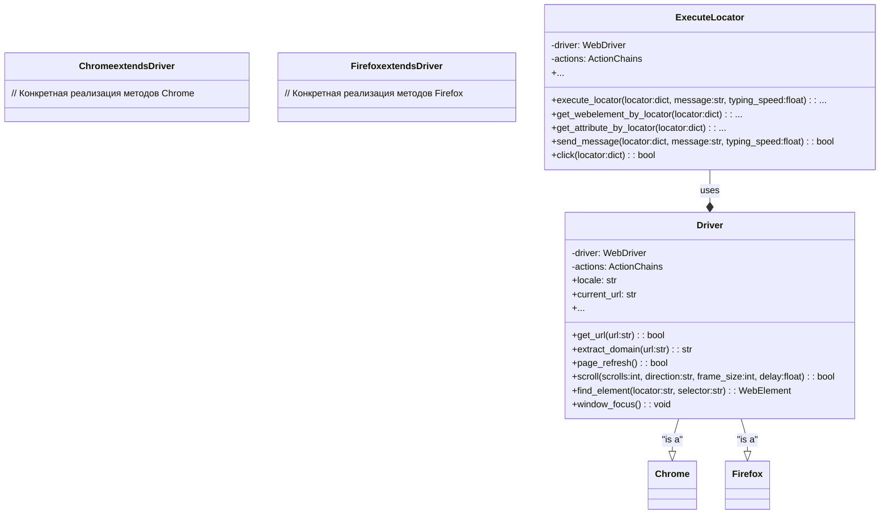

```MD
# Анализ кода модуля WebDriver Executor

## 1. <input code>

```python
# -*- coding: utf-8 -*-\n

""" Examples for using `Driver` and `Chrome` classes """

from src.webdriver.driver import Driver, Chrome
from selenium.webdriver.common.by import By

def main():
    """ Main function to demonStarte usage examples for Driver and Chrome """

    # Example 1: Create a Chrome driver instance and navigate to a URL
    chrome_driver = Driver(Chrome)
    if chrome_driver.get_url("https://www.example.com"):
        print("Successfully navigated to the URL")

    # ... (More example calls)
```

## 2. <algorithm>

**Блок-схема (неполная, из-за объёма кода):**

```mermaid
graph TD
    A[main()] --> B{Create Chrome driver};
    B --> C[get_url("https://www.example.com")];
    C -- Success --> D[print("Successfully navigated to the URL")];
    C -- Failure --> E[Error handling];
    E --> F[Exit];
    
    // ... other example calls
```

**Описание:**

Код демонстрирует примеры использования класса `Driver` (и, в частности, его реализации `Chrome`), предоставляемого модулем `webdriver`.  Функция `main()` последовательно вызывает методы класса `Driver` для выполнения различных действий с веб-драйвером.  
Каждый вызов метода иллюстрирует работу с драйвером, например, навигация по URL, извлечение домена. Данные передаются между функциями в виде аргументов и возвращаемых значений (например, URL для `get_url`, результат для печати).

## 3. <mermaid>



**Объяснение диаграммы:**

Диаграмма класса демонстрирует взаимосвязь между `Driver`, его подклассами (на примере `Chrome`, `Firefox`) и `ExecuteLocator`.  `Driver` – базовый класс, определяющий общий интерфейс работы с веб-драйвером, `Chrome` – его конкретная реализация для Chrome,  `ExecuteLocator` использует `Driver` для управления браузером, выполняя более специфические действия.

## 4. <explanation>

**Импорты:**

- `from src.webdriver.driver import Driver, Chrome`: Импортирует классы `Driver` и `Chrome` из модуля `driver.py` в текущем каталоге `src/webdriver`.
- `from selenium.webdriver.common.by import By`: Импортирует класс `By` из `selenium.webdriver.common.by`, необходимый для задания стратегий поиска элементов на веб-странице.


**Классы:**

- `Driver`: Базовый абстрактный класс, который может быть расширен для различных браузеров (Chrome, Firefox, etc.). Он определяет набор методов для взаимодействия с браузером, например, навигация, прокрутка, поиск элементов. В примере показано, как создаётся экземпляр `chrome_driver` этого класса.
- `Chrome`: Класс, наследующийся от `Driver`, конкретно реализующий методы для управления браузером Chrome.

**Функции:**

- `main()`: Функция, демонстрирующая примеры использования класса `Driver`, в том числе `Chrome`. В ней вызываются методы `get_url`, `extract_domain`, `scroll` и другие, для выполнения заданий с веб-драйвером.


**Переменные:**

- `chrome_driver`: Экземпляр класса `Driver` (в данном примере, `Chrome`).
- `url`: Строка с адресом веб-страницы.


**Возможные ошибки или области для улучшений:**

- **Отсутствие обработки ошибок:**  В примере `main()` отсутствует полная обработка исключений (`try...except`). Необходимо добавлять обработку исключений для устойчивого выполнения скриптов, например, при ошибках поиска элемента.
- **Зависимость от `src.webdriver.driver`:** Необходимо полное понимание функций модуля `driver.py` для полноценного анализа.

**Цепочка взаимосвязей:**

Модуль `webdriver` зависит от `selenium` для работы с браузером.  Классы `Driver` и `Chrome` (надеюсь, что `Chrome` в примере – это расширение `Driver`, а не отдельный класс, скорее всего, это класс, наследуемый от `Driver`) находятся внутри `src.webdriver.driver`.  Функция `main()` извне взаимодействует с этим модулем.

**Примечание:**  Для полного анализа необходимо рассмотреть код самого модуля `src.webdriver.driver`.  В данном отрывке предоставлена  краткая оценка, предполагая, что `Driver` – абстрактный класс, а `Chrome` – его конкретная реализация, и как `main()` взаимодействует с этими классами.