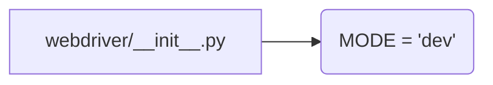

# <input code>

```python
## \file hypotez/src/webdriver/__init__.py
# -*- coding: utf-8 -*-
#! venv/Scripts/python.exe
#! venv/bin/python/python3.12

"""
.. module: src.webdriver 
	:platform: Windows, Unix
	:synopsis:

"""
MODE = 'dev'
```

# <algorithm>

Этот код является файлом инициализации модуля `webdriver` внутри пакета `src`. Он определяет глобальную переменную `MODE`, но не содержит логики работы с драйверами.  Поскольку здесь только импорты, которые не используются, то блок-схема не требуется.

# <mermaid>



# <explanation>

* **Импорты:** Код содержит комментарии `# from ... import ...`  для импортов, но сами импорты не используются.  Это типичная структура для организации кода в Python, где в файле `__init__.py` можно импортировать другие модули внутри пакета.  Отсутствие импорта с дальнейшим использованием означает, что эти модули не используются в текущей функции или классе.  Однако, имена импортов подразумевают, что этот пакет (`src.webdriver`) должен содержать классы для работы с различными веб-драйверами (Chrome, Firefox, Edge).  Например, импорты `src.webdriver.driver`, `src.webdriver.chrome`, `src.webdriver.firefox`, и т.д.

* **Классы:**  Этот файл `__init__.py` не содержит определений классов.  Классы для работы с разными веб-драйверами (Chrome, Firefox, etc) должны находиться в отдельных файлах (`driver.py`, `chrome.py`, `firefox.py`, и т.д.) внутри папки `src.webdriver`.

* **Функции:** Этот файл не содержит функций.

* **Переменные:**  `MODE = 'dev'`:  Глобальная переменная, которая, вероятно, используется для определения режима работы (например, 'dev' для разработки, 'prod' для производства). Это очень важная переменная, которая влияет на поведение, например, на выбор конкретного драйвера.  В этом случае, это глобальная переменная, что может являться поводом для возможного улучшения:


* **Возможные ошибки/улучшения:**

    * **Неиспользуемые импорты:**  Комментарии импортов являются бесполезными, если они не используются. Их следует удалить или реализовать.
    * **Глобальные переменные:**  Использование глобальной переменной `MODE` может потребовать дополнительных проверок, чтобы убедиться, что она используется корректно и при необходимости обновляется.  В идеале, она должна быть доступна в классе или функции, которая ее использует.
    * **Структура пакета:**  Код подразумевает наличие модулей (или других файлов Python) в папке `hypotez/src/webdriver`, таких как `driver.py`, `chrome.py`, `firefox.py` и др. для реализации логики взаимодействия с веб-драйверами.

* **Взаимосвязь с другими частями проекта:**  Этот файл является частью пакета `hypotez/src/webdriver`, который, скорее всего, отвечает за управление веб-драйверами для автоматизации задач (например, тестирования, сбора данных и т.д.).  Связь с другими частями проекта устанавливается через функции, которые используют классы из этого пакета.  Например, другие части проекта (например, тесты) могли бы импортировать классы из пакета `webdriver`.