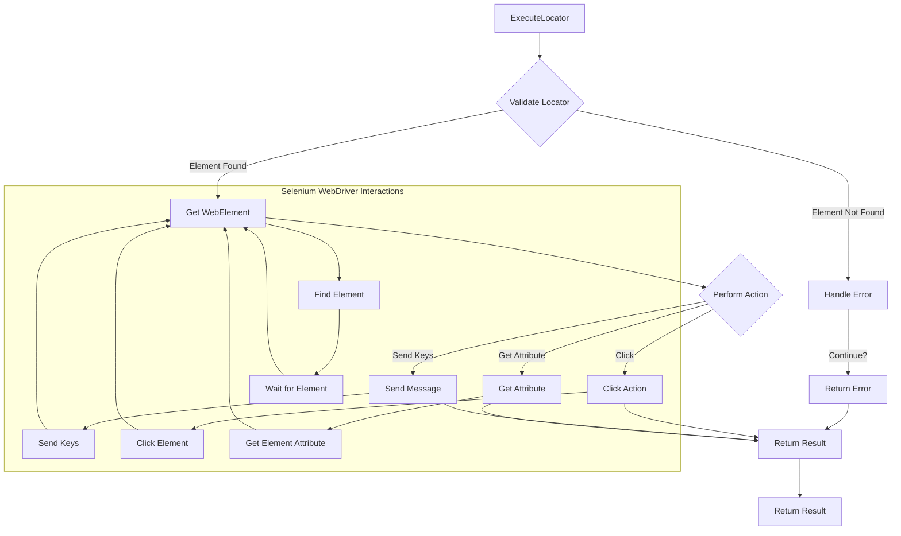

# WebDriver Executor (executor.en.md)

## <input code>

```
The `executor.py` file in the `src.webdriver` module contains the `ExecuteLocator` class, which is designed for performing various actions on web page elements using Selenium WebDriver. Let’s break down the main components and functions of this class:

## General Structure and Purpose

### Main Purpose

The `ExecuteLocator` class is designed to execute navigation algorithms and interactions with a web page based on configuration data provided in the form of locator dictionaries.

### Main Components

1. **Imports and Dependencies**

   ```python
   from selenium import webdriver
   from selenium.webdriver.common.keys import Keys
   from selenium.webdriver.common.by import By
   from selenium.webdriver.remote.webelement import WebElement
   from selenium.webdriver.support.ui import WebDriverWait
   from selenium.webdriver.support import expected_conditions as EC
   from selenium.webdriver.common.action_chains import ActionChains
   from selenium.common.exceptions import NoSuchElementException, TimeoutException

   from src import gs 
   from src.utils.printer import pprint, j_loads, j_loads_ns, j_dumps, save_png
   
   from src.logger import logger
   from src.logger.exceptions import DefaultSettingsException, WebDriverException, ExecuteLocatorException
   ```

   Here, essential libraries and modules are imported, including Selenium WebDriver for interacting with web pages, and internal modules for settings, logging, and exception handling.

2. **Class `ExecuteLocator`**

   The `ExecuteLocator` class is the core component of this file and contains methods for performing actions on web elements and handling locators. Let’s look at its methods and attributes in more detail.

### Class Attributes

- **`driver`**: A reference to the WebDriver instance used for browser interactions.
- **`actions`**: An `ActionChains` instance for performing complex actions on web page elements.
- **`by_mapping`**: A dictionary that maps string representations of locators to Selenium `By` objects.

### Class Methods

1. **`__init__(self, driver, *args, **kwargs)`**

   The class constructor initializes the WebDriver and `ActionChains`:

   ```python
   def __init__(self, driver, *args, **kwargs):
       self.driver = driver
       self.actions = ActionChains(driver)
   ```

2. **`execute_locator(self, locator: dict, message: str = None, typing_speed: float = 0, continue_on_error: bool = True)`**

   The main method for performing actions based on the locator:

   ```python
   def execute_locator(self, locator: dict, message: str = None, typing_speed: float = 0, continue_on_error: bool = True) -> Union[str, list, dict, WebElement, bool]:
       ...
   ```

   - **`locator`**: A dictionary with parameters for performing actions.
   - **`message`**: A message to send if needed.
   - **`typing_speed`**: Typing speed for sending messages.
   - **`continue_on_error`**: A flag indicating whether to continue execution if an error occurs.

   This method selects which actions to perform based on the locator configuration.

... (rest of the code)
```

## <algorithm>

A detailed step-by-step algorithm is difficult to represent without the full `execute_locator` method's implementation. However, a high-level overview:

1. **`execute_locator(locator)`:**
    * Takes a `locator` dictionary as input.
    * Extracts `by`, `selector`, `attribute`, etc., from the dictionary.
    * Determines the action to perform (e.g., click, send keys, get attribute).
    * Uses `get_webelement_by_locator` to find the element.
    * If element found, performs the specified action using `send_message`, `click`, etc.
    * Handles potential errors (e.g., `NoSuchElementException`) with `continue_on_error`.
    * Returns the result of the action (e.g., element, attribute value, True/False).

2. **`get_webelement_by_locator`:**
    * Takes `locator` and `message` as input.
    * Uses the `By` object from `locator` to locate the element.
    * Handles timeouts using `WebDriverWait` and `expected_conditions`.
    * Returns the located element, list of elements, or `False` if not found.

3. **`send_message`:**
    * Sends text to the located element.
    * Supports typing speed using `ActionChains`.
    * Returns `True` on success, `False` on failure.

4. **Error Handling:**  The code extensively uses `try...except` blocks to handle potential exceptions (e.g., `NoSuchElementException`, `TimeoutException`) and log errors.  The `continue_on_error` flag controls whether to proceed with subsequent locators if an error occurs.

## <mermaid>



## <explanation>

**1. Imports:**

The imports define the dependencies needed for web automation using Selenium WebDriver.  `src` is assumed to be the root directory of the project and contains modules for handling settings (`gs`), logging (`logger`), utilities (`utils.printer`), and potentially more.

   - `selenium`: This package provides the Selenium WebDriver API for controlling web browsers.
   - `selenium.webdriver.*`: Modules for different Selenium functionalities: web element interactions (`common.keys`, `common.by`), explicit waits (`support.ui`, `support.expected_conditions`), action chains (`webdriver.common.action_chains`), exception handling (`common.exceptions`).
   - `src.gs`: Likely contains global settings or configuration.
   - `src.utils.printer`: Contains helper functions for printing, JSON handling, saving screenshots, etc.
   - `src.logger`:  Provides logging and exception handling functionalities within the project.
   - `src.logger.exceptions`: Custom exception classes tailored for the specific use case (e.g., handling specific WebDriver errors or configuration errors).

**2. Classes:**

   - **`ExecuteLocator`:** This class encapsulates the logic for interacting with web elements based on locator dictionaries. Its role is to simplify and organize the complex process of web automation.

     - `driver`: The WebDriver instance for browser interaction.
     - `actions`:  For complex actions like simulating keyboard input with specific speed (`ActionChains`).
     - `by_mapping`: An internal mapping, which could simplify locator handling.

**3. Functions:**

   - **`__init__`:** Initializes the `ExecuteLocator` object, crucial for setting up the WebDriver and `ActionChains` instances.
   - **`execute_locator`:** This is the core method, handling the locator dictionary, and deciding what to do (click, send keys, get attributes), potentially calling other helper methods.
   - **`get_webelement_by_locator`:** Locates elements using the provided locator dictionary, handling possible timeouts using `WebDriverWait`.
   - **`get_attribute_by_locator`:** Retrieves an attribute from an element.
   - **`_get_element_attribute`:** Helper method to retrieve an element's attribute.
   - **`send_message`:** Sends a message (e.g., text input) to an element, with typing speed control.
   - **`evaluate_locator`:** This function could be used for dynamic locator evaluation or possibly using templates.
   - **`_evaluate`:** Helper method for evaluation of single attributes (potential placeholder handling).
   - **`get_locator_keys`:** Static method to return available locator keys (e.g., `product_links`, `pagination`).

**4. Variables:**

Variables (`locator`, `message`, `typing_speed`, `continue_on_error`) are used to pass configuration and control information to methods for dynamic actions and error handling.

**5. Possible Errors and Improvements:**

- **Error Handling:** The `continue_on_error` flag is valuable for controlling error propagation. However, a clear mechanism for logging errors would greatly improve debugging and understanding why failures happen. More specific exception handling could be helpful.
- **Maintainability:** The `locator` dictionary structure is crucial. It needs good documentation and consistent naming conventions to avoid confusion. Consider using a dedicated locator class to represent locators rather than relying solely on dictionaries.
- **Clarity:**  More descriptive variable names (e.g., `locator_type` instead of `by`) could enhance readability.
- **Testability:**  Adding unit tests for the `ExecuteLocator` class is highly recommended to verify its functionality with various locator types and situations.
- **Explicit waits:** Consider using `WebDriverWait` for better robustness in element waits and logging or handling cases where no element is found.


**Dependencies:** The code depends on `src.webdriver`, `src.logger`, and `src.utils`. This suggests an architecture where each module might have its own set of responsibilities (e.g., logging, general utils).


**Chain of Relationships:**

The `ExecuteLocator` class in `src.webdriver.executor` interacts directly with the WebDriver (`src.webdriver.driver`).  The logging and potentially exception classes (`src.logger.exceptions`) are used to log events and handle errors from actions performed on the webdriver. `src.utils` provides supporting functions like printing and data handling.

This analysis helps understand the role of `ExecuteLocator` within the larger project, and how different parts work together.