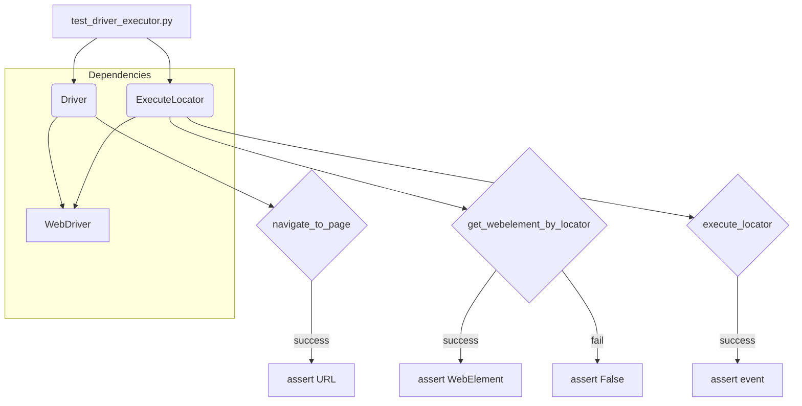

# <input code>

```python
Вот руководство для тестеров по запуску и выполнению тестов из файла `test_driver_executor.py`, а также описание тестов и их целей.

---

# Руководство для тестера по запуску и выполнению тестов

## Введение

В этом руководстве описывается, как запустить и выполнить тесты для классов `Driver` и `ExecuteLocator`, расположенные в файле `test_driver_executor.py`. Тесты проверяют функциональность методов классов и взаимодействие между `Driver` и `ExecuteLocator`.

## Структура тестов

Файл `test_driver_executor.py` содержит тесты для двух классов: `Driver` и `ExecuteLocator`. Эти тесты проверяют корректность работы методов классов, взаимодействие между ними, а также сценарии использования в различных ситуациях.

### Тестируемые методы и функции

- **`test_navigate_to_page`**: Проверяет, что WebDriver корректно загружает указанную страницу.
- **`test_get_webelement_by_locator_single_element`**: Проверяет, что метод `get_webelement_by_locator` корректно возвращает элемент по локатору.
- **`test_get_webelement_by_locator_no_element`**: Проверяет, что метод `get_webelement_by_locator` возвращает `False`, если элемент не найден.
- **`test_send_message`**: Проверяет, что метод `send_message` корректно отправляет сообщение элементу.
- **`test_get_attribute_by_locator`**: Проверяет, что метод `get_attribute_by_locator` корректно возвращает атрибут элемента.
- **`test_execute_locator_event`**: Проверяет, что метод `execute_locator` корректно выполняет событие на локаторе.
- **`test_get_locator_keys`**: Проверяет, что метод `get_locator_keys` возвращает правильные ключи локатора.
- **`test_navigate_and_interact`**: Проверяет последовательность навигации и взаимодействия с элементами на другой странице.
- **`test_invalid_locator`**: Проверяет обработку некорректных локаторов и соответствующее исключение.

## Запуск тестов

### Установка зависимостей

Перед запуском тестов убедитесь, что у вас установлены все необходимые зависимости. Для этого выполните команду:

```bash
pip install -r requirements.txt
```

В `requirements.txt` должны быть указаны необходимые библиотеки, такие как `pytest` и `selenium`.

### Настройка WebDriver

В тестах используется Chrome WebDriver. Убедитесь, что у вас установлен [ChromeDriver](https://sites.google.com/chromium.org/driver/) и укажите путь к `chromedriver` в строке:

```python
service = Service(executable_path="/path/to/chromedriver")  # Путь к вашему chromedriver
```

### Запуск тестов

Для запуска тестов используйте команду:

```bash
pytest src/webdriver/_pytest/test_driver_executor.py
```

Эта команда запустит все тесты, определенные в файле `test_driver_executor.py`.

# ... (остальная часть документации)
```

# <algorithm>

(Схема блок-схемы отсутствует, т.к. это текстовое руководство, а не код.)

Алгоритм работы тестов описан в текстовом формате.  Тесты последовательно проверяют методы классов `Driver` и `ExecuteLocator`, вызывая их с различными входными данными и проверяя возвращаемые значения.  Данные передаются между методами и классами через аргументы и атрибуты. В случае ошибки, тест должен выбросить исключение.

# <mermaid>



**Описание диаграммы:**

* `test_driver_executor.py`:  Главный файл, содержащий тесты.
* `Driver`: Класс, взаимодействующий с WebDriver.
* `ExecuteLocator`: Класс, управляющий взаимодействием с элементами страницы.
* `navigate_to_page`, `get_webelement_by_locator`, `execute_locator`: Методы классов `Driver` и `ExecuteLocator`.
* `WebDriver`:  Библиотека Selenium WebDriver, обеспечивающая взаимодействие с браузером.
* `assert`:  Ассерты в тестах.  Проверяют соответствие ожидаемого и фактического результата.

**Подключаемые зависимости:**

* `pytest`: Для фреймворка тестирования.
* `selenium`: Для взаимодействия с WebDriver.
* `ChromeDriver`:  Драйвер для Chrome.

# <explanation>

**Импорты:**

Документация описывает необходимость установки зависимостей (`requirements.txt`) для корректной работы тестов.  Это типичная практика в Python-проектах, где `requirements.txt` содержит список необходимых библиотек, таких как `pytest` (фреймворк тестирования) и `selenium` (библиотека для управления WebDriver). `chromedriver` — драйвер для Chrome, необходимый для запуска тестов.

**Классы:**

* `Driver`:  Класс, отвечающий за взаимодействие с браузером (WebDriver) и навигацию по страницам. Он содержит методы для навигации, поиска элементов и выполнения действий.
* `ExecuteLocator`: Класс, отвечающий за взаимодействие с конкретными элементами веб-страницы на основе локаторов.  Он обрабатывает различные типы локаторов и их параметры.


**Функции (методы классов):**

Документация описывает отдельные методы (функции) классов `Driver` и `ExecuteLocator`, используемые для тестирования функциональности.  Они отвечают за:  навигацию, поиск элементов, отправку сообщений, получение атрибутов элементов и обработку событий.  Каждый из них имеет специфическую цель, тестируемую различными тест-кейсами.

**Переменные:**

Переменные, такие как `executable_path`, содержащие путь к исполняемому файлу `chromedriver`, указывают на необходимость конфигурации перед запуском тестов.  Другие переменные содержат значения для проверки (например, URL, ожидаемые значения атрибутов).

**Возможные ошибки/улучшения:**

* Отсутствует код самих классов `Driver` и `ExecuteLocator`, что затрудняет глубокий анализ.
*  Не указано, какие именно ошибки могут быть обнаружены тестами.
*  Недостаточно информации о логике работы классов.
*  Отсутствуют примеры использования.

**Взаимосвязи с другими частями проекта:**

Описание тестов указывает, что `test_driver_executor.py` тестирует классы `Driver` и `ExecuteLocator`, что является частью проекта веб-автоматизации.  Зависимость от `requirements.txt` показывает связь с менеджментом зависимостей проекта.