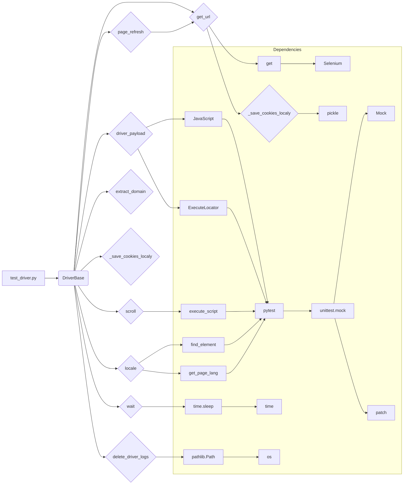

```MD
# <input code>

```python
## \file hypotez/src/webdriver/_pytest/test_driver.py
# -*- coding: utf-8 -*-\

#! venv/bin/python/python3.12

"""
.. module: src.webdriver._pytest 
	:platform: Windows, Unix
	:synopsis:

"""


"""
	:platform: Windows, Unix
	:synopsis:

"""


"""
	:platform: Windows, Unix
	:synopsis:

"""


"""
  :platform: Windows, Unix

"""
"""
  :platform: Windows, Unix
  :platform: Windows, Unix
  :synopsis:
"""
  
""" module: src.webdriver._pytest """


""" тестовый файл test_driver.py включает тесты для следующих методов класса DriverBase:

 - driver_payload
 - scroll
 - locale
 - get_url
 - extract_domain
 - _save_cookies_localy
 - page_refresh
 - wait
 - delete_driver_logs
Тесты используют pytest и unittest.mock для создания фиктивных объектов и методов, 
чтобы изолировать тестируемый код и избежать взаимодействия с реальными веб-страницами и файлами.
"""

import pytest
from unittest.mock import Mock, patch, PropertyMock
from selenium.common.exceptions import InvalidArgumentException
from src.webdriver.driver import DriverBase
from src.logger import logger

class TestDriverBase:
    @pytest.fixture
    def driver_base(self):
        """Fixture to create an instance of DriverBase for testing."""
        return DriverBase()

    # ... (rest of the code)
```

# <algorithm>

Этот код представляет собой набор тестов для класса `DriverBase` из модуля `src.webdriver.driver`.  Алгоритм работы каждого теста заключается в:

1. **Инициализация:** Создается экземпляр класса `DriverBase` (обычно в `driver_base` fixture).
2. **Мокинг:** Используются `unittest.mock` для замены реальных зависимостей (например, `JavaScript`, `ExecuteLocator`, `selenium` методы) на фиктивные объекты (`Mock`). Это изолирует тесты от реального взаимодействия с браузером и позволяет проверить, как методы `DriverBase` работают с этими зависимостями.
3. **Вызов тестового метода:** Тестируемый метод класса `DriverBase` вызывается с определенными аргументами.
4. **Проверка результатов:** Проверяется, что вызов метода `DriverBase` вызвал соответствующие методы моков и вернул ожидаемые результаты.  Например, проверяется, что `driver_base.scroll` вызвал `execute_script` с ожидаемым параметром.
5. **Возвращаемое значение:** Тесты проверяют корректность возвращаемых значений.

Примеры:

* **`test_scroll`:** Мокируется `execute_script`, а затем проверяется, что этот метод был вызван с правильными параметрами (в данном случае `scrollBy` для скролла вперед/назад).
* **`test_locale`:** Мокируется `find_element`, проверяется, что `locale` возвращает ожидаемое значение (из meta-тега, если он есть, иначе из `get_page_lang`).

Данные перемещаются между методами и классами через вызовы методов (`driver_base.scroll`, `driver_base.locale`) и атрибуты класса (`driver_base.execute_script`, `driver_base.ready_state`).  Фикстура `driver_base` предоставляет доступ к экземпляру `DriverBase`, а мокинг гарантирует, что поведение тестируемого метода не зависит от внешних зависимостей.

# <mermaid>



**Описание диаграммы:**

Диаграмма показывает взаимосвязь между `test_driver.py` и классами `DriverBase`, `JavaScript`, `ExecuteLocator` и другими связанными зависимостями, такими как `pytest`, `selenium`, `pickle`, и `time`.  Стрелки показывают направление данных и вызовов.  `pytest` и `unittest.mock` являются фреймворками для тестирования и мокирования, а `selenium` используется для взаимодействия с веб-драйвером. `pickle` используется для сохранения куки.

# <explanation>

**Импорты:**

* `pytest`: Библиотека для написания и запуска юнит-тестов.
* `unittest.mock`: Библиотека для создания фикстур и моков для тестирования, заменяющая реальные объекты на "моки" для изоляции тестируемого кода.
* `selenium.common.exceptions`:  Библиотека Selenium,  содержит исключения, которые могут быть подняты при работе с веб-драйвером.
* `src.webdriver.driver`: Модуль, содержащий класс `DriverBase`, который тестируется.
* `src.logger`: Модуль, вероятно, для ведения логов.

**Классы:**

* `TestDriverBase`: Класс, содержащий тесты для `DriverBase`.  `@pytest.fixture` `driver_base` создаёт и инициализирует `DriverBase` объект. Тестовые методы (`test_driver_payload`, `test_scroll`, ...) выполняют тестирование разных методов `DriverBase` с помощью моков.

**Функции:**

* `test_driver_payload`: Проверяет корректность работы `driver_payload`,  мокируя  `JavaScript` и `ExecuteLocator`.
* `test_scroll`: Проверяет метод `scroll`.
* `test_locale`: Проверяет работу `locale` с условиями нахождения/отсутствия meta-тега.
* `test_get_url`: Проверяет работу `get_url` и обращение к `_save_cookies_localy`.
* `test_extract_domain`: Проверяет работу `extract_domain`.
* `test_save_cookies_localy`: Проверяет работу `_save_cookies_localy`.
* `test_page_refresh`: Проверяет работу `page_refresh`.
* `test_wait`: Проверяет работу `wait`.
* `test_delete_driver_logs`: Проверяет работу `delete_driver_logs`.


**Переменные:**

Переменные, такие как `MODE`,  вероятно, определяют режим работы программы (например, 'dev' или 'prod').  `to_file` (в `test_save_cookies_localy`) хранит путь к файлу для сохранения куки.

**Возможные ошибки/улучшения:**

* Не указано, как `gs.dir_cookies` и `gs.dir_logs` инициализируются.  Важно определить их источник (например, из конфигурационного файла или через аргументы).
* Отсутствие ясности относительно `gs` (глобальная переменная?), что усложняет понимание кода.  Можно пересмотреть организацию данных.
* Отсутствие обработки исключений в `test_locale`.  Если `find_element` вызывает исключение, необходимо добавить обработку (например, `try...except` блок) для предотвращения падения теста.
* Утверждения (assert) могли бы быть более подробными для лучшей читаемости и диагностики.
* Можно было бы добавить проверки на корректность входных данных для методов.
* Проверка корректности пути к файлу `to_file` (в `test_save_cookies_localy`).


**Взаимосвязи с другими частями проекта:**

Тесты напрямую связаны с `src.webdriver.driver` (класс `DriverBase`) и зависят от функций/классов из `src.webdriver.javascript` и `src.webdriver.executor`.  Они также взаимодействуют с библиотекой `pytest` и `unittest.mock` для запуска и проверки тестов.  Необходимо учитывать возможные зависимости от других частей проекта (например, от конфигурации, файлов логов, или других вспомогательных функций).