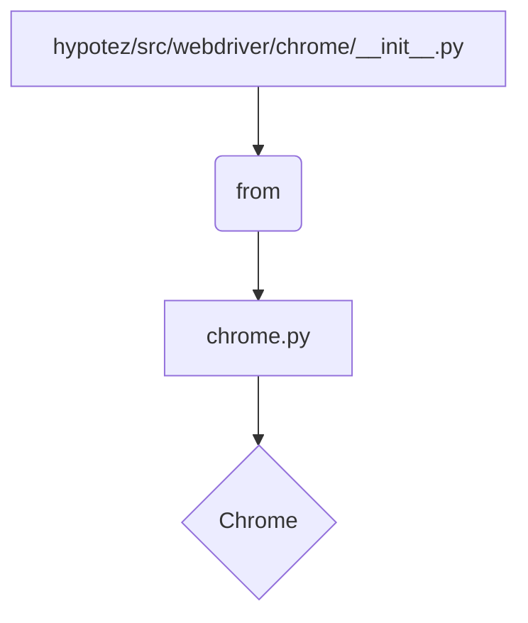

```MD
# Анализ кода hypotez/src/webdriver/chrome/__init__.py

1. **<input code>**

```python
## \file hypotez/src/webdriver/chrome/__init__.py
# -*- coding: utf-8 -*-

#! venv/bin/python/python3.12

"""
.. module: src.webdriver.chrome 
	:platform: Windows, Unix
	:synopsis:

"""

from .chrome import Chrome
```

2. **<algorithm>**

Этот файл является инициализирующим модулем для пакета `webdriver/chrome`.  Он не содержит собственной логики, а лишь импортирует один элемент.  Алгоритм работы сводится к единственному шагу:

* Импортировать класс `Chrome` из подмодуля `chrome`.

**Пример:**

Нет конкретных данных, обрабатываемых в этом файле.  Работа сводится к подготовке доступа к классу `Chrome` для дальнейшего использования.


3. **<mermaid>**



**Объяснение диаграммы:**

Модуль `__init__.py` импортирует класс `Chrome` из подмодуля `chrome.py`.  Таким образом, `chrome.py` содержит определение класса `Chrome`, а `__init__.py` предоставляет доступ к нему.

4. **<explanation>**

* **Импорты:**
    `from .chrome import Chrome`: Этот импорт позволяет использовать класс `Chrome`, определённый в файле `chrome.py` внутри пакета `webdriver/chrome`.  `.` означает, что импортируется класс из текущего пакета.

* **Классы:**
    В данном файле нет определения собственных классов. Он лишь импортирует класс `Chrome` из другого файла.  Информация о классе `Chrome` содержится в `hypotez/src/webdriver/chrome/chrome.py`.

* **Функции:**
    В данном файле нет функций.

* **Переменные:**
    Нет объявленных переменных.


**Цепочка взаимосвязей:**

Файл `hypotez/src/webdriver/chrome/__init__.py` является частью пакета `webdriver/chrome`.  Это пакет, вероятно, предназначен для управления веб-драйверами, особенно для браузера Chrome.  Для использования функциональности `Chrome`, необходимо импортировать необходимый класс из модуля `chrome.py`.  Следующая точка взаимодействия - это потенциально другие файлы, которые будут использовать `Chrome` для управления взаимодействием с веб-страницами.


**Возможные ошибки и улучшения:**

* Необходимо убедиться, что файл `chrome.py` существует и содержит определение класса `Chrome`.  Если этого не будет, то возникнет ошибка импорта.
* Если класс `Chrome` зависит от других компонентов (например, библиотеки Selenium), необходимо убедиться, что все зависимости удовлетворены.
* Документация для класса `Chrome` в файле `chrome.py` должна быть полной и понятной.


В целом, код представляет собой стандартный шаблон инициализации пакета Python. Он служит для организации импорта и доступа к классу `Chrome`.  Для более глубокого анализа необходимо просмотреть код файла `hypotez/src/webdriver/chrome/chrome.py`.