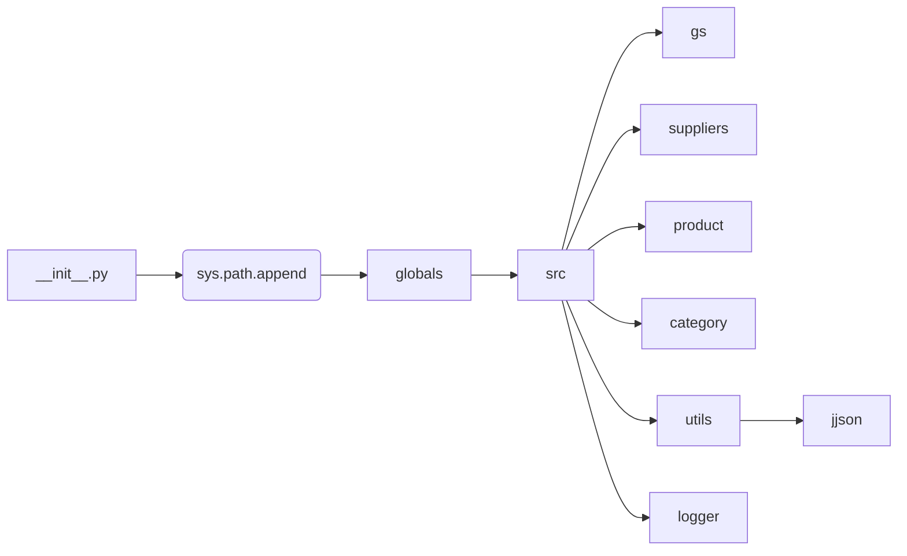

# <input code>

```python
## \file hypotez/src/webdriver/chrome/_examples/header.py
# -*- coding: utf-8 -*-\
#! venv/Scripts/python.exe
#! venv/bin/python/python3.12

"""
.. module: src.webdriver.chrome._examples 
	:platform: Windows, Unix
	:synopsis:

"""


"""
	:platform: Windows, Unix
	:synopsis:

"""


"""
	:platform: Windows, Unix
	:synopsis:

"""


"""
  :platform: Windows, Unix

"""
"""
  :platform: Windows, Unix
  :platform: Windows, Unix
  :synopsis:
"""
  
""" module: src.webdriver.chrome._examples """


import sys
import os
from pathlib import Path

dir_root : Path = Path (os.getcwd()[:os.getcwd().rfind('hypotez')+11])
sys.path.append (str (dir_root) )  # Добавляю корневую папку в sys.path
dir_src = Path (dir_root, 'src')
sys.path.append (str (dir_root) ) 
...

print(dir_root)
# ----------------
from pathlib import Path
import json
import re
# ----------------

from src import gs
from src.suppliers import Supplier
from src.product import Product, ProductFields, ProductFieldsLocators
from src.category import Category
from src.utils.jjson import j_dumps, j_loads,   pprint, save_text_file
from src.logger import logger
, StringNormalizer, ProductFieldsValidator
...
```

# <algorithm>

К сожалению, предоставленный код фрагментарный и неполный.  Отсутствуют ключевые блоки кода, необходимые для построения блок-схемы. Алгоритм невозможно описать без знания функций, используемых в `...` участках.

# <mermaid>



**Описание диаграммы:**

Диаграмма показывает основные модули и зависимости в коде.  `__init__.py` - файл, вероятно, инициализирующий пакет `src`, добавляющий свои пути к `sys.path`.  `src` - корневой каталог проекта, содержащий `gs`, `suppliers`, `product`, `category`, `utils`, `logger` и другие модули.  Зависимости между ними показаны стрелками. Модуль `jjson` находится в папке `utils`.  Описания остальных модулей зависят от их внутренней структуры, которую без полного кода определить невозможно.


# <explanation>

**Импорты:**

Код импортирует необходимые модули из стандартной библиотеки Python (`sys`, `os`, `pathlib`, `json`, `re`) и из собственных модулей проекта.
`from src import gs` - импортирует модуль `gs` из пакета `src`. Аналогичные импорты для `suppliers`, `product`, `category`, `utils`, `logger` показывают структуру проекта. Это типичная практика для организации кода в пакетах.
Импорты `j_dumps`, `j_loads`, `pprint`, `save_text_file` из `src.utils.jjson` предполагают существование модуля `jjson` в подпапке `utils` пакета `src`. `logger`, `StringNormalizer`, `ProductFieldsValidator` - тоже предположительно находятся в `src`.

**Классы:**

Несмотря на то, что не представлен полный код, по импортам можно предположить существование классов `Supplier`, `Product`, `ProductFields`, `ProductFieldsLocators`, `Category`, `StringNormalizer`, и `ProductFieldsValidator`.  Это предполагает использование объектно-ориентированного программирования для организации данных и логики. Подробные характеристики этих классов неизвестны без их определения в коде.

**Функции:**

Невозможно дать описание функций, так как код фрагментарный и отсутствуют определения функций.

**Переменные:**

`dir_root`: переменная типа `Path` хранит путь к корню проекта `hypotez`.
`dir_src`: переменная типа `Path`, хранит путь к директории `src`.
`MODE`: строковая переменная, которая хранит значение 'dev'. Это, вероятно, конфигурационная переменная.
```


**Возможные ошибки и улучшения:**

* **Неполный код:**  Невозможно определить все функциональности без полного кода.
* **Многоточия (`...`):**  Участки с `...` сильно ограничивают понимание.  Необходимо предоставить весь код, включая функции и классы.
* **Добавление комментариев:** Комментарии в коде (например, docstrings) существенно облегчают понимание.

**Взаимосвязи с другими частями проекта:**

Код из `hypotez/src/webdriver/chrome/_examples/header.py` явно связан с другими частями проекта через импорты, что указывает на взаимодействие.  Без полного кода точное понимание взаимосвязей трудно определить.  Вероятно, код взаимодействует с компонентами для веб-драйвера, обработки данных (из `gs`, `suppliers`, `product`, `category`), логирования и работы с JSON.