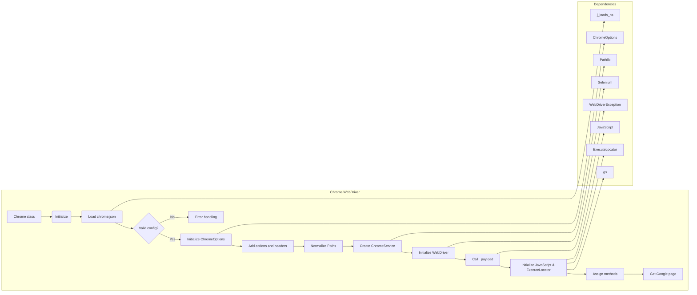

# <input code>

```python
## \file hypotez/src/webdriver/chrome/chrome.py
# -*- coding: utf-8 -*-\
#! venv/Scripts/python.exe
#! venv/bin/python/python3.12

"""
Module for Chrome WebDriver
=========================================================================================

This module contains a custom implementation of the Chrome WebDriver using Selenium. It integrates
configuration settings defined in the `chrome.json` file, such as user-agent and browser profile settings,
to enable flexible and automated browser interactions.

Key Features:
    - Centralized configuration via JSON files.
    - Support for multiple browser profiles.
    - Enhanced logging and error handling.

Example usage
--------------------

Example of using the `Chrome` class:

.. code-block:: python

    from src.webdriver.chrome import Chrome

    # Initialize Chrome WebDriver with user-agent settings
    browser = Chrome(user_agent='Mozilla/5.0...')
    browser.get("https://www.example.com")
    browser.quit()
"""


import os
import sys
from pathlib import Path
from typing import Optional
from types import SimpleNamespace
from selenium import webdriver
from selenium.webdriver.chrome.service import Service as ChromeService
from selenium.webdriver.chrome.options import Options as ChromeOptions
from fake_useragent import UserAgent
from selenium.common.exceptions import WebDriverException

import header
from src import gs
from src.webdriver.executor import ExecuteLocator
from src.webdriver.js import JavaScript
from src.utils.jjson import j_loads_ns
from src.logger import logger


class Chrome(webdriver.Chrome):
    """Class for Chrome WebDriver."""

    _instance = None
    driver_name: str = 'chrome'
    config: SimpleNamespace

    def __new__(cls, *args, **kwargs):
        """Ensure a single instance of Chrome WebDriver.

        If an instance already exists, it calls `window_open()`.

        Returns:
            Chrome: The singleton instance of the Chrome WebDriver.
        """
        if cls._instance is None:
            cls._instance = super().__new__(cls)
        else:
            cls._instance.window_open()  # Open a new window if instance already exists
        return cls._instance

    def __init__(self, user_agent: Optional[str] = None, *args, **kwargs):
        """Initializes the Chrome WebDriver with specified options and profile.

        Args:
            user_agent (Optional[str]): The user-agent string to be used. Defaults to a random user agent.
        """
        try:
            user_agent = user_agent or UserAgent().random
            self.config = j_loads_ns(Path(gs.path.src, 'webdriver', 'chrome', 'chrome.json'))  # Load settings from JSON file

            if not self.config:
                logger.debug(f'Error in `chrome.json` file.')
                ...
                return

            options = ChromeOptions()  # Initialize options
            profile_directory: Path  # Set user data directory
            executable_path: str

            # ... (normalize_path function)

            # Add arguments from options and headers settings
            # ... (Adding arguments)

            profile_directory = Path(gs.path.root / normalize_path(self.config.profile_directory.testing))
            binary_location = Path(gs.path.root / normalize_path(self.config.binary_location.binary))

            if profile_directory:
                options.add_argument(f'user-data-dir={profile_directory}')

            options.binary_location = str(binary_location)

            service = ChromeService(executable_path=str(binary_location)) if binary_location else ChromeService()

        except Exception as ex:
            logger.error('Error setting up Chrome WebDriver:', ex)
            ...
            return

        try:
            super().__init__(options=options, service=service)
        except WebDriverException as ex:
            logger.critical('Error initializing Chrome WebDriver:', ex)
            ...
            return
        except Exception as ex:
            logger.critical('Chrome WebDriver crashed. General error:', ex)
            ...
            return

        self._payload()


    def _payload(self) -> None:
        # ... (Initializing JavaScript and ExecuteLocator)
        pass

if __name__ == "__main__":
    driver = Chrome()
    driver.get(r"https://google.com")
```

# <algorithm>

```mermaid
graph TD
    A[User requests Chrome instance] --> B{Is Chrome instance already created?};
    B -- Yes --> C[Chrome.window_open()];
    B -- No --> D[New Chrome instance created];
    D --> E[Load chrome.json];
    E --> F{Is chrome.json valid?};
    F -- Yes --> G[Initialize ChromeOptions];
    F -- No --> H[Error logging and return];
    G --> I[Add options and headers from config];
    I --> J[Normalize paths for profile_directory and binary_location];
    J --> K[Check if profile_directory is valid];
    K -- Yes --> L[Set user-data-dir option];
    K -- No --> L;
    L --> M[Create ChromeService];
    M --> N[Initialize webdriver];
    N --> O[Call _payload()];
    O --> P[Initialize JavaScript and ExecuteLocator];
    P --> Q[Assign methods from JavaScript and ExecuteLocator];
    Q --> R[Get Google page];
    
    style H fill:#fdd;
    style H stroke:#d62728,2px;
    style H font-color:#fff;

    style H fill:#fdd;
    style H stroke:#d62728,2px;
    style H font-color:#fff;
```

**Example:** If `chrome.json` specifies `profile_directory` as `%APPDATA%\ChromeProfile`, and `APPDATA` is set to `C:\Users\user\AppData\Roaming`, the `normalize_path` function will return `C:\Users\user\AppData\Roaming\ChromeProfile`.


# <mermaid>



**Explanation of Dependencies:**

* `j_loads_ns`: Handles loading configuration from `chrome.json`.
* `ChromeOptions`: Selenium class for configuring Chrome.
* `Pathlib`: Used for path manipulation.
* `Selenium`: The core library for web automation.
* `WebDriverException`: Handles exceptions related to the WebDriver.
* `JavaScript`, `ExecuteLocator`, `gs`: Internal project modules handling JavaScript execution, locator execution and path handling.


# <explanation>

**Imports:**

The code imports necessary modules from various parts of the project (`src`) and external libraries (e.g., Selenium, fake_useragent). The `src` directory structure implies a modular organization. For example, `src.webdriver.chrome`, `src.webdriver.executor`, `src.webdriver.js`, `src.utils.jjson`, and `src.logger` suggest distinct modules responsible for WebDriver handling, execution logic, JavaScript interactions, configuration parsing, and logging, respectively. `header` is likely a utility file or module containing additional constants or configurations.  `fake_useragent` is a separate package for generating realistic user agent strings.  


**Classes:**

*   **`Chrome`:**  This class inherits from `webdriver.Chrome` (Selenium), extending its functionalities.  It uses the singleton pattern (`_instance`) to ensure only one WebDriver instance exists, preventing potential conflicts. The `__new__` method and `window_open` method help in handling multiple browser instances. The `__init__` method configures the WebDriver with options loaded from `chrome.json`, user-agent, and potentially, browser profiles. Crucial error handling (using `try...except` blocks) is implemented to catch potential exceptions during initialization.


**Functions:**

*   **`normalize_path`:**  This function is crucial for handling environment-variable-based paths (e.g., `%APPDATA%`). It replaces placeholders with their actual values.


**Variables:**

*   `config`: Stores the configuration loaded from `chrome.json` as a `SimpleNamespace` object.
*   `options`: Used to customize Chrome's behavior, e.g., using user-provided options, user-data-dir, etc.
*   `service`: Manages the Chrome WebDriver executable.

**Possible Errors and Improvements:**

*   **Robustness:**  The code has extensive `try...except` blocks, which is good for handling potential exceptions during setup. However, consider adding more specific exception handling (e.g., `FileNotFoundError` for `executable_path`) for improved diagnostics.
*   **Error Handling in `_payload`:** The `_payload` method is not fully implemented. It should also have error handling in case of issues initializing the JavaScript or ExecuteLocator components.  
*   **Configuration Validation:**  More validation of the `chrome.json` file content (e.g., checking required keys) would make it even more reliable.
*   **Clearer Variable Naming:**  While the code is readable, variables like `executable_path` and `profile_directory` could benefit from slightly more descriptive names.
*   **Code Comments:** Add comments to explain the logic behind the `if` conditions for using options or headers.
*   **`logger` Use:** The code does a good job of logging errors, but consider adding logging for important steps in the initialization process for better debugging.
*   **Implicit return:** Missing `return` statements in except blocks could lead to unexpected behavior. Consider adding explicit return to handle cases where exception occurred in specific blocks.


**Relationship with other parts of the project:**

The `Chrome` class depends heavily on other parts of the project:

*   `gs`: For accessing project-wide configuration and path settings.
*   `src.webdriver.executor` and `src.webdriver.js`: For interfacing with functionalities related to executing locators and JavaScript code within the browser.
*   `src.utils.jjson`: For handling the JSON configuration file.
*   `src.logger`: For logging important events and errors.

The `Chrome` class acts as a central point for coordinating these interactions within the project to provide a functional web driver.