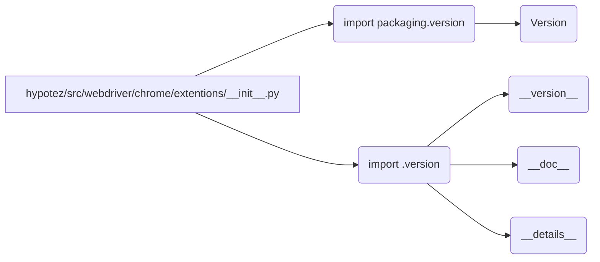

# Анализ кода hypotez/src/webdriver/chrome/extentions/__init__.py

**1. <input code>**

```python
## \file hypotez/src/webdriver/chrome/extentions/__init__.py
# -*- coding: utf-8 -*-\
#! venv/Scripts/python.exe
#! venv/bin/python/python3.12

"""
.. module: src.webdriver.chrome.extentions 
	:platform: Windows, Unix
	:synopsis:

"""


"""
	:platform: Windows, Unix
	:synopsis:

"""


"""
	:platform: Windows, Unix
	:synopsis:

"""


"""
  :platform: Windows, Unix

"""
"""
  :platform: Windows, Unix
  :platform: Windows, Unix
  :synopsis:
"""
  
""" module: src.webdriver.chrome.extentions """


from packaging.version import Version
from .version import __version__, __doc__, __details__
```

**2. <algorithm>**

Этот код представляет собой инициализационный модуль (\_\_init__.py) для пакета `extentions` внутри `webdriver/chrome` в проекте `hypotez`.  Из-за структуры кода, не содержащей функций или классов, алгоритм работы сводится к импорту модулей и, возможно, к определению констант.  Подробная блок-схема не требуется.  Данные не перемещаются между функциями, а только импортируются из других модулей.


**3. <mermaid>**



**4. <explanation>**

* **Импорты**:
    * `from packaging.version import Version`: Импортирует класс `Version` из пакета `packaging`.  Этот пакет используется для работы с версиями программного обеспечения.  Он позволяет сравнивать версии, обрабатывать их как объекты.  Связь с `src` происходит через импорт из внешней библиотеки.
    * `from .version import __version__, __doc__, __details__`: Импортирует переменные `__version__`, `__doc__`, `__details__` из модуля `version.py` внутри текущей директории (`./version.py`).  Связь с `src` происходит через иерархию импорта, что указывает на наличие `version.py` в папке `extentions`.  Эти переменные, вероятно, содержат метаданные о версии модуля.

* **Классы**: Нет определённых классов в этом файле.

* **Функции**: Нет определённых функций в этом файле.

* **Переменные**:
    * ``: Переменная, вероятно, определяет режим работы модуля (`dev`, `prod`, и т.п.).  Она глобальна для модуля.

* **Возможные ошибки или области для улучшений**:
    * Неясно, какое использование имеет `MODE`.  Желательно добавить комментарии или документацию, описывающие назначение переменной.

* **Взаимосвязи с другими частями проекта**:
    * `hypotez/src/webdriver/chrome/extentions` зависим от `packaging` для обработки версий.
    *  `hypotez/src/webdriver/chrome/extentions` зависим от `hypotez/src/webdriver/chrome/extentions/version.py` для получения информации о версии. Этот файл содержит метаданные о версии расширений.


**Заключение**:

Код представляет собой типичный инициализационный модуль Python, который импортирует необходимые компоненты для работы, в том числе информацию о версии. Для более глубокого анализа необходимо изучить `version.py`. Отсутствие функций и классов делает его относительно простым.