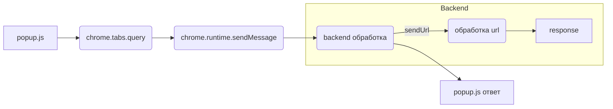

# Анализ кода popup.js

## <input code>

```javascript
document.getElementById("sendUrlButton").addEventListener("click", () => {
    alert("Hello, world!");
    chrome.tabs.query({ active: true, currentWindow: true }, (tabs) => {
        let activeTab = tabs[0];
        let activeTabUrl = activeTab.url;
        
        chrome.runtime.sendMessage({ action: "sendUrl", url: activeTabUrl }, (response) => {
            if (response.status === "success") {
                alert("URL sent successfully!");
            } else {
                alert("Failed to send URL.");
            }
        });
    });
});
```

## <algorithm>

**Блок-схема:**

```mermaid
graph TD
    A[Клик по кнопке "sendUrlButton"] --> B{Получение активной вкладки};
    B --> C[Получение URL активной вкладки];
    C --> D[Отправка сообщения через chrome.runtime.sendMessage];
    D --> E{Обработка ответа};
    E -- success --> F[Вывести "URL sent successfully!"];
    E -- failure --> G[Вывести "Failed to send URL."];
    F --> H[Конец];
    G --> H[Конец];
```

**Примеры:**

* **A:** Пользователь нажимает на кнопку "sendUrlButton".
* **B:** Функция `chrome.tabs.query` ищет активную вкладку в текущем окне.
* **C:** Из полученного массива `tabs` извлекается объект `activeTab` и его `url`.  Например, `activeTabUrl` получит значение "https://www.example.com".
* **D:**  Отправляется сообщение `chrome.runtime.sendMessage` в контекст расширения. Сообщение содержит `action: "sendUrl"` и `url: activeTabUrl`.
* **E:**  Функция-обработчик `(response => ...)` получает ответ от контекста расширения.
* **F:**  Если `response.status` равно "success", выводится соответствующее сообщение.
* **G:** Если `response.status` не равно "success", выводится сообщение об ошибке.
* **H:** Выполнение кода завершается.

## <mermaid>



**Объяснение диаграммы:**

* `popup.js` – файл, содержащий код, работающий в всплывающем окне расширения.
* `chrome.tabs.query` - функция, запрашивающая информацию об активной вкладке.
* `chrome.runtime.sendMessage` - функция для отправки сообщений в контекст расширения.
* `backend обработка` — это код, работающий в фоне расширения, который обрабатывает полученный `url`.
* `response` – ответ от `backend обработка`.
* `popup.js ответ` – часть кода, обрабатывающая ответ.

## <explanation>

**Импорты:**

Код не использует импортов в традиционном понимании (например, `import`). Все необходимые функции (`alert`, `document.getElementById`, `addEventListener`) доступны из встроенного JavaScript.

**Классы:**

В коде нет классов.

**Функции:**

* `() => { ... }`:  Анонимная стрелочная функция, обработчик события `click` на кнопке.
* `chrome.tabs.query`:  Функция из API Chrome Extensions, которая получает информацию о вкладках. Аргументы: объект запроса (`{ active: true, currentWindow: true }`) и коллбек-функцию, которая выполняется с результатами поиска (`(tabs) => ...`).
* `chrome.runtime.sendMessage`: Функция из API Chrome Extensions, которая отправляет сообщение в фоновую страницу (`background.js`). Аргументы: объект сообщения (`{ action: "sendUrl", url: activeTabUrl }`) и коллбек-функцию, которая выполняется с ответом (`(response) => ...`).

**Переменные:**

* `sendUrlButton`: Переменная, хранящая ссылку на элемент `button` с id `"sendUrlButton"`.
* `activeTab`: Переменная, хранящая объект активной вкладки.
* `activeTabUrl`: Переменная, хранящая строку `URL` активной вкладки.
* `response`: Переменная, хранящая объект ответа от фоновой страницы.

**Возможные ошибки и улучшения:**

* Отсутствие проверки на наличие активной вкладки. Если `tabs` пуст, `tabs[0]` вызовет ошибку. Нужно добавить проверку.
* Отсутствие обработки ошибок при получении URL (например, если таб закрылся).
* Отсутствие логирования. Добавление `console.log` или `console.error` поможет отлаживать код.
* Отсутствие валидации `response.status`. `response.status` может быть любого типа, а не только "success" или "failure", поэтому нужно добавить проверку.

**Взаимосвязь с другими частями проекта:**

Код `popup.js` взаимодействует с кодом на фоновой странице (например, `background.js`), который обрабатывает URL, полученные от `popup.js`. Необходимо, чтобы на фоновой странице был обработчик сообщений с `action: "sendUrl"`.

**Пример улучшенного кода (с учетом замечаний):**

```javascript
// ... (код остается прежним)
    chrome.tabs.query({ active: true, currentWindow: true }, (tabs) => {
        if (tabs.length > 0) {
            let activeTab = tabs[0];
            let activeTabUrl = activeTab.url;
            // валидация URL
            if (activeTabUrl) {
                // ... (остальной код)
            } else {
                alert("Не удалось получить URL активной вкладки.");
            }
        } else {
            alert("Активная вкладка не найдена.");
        }
    });