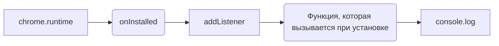

# Анализ кода background.js

**1. <input code>**

```javascript
chrome.runtime.onInstalled.addListener(() => {
    console.log('OpenAI Model Interface Extension Installed');
});
```

**2. <algorithm>**

```mermaid
graph TD
    A[chrome.runtime.onInstalled.addListener] --> B{Установка расширения};
    B -- True --> C[console.log('OpenAI Model Interface Extension Installed')];
    C --> D[Конец];
```

**Пример:**

При установке расширения (событие `onInstalled`) происходит вызов функции, указанной в `addListener`. Функция выполняет логическое действие: выводит сообщение в консоль браузера.

**Перемещение данных:**

Нет перемещения данных между функциями или классами.  Данные не обрабатываются, только выводится строка в консоль.

**3. <mermaid>**



**Объяснение диаграммы:**

Диаграмма показывает, что событие `onInstalled` из объекта `chrome.runtime` вызывает функцию, зарегистрированную с помощью `addListener`. Далее происходит вызов функции `console.log` для вывода сообщения в консоль.  Зависимость идет напрямую от API Chrome.


**4. <explanation>**

* **Импорты:** Нет импортов. Код использует встроенные возможности API Chrome.

* **Классы:** Нет классов.

* **Функции:**
    * `chrome.runtime.onInstalled.addListener`: Это метод объекта `chrome.runtime`, отвечающий за регистрацию обработчика событий. Он принимает функцию callback, которая будет вызвана при установке расширения.
        * Аргументы: в данном случае callback функция без аргументов.
        * Возвращаемое значение: нет.
        * Назначение: регистрирует обработчик для события установки расширения.
    * `console.log`:  Это встроенная функция JavaScript для вывода сообщений в консоль разработчика браузера.
        * Аргументы: строка 'OpenAI Model Interface Extension Installed'
        * Возвращаемое значение: нет.
        * Назначение: вывести сообщение в консоль.


* **Переменные:** Нет переменных.

* **Возможные ошибки или области для улучшений:**

    * **Отсутствует логика:** Код лишь выводит сообщение. Для полноценного расширения нужен функционал взаимодействия с OpenAI API (например, запрос на модель или обработка ответа).  Без реализации функциональности расширение выполняет лишь минимальную задачу.


* **Взаимосвязи с другими частями проекта:**

    Этот код находится в `background.js`,  которая является частью расширения.  Расширение, вероятно, содержит другие файлы, включая логику работы с API OpenAI и обработку пользовательского ввода (например, в `popup.js`). Без доступа к этим файлам сложно представить полную картину взаимодействия.  Взаимодействие с API OpenAI предполагает наличие соответствующего запроса/вызова  из других частей расширения.


**Заключение:**

Этот код представляет собой базовый обработчик события установки расширения.  Он не выполняет функциональной работы по взаимодействию с OpenAI API, а лишь регистрирует событие. Для полноценного расширения необходимо добавить логику запроса к OpenAI API и обработки возвращаемых данных.