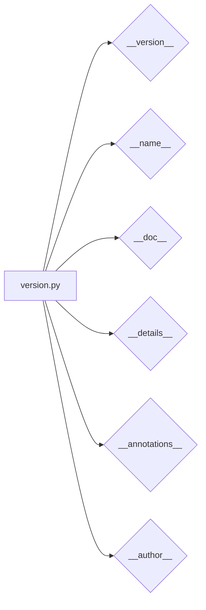

# <input code>

```python
## \file hypotez/src/webdriver/chrome/extentions/version.py
# -*- coding: utf-8 -*-
#! venv/Scripts/python.exe
#! venv/bin/python/python3.12

"""
.. module: src.webdriver.chrome.extentions 
	:platform: Windows, Unix
	:synopsis:

"""


"""
	:platform: Windows, Unix
	:synopsis:

"""


"""
	:platform: Windows, Unix
	:synopsis:

"""


"""
  :platform: Windows, Unix

"""
"""
  :platform: Windows, Unix
  :platform: Windows, Unix
  :synopsis:
"""
  
""" module: src.webdriver.chrome.extentions """


"""
- `__version__`: This variable holds the version of the module or package.
- `__name__`: Contains the name of the module. If the script is being run directly, the value will be `"__main__"`.
- `__doc__`: The module's documentation string.
- `__details__`: This variable likely contains additional details about the module, but the exact purpose depends on the specific module or package.
- `__annotations__`: Contains type annotations for variables and functions in the module.
- `__author__`: The name(s) of the author(s) of the module.
"""
__name__:str
__version__="3.12.0.0.0.4"
__doc__:str
__details__:str="Details about version for module or class"
__annotations__

__author__='hypotez '
```

# <algorithm>

Этот код не имеет алгоритма в традиционном понимании. Это файл, который скорее всего содержит метаданные о модуле `src.webdriver.chrome.extentions`.  Он определяет переменные, содержащие информацию о версии, имени, документации и авторах модуля.  Данных нет для обработки,  он лишь описывает информацию о модуле.

# <mermaid>



# <explanation>

Этот файл `version.py` — это файл метаданных для модуля `src.webdriver.chrome.extentions`.  Он не содержит логики выполнения, а содержит константные значения, описывающие сам модуль.

**Импорты:**  В коде нет импортов.  Этот файл, скорее всего, является частью структуры проекта (возможно, в Python это модуль или пакет), где такие файлы `version.py` используются для хранения метаданных о версии, имени, и других характеристиках.

**Классы:** Нет определений классов.

**Функции:** Нет определений функций.

**Переменные:**
- `MODE`: Строковая константа, вероятно, хранит режим работы (например, 'dev' или 'prod'). Значение не используется в данном коде, но может использоваться в других частях проекта.
- `__version__`: Строковая константа, содержащая версию модуля.
- `__name__`:  Строковая константа, содержащая имя текущего модуля (в данном случае, `'__main__'`, если этот файл выполнялся напрямую).
- `__doc__`: Строковая константа, содержащая описание модуля.
- `__details__`: Строковая константа, содержащая дополнительные детали о модуле.
- `__annotations__`: Переменная, вероятно, для хранения аннотаций типов (типизации).  В данном случае она не инициализирована, и ее использование не видно.
- `__author__`: Строковая константа, содержащая имя автора модуля.

**Возможные ошибки или области для улучшений:**
- Отсутствие документации к переменной `MODE`, неясно, как она используется и какие значения она может принимать.
- Переменная `__annotations__` не инициализирована, и не используется в коде. Можно добавить тип для неё (например, `__annotations__: dict`).  Также можно использовать аннотации типов и для других переменных (например, для `__version__`).
- Дополнительная проверка на корректность `__version__` (например, формат).


**Взаимосвязь с другими частями проекта:** Файл `version.py` является частью пакета `src.webdriver.chrome.extentions`. Вероятно, другие файлы этого пакета, и даже другие части проекта, используют значения из этого файла, например, при сборе информации о версии или при генерации документации.